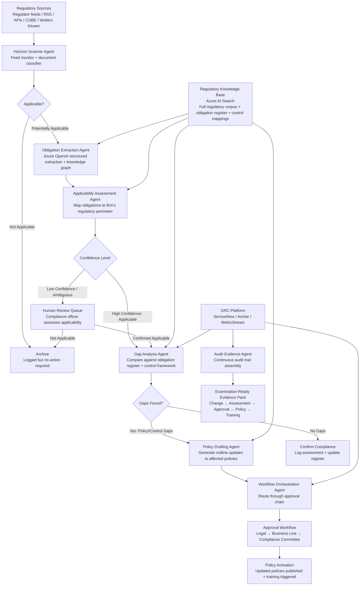

## Solution Overview

The right architecture for regulatory change management is a multi-agent pipeline with event-driven coordination — not a single monolithic agent. The regulatory change lifecycle touches too many distinct cognitive tasks — source monitoring, document classification, obligation extraction, applicability assessment, gap analysis, policy drafting, workflow orchestration, and audit evidence assembly — for one agent to handle reliably. Production systems from CUBE (RegPlatform, 10,000+ issuing bodies, 750 jurisdictions) and AscentAI (RLM Platform, 1,800 hours → 2.5 minutes for MiFID II obligation extraction at ING/CommBank) demonstrate that each stage requires specialized processing: CUBE's proprietary RegLM is fine-tuned specifically for regulatory text classification, entity extraction, citation extraction, and obligation identification — tasks where general-purpose LLMs hallucinate at unacceptable rates on dense legal language.

The recommended design pairs LLM-powered agents for tasks that defied automation for decades — interpreting regulatory language, extracting discrete obligations from multi-hundred-page regulations, assessing applicability against a firm's specific regulatory perimeter, and drafting policy updates — with deterministic services for everything that must be fast, auditable, and reproducible: regulatory feed ingestion, obligation register updates, workflow routing, deadline calculation, and audit evidence assembly. The key insight from 2025 academic research on regulatory NLP is that combining LLMs with knowledge graphs achieves 93% precision in obligation filtering and 99%+ accuracy in classifying obligation types — significantly better than either approach alone.

The reference integration seam targets enterprise GRC platforms (ServiceNow GRC, RSA Archer, MetricStream) via REST API, because the agents augment the existing compliance infrastructure rather than replacing it. The same pattern ports to other GRC platforms by swapping the connector layer.

## Architecture

### Architecture Diagram



### Component Overview

| # | Component | Technology / Service | Role |
|---|-----------|----------------------|------|
| 1 | Horizon Scanner Agent | Regulatory feed APIs + LLM classifier | Monitors regulatory publication sources 24/7, classifies incoming documents by type, jurisdiction, and topic, and filters for potential applicability to the firm's licensed activities. |
| 2 | Obligation Extraction Agent | Azure OpenAI GPT-4o structured outputs + knowledge graph | Parses regulatory text into discrete, machine-readable obligations with deontic classification (must/shall/may), addressees, predicates, and conditions. Academic benchmarks: 93% precision in obligation filtering, 99%+ accuracy in obligation type classification. |
| 3 | Applicability Assessment Agent | Azure OpenAI GPT-4o + RAG over regulatory perimeter | Evaluates extracted obligations against the firm's regulatory perimeter (licensed activities, entity types, jurisdictions, product lines) to determine which obligations apply. AscentAI demonstrated this mapping from 1,800 hours to 2.5 minutes for MiFID II. |
| 4 | Gap Analysis Agent | Deterministic comparison + LLM reasoning | Compares new/changed obligations against the firm's existing obligation register and control framework to identify gaps — obligations that are not yet covered by existing policies and controls. |
| 5 | Policy Drafting Agent | Azure OpenAI GPT-4o | Generates redline policy updates: proposed insertions, modifications, and deletions to existing policy documents, with change justification linked to the triggering regulation. |
| 6 | Workflow Orchestration Agent | LangGraph StateGraph + GRC API | Routes assessments and policy drafts through configurable approval chains, tracks deadlines, escalates overdue items, and manages the end-to-end change implementation lifecycle. |
| 7 | Audit Evidence Agent | Deterministic assembly + Azure Blob Storage | Continuously assembles the audit trail: linking each regulatory change to its assessment, policy update, approval record, training completion, and attestation — so the firm is examination-ready at all times. |
| 8 | Regulatory Knowledge Base | Azure AI Search + Azure Blob Storage | Semantic search over the full regulatory corpus, obligation register, control framework, and historical assessments. Provides RAG grounding for all LLM agents. |
| 9 | GRC Connector | REST API client | Reads from and writes to the enterprise GRC platform (ServiceNow GRC, Archer, MetricStream) for obligation register, control framework, and workflow management. |

## Data Flow

### AI Data Flow

| Stage | What enters the LLM | What comes out | What happens next |
|-------|---------------------|----------------|-------------------|
| Document classification | Raw regulatory publication (title, summary, source, jurisdiction) | Classification labels: document type (legislation/guidance/enforcement/consultation), jurisdiction, topic areas, urgency level, confidence score | Router dispatches applicable documents to obligation extraction. Non-applicable documents archived with classification rationale. |
| Obligation extraction | Regulatory text chunks (2,000-4,000 tokens each), extraction schema, few-shot examples of deontic statements | Structured `Obligation` JSON: obligation text, deontic type (must/shall/may/must-not), addressee, predicate, conditions, effective date, cross-references, confidence | Obligations stored in staging register; forwarded to applicability assessment. |
| Applicability assessment | Extracted obligations + firm's regulatory perimeter definition (licensed activities, entity types, jurisdictions, product lines) + similar past assessments from RAG | `ApplicabilityAssessment` JSON: applicable (yes/no/partial), reasoning, affected entities, affected jurisdictions, confidence score | High-confidence applicable obligations forwarded to gap analysis. Low-confidence routed to human review. |
| Gap analysis | Applicable obligations + existing obligation register entries + current policy and control descriptions from GRC | `GapAssessment` JSON: obligation-to-control mapping, identified gaps, gap severity, recommended actions | Gaps trigger policy drafting agent. No-gap assessments logged as compliance confirmation. |
| Policy drafting | Gap details + current policy document text + regulatory change context + firm's policy style guide | `PolicyRedline` JSON: proposed insertions, modifications, deletions, change justification, regulatory citation | Redlines submitted to approval workflow. Compliance officer reviews before activation. |
| Horizon trend analysis | Batch of recent consultation papers, enforcement trends, regulatory speeches | `TrendReport`: emerging regulatory themes, predicted rulemaking directions, recommended preparedness actions | Quarterly briefing for CCO and Board Risk Committee. |

### End-to-End Sequence (Regulatory Change Flow)

```text
1. Detect    → Horizon Scanner monitors regulatory feeds and detects a new publication.
2. Classify  → Scanner classifies the document by type, jurisdiction, topic, and urgency.
3. Extract   → Obligation Extraction Agent parses the regulation into discrete obligations.
4. Assess    → Applicability Assessment Agent maps obligations to the firm's regulatory perimeter.
5. Review    → Low-confidence assessments route to human compliance officer for review.
6. Analyze   → Gap Analysis Agent compares applicable obligations against existing controls.
7. Draft     → Policy Drafting Agent generates redline updates for gap-closing policies.
8. Route     → Workflow Orchestration Agent submits drafts through Legal → Business → Committee.
9. Activate  → Approved policy updates published; training requirements triggered.
10. Evidence → Audit Evidence Agent assembles the complete change trail for examination readiness.
```

## LLM Role

| Step | AI Needed? | LLM Role | Why AI Fits |
|------|------------|----------|-------------|
| Source monitoring | No | None | Regulatory feeds are structured RSS/API endpoints; monitoring is a polling/webhook pattern. |
| Document classification | Yes | Classify regulatory text by type, jurisdiction, topic, urgency | Regulatory publications vary in format, language, and structure across jurisdictions. Rules-based classification fails on the diversity of 10,000+ issuing bodies. |
| Obligation extraction | Yes, with knowledge graph grounding | Extract deontic statements, parse obligation structure (addressee, predicate, conditions) | Dense legal language with nested cross-references and conditional clauses. This is the task that consumed 1,800 hours manually at ING/CommBank. LLM + knowledge graph achieves 93% precision. |
| Applicability assessment | Yes, RAG-grounded | Reason about whether obligations apply given the firm's regulatory perimeter | Requires contextual reasoning about entity types, licensed activities, and jurisdictional scope — not a simple lookup. |
| Gap analysis | Hybrid | LLM reasons about semantic similarity between obligations and controls; deterministic matching handles exact matches | Most obligation-to-control mapping involves semantic similarity (not exact match), but structural comparisons are deterministic. |
| Policy drafting | Yes | Generate redline text respecting the firm's policy style and regulatory citation conventions | Policy language must be precise, consistent, and traceable to the regulatory change — a generative task suited to LLM capabilities. |
| Workflow routing | No | None | Approval chains are configurable business rules; routing is deterministic. |
| Deadline calculation | No | None | Effective dates and implementation deadlines are extracted as structured data; calculation is arithmetic. |
| Audit trail assembly | No | None | Evidence linking is a deterministic join across assessment, approval, policy, and training records. |
| Trend analysis / horizon scanning | Yes | Synthesize patterns across consultation papers, enforcement actions, regulatory speeches | Pattern recognition across diverse unstructured sources to identify emerging themes. |

## Agent Pattern

| Aspect | Choice |
|--------|--------|
| **Pattern** | Multi-agent pipeline with event-driven coordination |
| **Orchestration** | Event-driven: agents triggered by regulatory feed updates, assessment completions, approval decisions; LangGraph StateGraph for intra-pipeline coordination |
| **Human-in-the-Loop** | Confidence-based escalation: low-confidence applicability assessments, all policy redlines before activation, high-impact regulatory changes always require human review |
| **State Management** | GRC platform is the system of record for obligations and controls; LangGraph checkpointing for in-flight pipeline state; Azure Blob Storage for regulatory document corpus |
| **Autonomy Level** | Semi-autonomous: routine monitoring, extraction, and classification are fully automated; applicability assessment and policy changes require human approval gates |

### Why This Pattern?

The multi-agent pipeline is chosen over alternatives for specific, evidence-based reasons:

**Why not a single agent?** The regulatory change lifecycle involves fundamentally different cognitive tasks. Document classification requires broad topic understanding. Obligation extraction requires fine-grained legal language parsing. Applicability assessment requires reasoning about the firm's specific regulatory perimeter. Policy drafting requires generative text production in a constrained style. A single agent would need an enormous context window and tool surface, degrading quality on each subtask. CUBE's production architecture uses specialized models (their proprietary RegLM) fine-tuned for each task — not a general-purpose agent.

**Why not pure RAG?** RAG is essential for grounding — the obligation extraction and applicability assessment agents use retrieval over the regulatory corpus and the firm's obligation register. But the system must also take actions: update the obligation register, draft policy changes, route approvals, assemble audit evidence. RAG retrieves; agents act. The RAG layer is a subsystem within the multi-agent pipeline, not the architecture itself.

**Why event-driven rather than a single graph?** Regulatory changes arrive asynchronously from hundreds of sources. Some require urgent processing (enforcement actions, supervisory notices); others are routine (consultation papers, guidance updates). An event-driven architecture where the horizon scanner publishes events and downstream agents consume them on their own schedules handles this heterogeneity better than a single graph that assumes a uniform input cadence.

**Why LangGraph for intra-pipeline coordination?** Within each change-processing pipeline (from detection through evidencing), there are conditional branches (applicable vs. not, gap found vs. no gap), human-in-the-loop pauses (compliance officer review), and state that must persist across agent handoffs. LangGraph's StateGraph with interrupt-and-resume provides exactly this: typed state, conditional edges, and human-in-the-loop checkpointing.

**Why the GRC platform as state backbone?** The constraint is clear: agents must augment the existing GRC platform, not replace it. The GRC platform (ServiceNow, Archer, MetricStream) holds the authoritative obligation register, control framework, and audit records. Agents read from and write to it. This means agents can be deployed incrementally — start with horizon scanning and classification, then add extraction, then applicability assessment — without requiring a GRC migration.

## Prompt Strategy

### Prompt Structure

| Agent | Prompt Style | Why |
|-------|--------------|-----|
| Document classifier | Few-shot classification with jurisdiction and topic taxonomy | Incoming regulatory publications vary enormously in format across 10,000+ issuing bodies. Few-shot examples cover the major patterns without overtraining. |
| Obligation extractor | Schema-first system prompt with deontic analysis rules | Forces the model to fill a defined obligation schema rather than generating free-form summaries. This is the highest-leverage pattern for structured extraction from legal text. |
| Applicability assessor | Reasoning prompt with regulatory perimeter context + RAG retrieval of similar past assessments | Must reason about entity types, licensed activities, and jurisdictional scope — grounded in how the firm assessed similar obligations previously. |
| Gap analyst | Comparison prompt with obligation-control pairs + semantic similarity threshold | Must evaluate whether existing controls satisfy new obligations. Structured output identifies gaps with severity and remediation recommendations. |
| Policy drafter | Generative prompt with firm style guide, regulatory citation conventions, and redline format | Must produce policy language that is precise, consistent, and traceable — constrained generation, not free-form writing. |

### Example Obligation Extraction Prompt

```text
System:
You are the Obligation Extraction Agent for a regulatory change management platform.
Your job is to extract discrete regulatory obligations from regulatory text.

Rules:
1. Extract only obligations explicitly stated in the regulatory text.
   An obligation is a statement that imposes a duty, prohibition, or permission
   on a specified addressee (e.g., "firms must", "institutions shall",
   "the competent authority may require").
2. For each obligation, identify:
   - obligation_text: The exact text of the obligation (verbatim quote)
   - deontic_type: must | shall | may | must_not | should
   - addressee: Who the obligation applies to (e.g., "credit institutions",
     "investment firms", "payment service providers")
   - predicate: What the addressee must do or not do
   - conditions: Under what circumstances the obligation applies
   - effective_date: When the obligation takes effect (if stated)
   - cross_references: Other articles, sections, or regulations referenced
   - article_reference: The article/section number where the obligation appears
3. Do NOT infer obligations that are not explicitly stated.
4. Do NOT merge multiple obligations into one — each discrete duty is a separate entry.
5. If a provision is ambiguous between obligation and recommendation,
   set deontic_type based on the modal verb used and add
   ambiguity_flag=true.
6. Return only the schema-valid JSON array of obligations.
```

### Example Applicability Assessment Prompt

```text
System:
You are the Applicability Assessment Agent. You determine whether extracted
regulatory obligations apply to a specific financial institution.

You have access to:
- The firm's regulatory perimeter: licensed activities, entity types,
  jurisdictions, product lines, and customer segments
- Historical applicability assessments for similar obligations (via RAG retrieval)

Rules:
1. Assess each obligation against the firm's regulatory perimeter.
2. An obligation is "applicable" if the firm matches the addressee definition
   AND operates in the specified jurisdiction AND conducts the relevant activity.
3. An obligation is "partially_applicable" if it applies to some entities
   or jurisdictions but not all.
4. Provide reasoning that traces your assessment to specific elements
   of the firm's regulatory perimeter.
5. Include confidence_score (0.0-1.0). Below 0.80, the assessment will be
   routed to a human compliance officer for review.
6. Reference any similar past assessments found via retrieval.
7. Never assume applicability — if the addressee definition does not clearly
   match the firm's entity type, mark as "requires_review".
```

### Prompt Engineering Rules

- Keep agent prompts narrow and task-specific. CUBE's production RegLM is fine-tuned per task (classification, extraction, summarization) rather than using a single general-purpose prompt.
- Use structured output schemas (JSON mode) for all extraction and assessment agents. This turns "analyze this regulation" into "fill this contract."
- Require evidence and reasoning in all assessment outputs so human reviewers can verify decisions without re-reading the source regulation.
- Ground applicability assessments in past decisions via RAG retrieval — consistency with prior assessments is critical for audit defensibility.
- Include explicit "never hallucinate" guardrails: "Do NOT infer obligations not stated," "Do NOT invent regulatory cross-references." The 10-20% accuracy drop on long regulatory documents reported for general-purpose LLMs must be mitigated by chunking and schema enforcement.

## Human-in-the-Loop

### Escalation Policy

| Trigger | Action | Why |
|---------|--------|-----|
| Applicability confidence below 0.80 | Route to compliance officer for manual assessment | Incorrect applicability determination either misses a binding obligation or wastes resources implementing a non-applicable one. |
| All policy redlines before activation | Compliance officer + Legal review required | Policy changes alter the firm's compliance posture. Autonomous policy activation is out of scope. |
| High-impact regulatory changes (new legislation, major amendments) | Senior compliance officer + General Counsel review | These changes may require strategic decisions about business model, product, or market adjustments. |
| Cross-border regulatory conflicts detected | Regulatory affairs team review | Conflicting obligations across jurisdictions require human judgment about which regime takes precedence. |
| Enforcement actions against the firm or peers | Immediate CCO notification + priority assessment | Enforcement signals require rapid senior attention and potential remediation. |
| Novel obligation types not seen in training data | Route to subject-matter expert | The LLM may struggle with obligation types not well-represented in the training corpus. |

### Confidence Thresholds

Starting points to be calibrated on historical assessment data:

- Auto-classify documents when classification confidence is `>= 0.90`
- Route applicability assessments to human when confidence is `< 0.80`
- Always require human approval for policy changes, regardless of AI confidence
- Auto-archive non-applicable documents when non-applicability confidence is `>= 0.95`
- Always escalate enforcement actions, regardless of confidence scores

## Integration Points

| System | Integration Method | Direction | Purpose |
|--------|--------------------|-----------|---------|
| Regulatory feed providers (CUBE, Wolters Kluwer, LexisNexis) | REST API / RSS / Webhooks | Inbound | Receive regulatory publications, amendments, guidance, and enforcement actions from commercial regulatory intelligence feeds. |
| GRC platform (ServiceNow GRC / RSA Archer / MetricStream) | REST API | Bidirectional | Read obligation register and control framework; write assessment results, gap findings, and policy change records. |
| Policy management system (PolicyHub / ConvergePoint / SharePoint) | REST API / Graph API | Bidirectional | Read current policy documents for gap analysis and redline generation; write updated policy drafts. |
| Document management (SharePoint / iManage) | Graph API / REST API | Bidirectional | Store regulatory documents and evidence artifacts; retrieve historical assessments. |
| Identity provider (Azure Entra ID / Okta) | OIDC / SAML | Authentication | User authentication, role-based access control for human review workflows. |
| Email / Notifications (Microsoft 365 / SMTP) | Graph API / SMTP | Outbound | Notify compliance officers of new assessments requiring review, deadline warnings, escalations. |
| Workflow / ITSM (ServiceNow / Jira) | REST API | Write | Create and track change implementation tasks, training requirements, and evidence collection items. |

## Tools & Frameworks

### AI / ML Stack

| Component | Technology | Why Chosen |
|-----------|------------|------------|
| **LLM Provider** | Azure OpenAI | Enterprise compliance (data residency, SLAs, content filtering), private endpoint support, integration with Azure identity. |
| **Model (extraction/assessment)** | GPT-4o | Strong reasoning on dense legal text, structured output support, 128K context window for long regulatory documents. |
| **Model (classification/triage)** | GPT-4o-mini | Cost-effective for high-volume classification tasks where full reasoning is not required. |
| **Agent Framework** | LangGraph (Python) | StateGraph for typed pipeline state, conditional routing, human-in-the-loop interrupts, and checkpointing. Production-proven at C.H. Robinson for complex classification. |
| **Azure-native alternative** | Semantic Kernel / Microsoft Agent Framework | Strong option for .NET teams; plugin-based architecture maps well to regulatory tool definitions. Microsoft + EY Law deployed Semantic Kernel + Azure OpenAI for regulatory compliance task comprehension in production via the EY Global Tax Platform. |
| **Vector Database** | Azure AI Search | Managed hybrid search (keyword + semantic) over regulatory corpus; supports multi-language search across 80+ languages matching CUBE's coverage. |
| **Embedding Model** | text-embedding-3-large (baseline); Noxtua Voyage Embed or voyage-3-large for legal-domain optimization | text-embedding-3-large is a solid baseline. Legal-domain-specific models like Noxtua Voyage Embed achieve +25.3% over text-embedding-3-large on legal benchmarks; voyage-3-large achieves +9.74% with 32K token context. |
| **Knowledge Graph** | Neo4j or Azure Cosmos DB for Apache Gremlin | Represent regulation-obligation-control-policy relationships as a graph for traversal-based gap analysis. Academic evidence: knowledge graph + LLM achieves 93% obligation extraction precision. |
| **Structured Extraction** | Azure OpenAI structured outputs (JSON mode) | Enforces JSON schema compliance for all extraction and assessment agents. |

### Infrastructure Stack

| Component | Technology | Why Chosen |
|-----------|------------|------------|
| **Compute** | AKS or Azure Container Apps | Horizontal scaling for parallel obligation extraction across multi-hundred-page regulations. |
| **Message Queue** | Azure Service Bus | Event-driven trigger for agents; handles bursty regulatory publication schedules (end-of-quarter surges). |
| **Storage** | Azure Blob Storage + Azure SQL | Blob for regulatory document corpus and evidence artifacts; SQL for obligation register and assessment records. |
| **Monitoring** | Application Insights / OpenTelemetry | Trace agent decisions, confidence scores, escalation rates, and processing latency. |

## Security & Compliance

| Concern | Approach |
|---------|----------|
| **Authentication** | Managed identity for all Azure services; OIDC federation for GRC platform API calls. |
| **Authorization** | RBAC: compliance officers approve assessments; only Compliance Committee can activate policy changes; agents have scoped write access to staging tables only. |
| **Data at Rest** | Customer-managed key encryption for obligation registers, gap assessments, and policy documents — these reveal the firm's control weaknesses. |
| **Data in Transit** | TLS 1.2+ for all API calls; private endpoints for Azure OpenAI, Azure AI Search, and GRC platform connectivity. |
| **PII Handling** | Regulatory texts are generally public. However, the firm's obligation register, gap assessments, and policy documents are confidential. No firm-specific data is sent to public LLM endpoints. |
| **Audit Trail** | Every agent decision logged with: input document, extracted output, tool calls, confidence score, escalation reason, human reviewer ID, and timestamp. Immutable log storage for examination readiness. |
| **Model Governance** | Content filters enabled; prompt guardrails prevent hallucination of regulatory citations; all LLM outputs versioned and traceable to model version and prompt version. |
| **AI Act Compliance** | The system itself is documented per EU AI Act requirements: purpose, intended users, risk classification, human oversight mechanisms, performance metrics, and known limitations. |

## Scalability & Performance

| Dimension | Approach |
|-----------|----------|
| **Throughput** | Process 100-500 new regulatory publications per day across all monitored jurisdictions. Obligation extraction at 50-200 obligations/hour per agent instance, scaling horizontally via queue-based fan-out. |
| **Latency Target** | Document classification: < 10 seconds. Obligation extraction from a 100-page regulation: < 5 minutes (parallelized by section). Applicability assessment: < 30 seconds per obligation. End-to-end detection-to-assessment: < 24 hours. |
| **Scaling Strategy** | Horizontal pod autoscaling per agent type, triggered by Service Bus queue depth. Peak volumes during major regulatory overhauls (Basel III.1, EU AI Act rollout) absorbed by adding extraction worker replicas. |
| **Rate Limits** | Azure OpenAI provisioned throughput for extraction agent (highest token consumption); standard deployment for classification and assessment agents. |
| **Caching** | Cache regulatory perimeter definitions, control framework snapshots, and frequently-referenced regulatory cross-references. Never cache confidential gap assessments across sessions. |

## Cost Estimate

The table below estimates costs for a mid-size financial institution monitoring 200-300 regulatory issuing bodies across 10-20 jurisdictions:

| Component | Unit Cost | Monthly Estimate |
|-----------|-----------|------------------|
| **LLM API calls** (extraction, classification, assessment, drafting) | ~$0.03-0.15 per obligation processed | `$5k-$12k` estimated |
| **Regulatory feed subscriptions** (CUBE, Wolters Kluwer, or equivalent) | Commercial licensing | `$30k-$80k` estimated (existing cost, not incremental) |
| **Vector DB / AI Search** (regulatory corpus indexing) | Azure AI Search S1/S2 | `$1k-$3k` estimated |
| **Compute** (AKS workers, API services) | Container runtime | `$2k-$5k` estimated |
| **Knowledge Graph** (Neo4j or Cosmos DB Gremlin) | Managed service | `$1k-$3k` estimated |
| **Message queue + storage + monitoring** | Service Bus, Blob, App Insights | `$1k-$2k` estimated |
| **Total (incremental AI costs)** | | **`$10k-$25k` estimated** |

For comparison, a compliance team of 8-15 analysts dedicated to regulatory change management at a mid-size financial institution represents $1M-$2.5M annually in fully-loaded compensation. The AI system does not replace the team but enables them to handle 3-5x more regulatory changes with the same headcount — or maintain coverage as regulatory volume continues its 23% YoY growth (Corlytics, 2025) without proportional headcount growth.

## Alternatives Considered

| Alternative | Pros | Cons | Why Not Chosen |
|-------------|------|------|----------------|
| Single tool-calling agent | Simpler architecture, fewer components | Context window overflow on long regulations; tool surface too large for reliable selection across 7+ distinct tasks; validation harder | CUBE's production system uses task-specific models (RegLM), not a single general-purpose agent. |
| Pure RPA / rules-based monitoring | Deterministic, easy to audit | Cannot interpret regulatory language, extract obligations from unstructured text, or reason about applicability — the tasks that consume 90% of compliance officer time | AscentAI exists because rules-based approaches failed on regulatory text complexity. 1,800 hours manual vs. 2.5 minutes AI proves the gap. |
| Pure RAG over regulatory corpus | Good for Q&A over known regulations | Does not extract obligations, assess applicability, draft policies, or orchestrate workflows. RAG answers questions; it does not manage change | RAG is a subsystem within the pipeline (grounding for extraction and assessment), not the operating pattern. |
| Commercial RegTech only (CUBE/AscentAI/Wolters Kluwer) | Production-ready, proven at scale | Vendor lock-in; limited customization of obligation mapping to firm-specific controls; high licensing cost; does not integrate deeply with firm's GRC platform and policy management system | The recommended architecture uses commercial feeds as input sources but adds firm-specific AI layers for applicability, gap analysis, and policy drafting. |
| Fine-tuned domain-specific model (RegLM approach) | Highest accuracy on regulatory text | Requires large labeled training datasets; ongoing model maintenance; significant ML engineering investment | Viable for firms with dedicated ML teams; the GPT-4o + structured outputs approach achieves 90%+ accuracy with prompting alone and is more accessible. |
