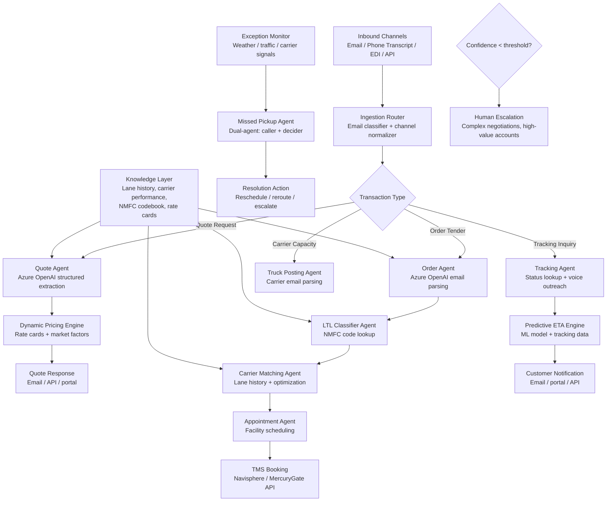

## Solution Overview

The right architecture for freight logistics automation is not a single monolithic agent. C.H. Robinson's production deployment demonstrates why: the shipment lifecycle touches too many distinct cognitive tasks — email parsing, freight classification, dynamic pricing, carrier matching, appointment scheduling, tracking, and exception handling — for one agent to handle well. Their "Always-On Logistics Planner" runs 30+ specialized AI agents, each owning a narrow step in the lifecycle, connected through the Navisphere TMS backend. The result: 3+ million automated shipping tasks, price quotes in 32 seconds, and a 40% productivity increase.

The recommended design is a multi-agent orchestrator-worker system with event-driven coordination. LLM workers handle the parts that defied automation for decades: reading unstructured emails to extract shipment details, classifying freight against NMFC codes, reasoning about carrier selection, and conducting voice-based carrier outreach. Deterministic services handle everything that must be fast, auditable, and reproducible: dynamic pricing calculations, rate card lookups, appointment slot optimization, TMS record creation, and EDI transmission. The key insight from C.H. Robinson's approach — "map the problems, then engineer solutions" — means each agent exists because a specific bottleneck was identified, not because multi-agent architecture was chosen first.

The reference integration seam targets a standard TMS (e.g., Navisphere, MercuryGate, BluJay) via REST API, because the agents augment the existing platform rather than replacing it. The same pattern ports to other TMS platforms by swapping the connector layer.

---

## Architecture

### Architecture Diagram



### Component Overview

| # | Component | Technology / Service | Role |
|---|-----------|----------------------|------|
| 1 | Ingestion router | LLM classifier + rules engine | Classifies inbound emails by transaction type (quote, order, tracking, capacity) and normalizes to canonical format. |
| 2 | Quote agent | Azure OpenAI structured outputs | Extracts shipment details from unstructured quote requests and feeds the pricing engine. |
| 3 | Dynamic Pricing Engine | Deterministic optimization service | Evaluates 847+ rate cards, market factors, carrier performance, and lane history to generate competitive quotes. |
| 4 | Order agent | Azure OpenAI structured outputs | Parses emailed tenders including attachments, validates shipment details, optimizes mode selection. |
| 5 | LTL classifier agent | Azure OpenAI + NMFC lookup tool | Determines correct freight class and NMFC code from product descriptions. |
| 6 | Carrier matching agent | ML model + optimization | Matches shipments with carriers based on lane history, pricing, performance, capacity, and equipment type. |
| 7 | Appointment agent | Scheduling optimizer | Coordinates pickup/delivery windows across 43,000+ locations, balancing facility hours, driver availability, and transit time. |
| 8 | Truck posting agent | Azure OpenAI email parsing | Reads carrier emails offering capacity, extracts truck availability, posts to real-time capacity center. |
| 9 | Tracking agent | Voice AI + TMS lookup | Responds to tracking inquiries, proactively contacts carriers via voice for status updates. |
| 10 | Missed pickup agent | Dual-agent (caller + decider) | Voice agent contacts carriers about missed pickups; decision agent determines resolution. |
| 11 | Predictive ETA engine | ML model on historical data | Continuously refines delivery predictions using tracking data, weather, traffic. |
| 12 | TMS connector | REST API client | Reads from and writes to the TMS (Navisphere or equivalent) for all booking, tracking, and status operations. |

---

## Data Flow

### AI Data Flow

| Stage | What enters the LLM | What comes out | What happens next |
|-------|---------------------|----------------|-------------------|
| Email classification | Raw email text, subject line, sender domain | Transaction type label (quote/order/tracking/capacity) and confidence score | Router dispatches to the appropriate agent. |
| Quote extraction | Email body + attachments, extraction schema, few-shot examples | Structured `QuoteRequest` JSON: origin, destination, weight, commodity, timeline, special requirements | Dynamic Pricing Engine calculates the quote. |
| Order parsing | Emailed tender text + attachments, order schema | Structured `OrderTender` JSON: all shipment fields validated against TMS requirements | Mode optimizer selects TL vs LTL, then books in TMS. |
| Freight classification | Product description, weight, dimensions, NMFC tool results | Proposed NMFC code, freight class, confidence, reasoning | If high confidence, writes directly; otherwise routes to human classifier. |
| Carrier email parsing | Carrier email offering truck capacity | Structured capacity record: equipment type, origin, destination, availability window | Posted to real-time capacity center for matching. |
| Tracking voice call | Phone transcript from carrier call | Structured tracking update: location, status, ETA, exceptions | Updates TMS and triggers customer notification. |
| Missed pickup resolution | Carrier call results, shipment context, resolution options | Resolution decision: reschedule, dispatch alternate carrier, or escalate | Executes resolution action and notifies all parties. |

### End-to-End Sequence (Order Flow)

```text
1. Trigger  -> Customer emails a freight order tender to the logistics provider.
2. Classify -> Email classification agent identifies this as an order tender.
3. Extract  -> Order agent parses email + attachments into structured shipment data.
4. Classify -> LTL classifier determines NMFC code and freight class (if LTL).
5. Match    -> Carrier matching agent selects optimal carrier from available options.
6. Schedule -> Appointment agent coordinates pickup/delivery windows.
7. Book     -> TMS connector creates the booking in Navisphere.
8. Track    -> Tracking agent monitors shipment, contacts carrier for updates.
9. Resolve  -> If exception detected, missed pickup agent intervenes autonomously.
10. Notify  -> Customer receives proactive status updates and predictive ETA.
```

---

## LLM Role

In C.H. Robinson's architecture, the LLM is limited to language understanding and decision-making on unstructured inputs. The LLM never:
- Calculates rates (deterministic pricing engine does this)
- Books shipments directly in the TMS (API wrapper does this)
- Makes autonomous financial commitments (guardrails enforce escalation thresholds)

The LLM always:
- Reads and reasons about unstructured email, attachments, and phone transcripts
- Extracts structured data from natural language inputs with confidence scoring
- Routes exceptions to human decision-makers when confidence is low
- Explains its reasoning in audit trails for compliance

This boundary is deliberate: it keeps the system fast, auditable, and replaceable. If the LLM model changes, the deterministic services and TMS integration continue to work without modification.

---

## Agent Specialization

Each agent is designed to own one cognitive task with clear input/output contracts:

**Quote Agent**: Extracts `origin`, `destination`, `weight`, `commodity`, `timeline` from emails. Returns a structured `QuoteRequest` with confidence scores. If confidence < 85%, human review is triggered.

**Order Agent**: Parses tender attachments and email text. Returns structured `OrderTender` with validation status. Escalates to human if attachment parsing fails or required fields are missing.

**LTL Classifier Agent**: Takes commodity description + weight. Returns NMFC code + freight class + confidence. Uses NMFC lookup API with tool-calling to prevent hallucination.

**Missed Pickup Agent**: A dual-agent system: one agent calls the carrier (voice AI), the second interprets the response and decides resolution (reschedule, alternate carrier, escalate). Parallelized for 100+ simultaneous calls.

---

## Integration Points

### TMS Integration (Navisphere Example)

The system connects to Navisphere via REST APIs:

- **Read**: Shipment status, tracking data, appointment slots, rate cards
- **Write**: Booking records, appointment reservations, tracking updates
- **Query**: Carrier availability, facility hours, historical lane performance

All TMS writes are asynchronous through a message queue (Azure Service Bus) to decouple agent processing from TMS latency.

### External Data Sources

- **NMFC Codebook**: Licensed lookup API (e.g., NMFTA ClassIT+)
- **Rate Cards**: Imported from procurement system, cached with version control
- **Carrier APIs**: Direct integration for capacity posting and tracking
- **Weather/Traffic**: Real-time feeds for exception detection and rerouting

---

## Human-in-the-Loop Escalation

The system escalates to humans based on:

1. **Confidence thresholds**: Quote extraction < 85%, NMFC classification < 90%, carrier matching < 80%
2. **Exception complexity**: Novel commodity, unusual routing constraints, high-value account
3. **Regulatory triggers**: Hazmat shipments, international, special handling
4. **Manual request**: Customer explicitly requests human intervention

Escalated work enters a prioritized queue in the TMS with full context from the agent's reasoning.

---

## Failure Modes & Mitigations

| Failure Mode | Mitigation |
|--------------|-----------|
| Email extraction errors | Confidence scoring + human review below thresholds. Start with high-volume, well-structured customers. |
| NMFC misclassification on novel commodities | Tool-grounded lookup prevents code hallucination. Confidence threshold routes uncertain cases to specialist. |
| Carrier matching errors | Lane history validation + performance scoring. Carrier selection explained in audit trail. |
| Voice AI misunderstanding | Structured extraction from transcripts with confidence scoring. Low confidence triggers manual follow-up. |
| TMS integration failures | Message queue buffers requests; failed writes trigger escalation. |

---

## Performance & Observability

The system maintains detailed observability:

- **Latency metrics**: Per-agent processing time, TMS API latency, end-to-end flow duration
- **Accuracy metrics**: Quote accuracy vs. manual baseline, NMFC classification accuracy, appointment success rate
- **Confidence distribution**: What % of extractions hit high/medium/low confidence bands
- **Escalation rate**: % of work requiring human intervention by failure mode
- **Cost per transaction**: LLM API cost + TMS API cost + compute

All metrics feed into dashboards for operations teams and executives to track ROI and identify bottlenecks.
