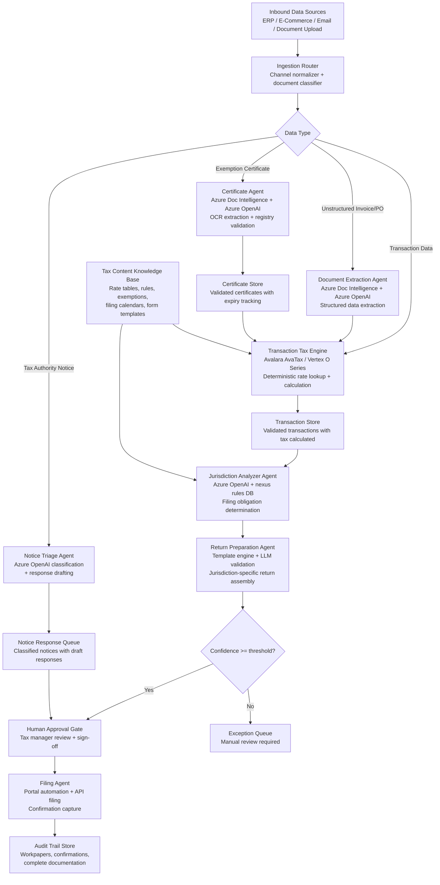

## Solution Overview

The critical architectural insight for tax compliance AI is that tax rate calculation and return math must remain deterministic — never delegated to an LLM. Avalara's production system processes billions of transactions across 190+ countries with 15-millisecond response times using a deterministic tax engine backed by expert-verified rate databases covering 12,000+ U.S. jurisdictions and 20,000+ globally. LLMs enter the picture for tasks that previously required human judgment on unstructured data: parsing exemption certificates, classifying tax authority notices, extracting transaction data from non-standard sources, and generating audit workpapers. Thomson Reuters' ONESOURCE Sales and Use Tax AI demonstrates this hybrid pattern — CoCounsel (their LLM layer) orchestrates data import, validation, and return mapping while deterministic tax content provides the actual rates and rules.

The recommended design is a **multi-agent orchestrator-worker system with a deterministic tax engine core**. An LLM-powered orchestrator (modeled after Avalara's Avi agent) coordinates specialized worker agents: a Document Extraction Agent processes unstructured inputs using Azure Document Intelligence and Azure OpenAI structured outputs; a Jurisdiction Analyzer Agent determines nexus obligations and filing requirements; a Return Preparation Agent assembles validated transaction data into jurisdiction-specific return formats; a Filing Agent automates portal submission; and a Notice Triage Agent classifies and drafts responses to tax authority correspondence. The deterministic tax engine (Avalara AvaTax API, Vertex O Series, or equivalent) handles all rate lookups, taxability determinations, and calculation logic — the LLM never computes tax amounts.

This separation is deliberate: in a domain where 800+ rate changes occur annually across U.S. jurisdictions alone, and where every filing position must be audit-defensible, the LLM handles language understanding and document reasoning while the tax engine provides authoritative, version-controlled tax content.

---

## Architecture

### Architecture Diagram

### Key Design Principles

1. **Deterministic Tax Engine Core**: All rate calculations, taxability determinations, and mathematical operations are delegated to the authoritative tax engine (Avalara, Vertex), never to the LLM. The LLM handles data preparation and contextual reasoning only.

2. **Document Intelligence for Unstructured Inputs**: Azure Document Intelligence handles OCR, layout analysis, and field extraction from PDFs, images, and scanned documents. The LLM validates and enriches the extracted data.

3. **Jurisdiction-First Architecture**: Nexus determination happens early in the pipeline. Only after confirming filing obligations does the system move to return preparation.

4. **Confidence-Based Escalation**: Every AI-generated return includes a confidence score. Returns below a threshold automatically route to human review before submission.

5. **Audit Trail by Design**: Every action (classification, extraction, calculation, filing) is logged with full traceability for regulatory defense.

---

## Multi-Agent Orchestration

| Agent | Role | Tools | Input | Output |
|-------|------|-------|-------|--------|
| **Orchestrator** | Master controller, dependency management | LangGraph StateGraph | Filing calendar, transaction schedule | Coordinated agent invocations, progress tracking |
| **Document Extraction** | Parse unstructured documents | Azure Document Intelligence, GPT-4o structured outputs | Invoices, POs, email attachments | Structured transaction data, confidence scores |
| **Certificate Validator** | Validate exemption certificates | OCR, registry lookup APIs, state verification | Exemption certificates (PDF, image) | Validated certificates with expiry tracking |
| **Jurisdiction Analyzer** | Determine filing obligations | Nexus rules database, economic threshold lookup | Transactions by origin/destination/product | Filing obligation list, nexus exposure report |
| **Tax Calculator** | Compute tax amounts | Avalara AvaTax or Vertex API | Transactions, jurisdiction, exemptions | Calculated tax by jurisdiction, rate justification |
| **Return Preparer** | Assemble jurisdiction-specific returns | Form templates, validation rules | Transactions with calculated tax | Return in jurisdiction-specific format, confidence |
| **Notice Classifier** | Triage tax authority notices | Classification model, notice templates | Notice text, sender domain | Notice type, urgency, required response deadline |
| **Filer** | Submit returns to tax authorities | Portal automation (Playwright), API filing | Approved return, filing credentials | Filing confirmation, receipt number, audit trail |

---

## Integration with Existing Systems

### ERP Integration (SAP S/4HANA, Oracle, NetSuite)

- **Inbound**: Extract transaction data via OData APIs or Fiori interfaces
- **Outbound**: Write validated tax amounts back to GL (tax line items), post to AP when applicable
- **Sync Frequency**: Real-time for POS transactions, batch (daily/weekly) for non-real-time transactions

### E-Commerce Platform Integration (Shopify, Magento, WooCommerce)

- **Inbound**: Stream transactions via webhook or batch API export
- **Outbound**: Update order records with calculated tax, sync to fulfillment system
- **Data Fields**: Order total, shipping address, products, discounts, exemption certificate (if applicable)

### Tax Authority Portals

- **Filing**: Playwright-based browser automation for portals without APIs; direct API filing where available (Avalara SFTP, Vertex API)
- **Notice Monitoring**: Scheduled polling of portal inboxes; email forwarding for notice capture
- **Credentials Management**: Azure Key Vault for secure credential storage and rotation

---

## Failure Modes & Mitigations

| Failure Mode | Impact | Mitigation |
|--------------|--------|-----------|
| Document extraction errors on poor-quality scans | Incorrect transaction data flowing to tax engine | Confidence scoring; manual review of low-confidence extractions before tax calculation. |
| Exemption certificate validation false positives | Incorrect exemption applied, tax underpayment | Cross-verify against state registry; require human review if registry lookup fails. |
| Nexus determination misses new filing obligations | Late filing, penalties | Quarterly nexus review; economic threshold monitoring; external notice triggers. |
| Notice classification misses urgent deadlines | Missed response deadline, penalty escalation | Rule-based deadline parsing; email alerts for high-urgency classifications; human spot-checking. |
| Portal filing failures (rate limits, authentication, format changes) | Filing delays | Retry logic with exponential backoff; fallback to alternative filing method (SFTP, paper); escalation alert. |
| Regulatory rule changes (new rates, exemptions) | Stale rules in engine, incorrect calculations | Subscribe to tax authority change feeds; validate rules monthly; version control all rule updates. |

---

## Data Privacy & Security

- **PII Handling**: Customer exemption certificate data, employee expense data containing sensitive information. Must be segregated, encrypted at rest and in transit.
- **Regional Data Residency**: EU transaction data must remain in EU region; equivalent for other jurisdictions with data residency laws.
- **Audit Trail Immutability**: All actions logged to immutable store (Azure Cosmos DB with audit logs); satisfies SOX, GDPR audit requirements.
- **Sandboxing**: Tax engine interactions sandboxed; API keys in Azure Key Vault, rotated quarterly.
