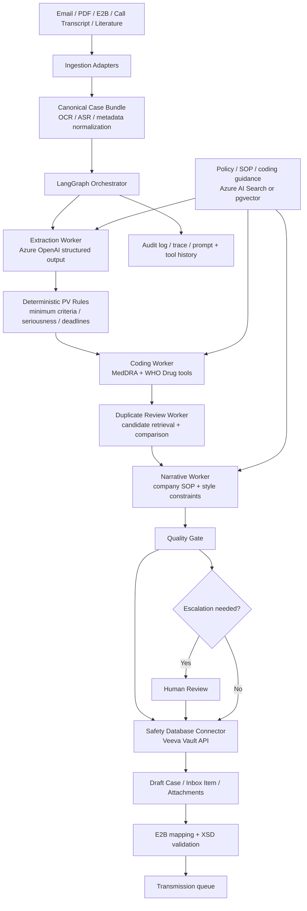

## Solution Overview

The right architecture for pharmacovigilance case intake is not a single "do everything" agent. Public implementations that publish useful detail are converging on a hybrid pattern instead: multiple specialized AI workers for intake, triage, translation, and reporting, wrapped in deterministic compliance checks and human review. Tech Mahindra describes a multi-agent case-intake system; ArisGlobal has moved the same direction with NavaX intake, translation, and multi-agent suites; Pfizer's peer-reviewed pilot showed AI is viable for extraction and case-validity assessment, but not yet strong enough to remove controlled review from every step.

For this use case, the recommended design is a graph-orchestrated, semi-autonomous workflow. LLM workers handle the parts humans currently do by reading and synthesizing messy evidence: extracting case facts from free text, proposing MedDRA and drug-dictionary mappings, comparing likely duplicates, and drafting the case narrative. Deterministic services handle everything that must be inspectable and reproducible: minimum-criteria checks, deadline rules, dictionary search, case-state transitions, XML schema validation, and submission handoff.

The reference integration seam targets Veeva Vault Safety because its public documentation exposes the intake inbox, object-record APIs, attachments, and E2B mapping/validation flow. The same pattern ports to other incumbent safety systems by swapping the connector layer, not the AI layer.

---

## Architecture

### Architecture Diagram



### Component Overview

| # | Component | Technology / Service | Role |
|---|-----------|----------------------|------|
| 1 | Ingestion adapters | Exchange / Graph API / SFTP / file watcher | Collect source reports without changing upstream channels. |
| 2 | Canonical bundle normalizer | Python service plus OCR/ASR where needed | Converts email, PDF, scan, and transcript inputs into a single case bundle for AI processing. |
| 3 | Orchestrator | LangGraph `StateGraph` | Manages persistent case state, branching, retries, and human interrupts. |
| 4 | Extraction worker | Azure OpenAI structured outputs | Produces schema-valid intake JSON with evidence spans. |
| 5 | Coding tools | Internal MedDRA and WHO Drug Dictionary services | Returns ranked terminology candidates; the model never invents codes. |
| 6 | Duplicate candidate service | Safety DB search + fuzzy matching service | Retrieves likely duplicates before the model compares them. |
| 7 | Narrative worker | Azure OpenAI + SOP retrieval | Drafts regulator-style narrative from structured fields and evidence. |
| 8 | Knowledge store | Azure AI Search or pgvector | Supplies SOPs, coding policies, and narrative exemplars for retrieval. |
| 9 | Safety-system connector | Veeva Vault API + Intake Inbox Item API | Writes draft records, uploads attachments, and advances lifecycle actions. |
| 10 | Submission validator | Safety DB E2B mapping + XSD validation | Validates outbound XML before transmission. |
| 11 | Human review queue | Safety database work queue or review UI | Approves serious, ambiguous, and low-confidence cases. |

---

## Data Flow

### AI Data Flow

| Stage | What enters the LLM | What comes out | What happens next |
|-------|---------------------|----------------|-------------------|
| Intake extraction | Canonical case bundle, source snippets, extraction schema, minimum-criteria instructions | Structured `IntakePacket` JSON with evidence spans and confidence | Rules engine checks four minimum ICSR criteria and seriousness flags. |
| Coding | Extracted verbatims, retrieved policy snippets, tool results from MedDRA / WHO Drug services | Proposed coded terms, rationale, unresolved ambiguities | Deterministic mapper writes only approved dictionary codes. |
| Duplicate review | Current case summary, top candidate cases from safety DB | Duplicate disposition and comparison rationale | Borderline matches route to human review. |
| Narrative drafting | Final structured case, house narrative template, SOP excerpts | Submission-ready English narrative draft | QC worker checks completeness and tone; reviewer approves when needed. |
| Quality critique | Draft case, required-field checklist, prior node outputs | Missing fields, contradictions, and escalation reason | Graph either auto-writes or pauses for review. |

### End-to-End Sequence

```text
1. Trigger  -> A new report arrives through email, PDF upload, transcript, or inbound E2B.
2. Ingest   -> Source material is normalized into a canonical case bundle.
3. Extract  -> The extraction worker emits structured JSON plus evidence spans.
4. Decide   -> Deterministic rules classify minimum criteria, seriousness, and deadline urgency.
5. Enrich   -> Coding and duplicate workers call domain tools and update the draft state.
6. Draft    -> The narrative worker creates a reviewer-facing case narrative.
7. Escalate -> Serious, ambiguous, or low-confidence cases pause for human review.
8. Write    -> Approved state is written into the safety database and attachments are stored.
9. Validate -> Outbound E2B XML is generated and validated against XSD.
10. Submit  -> The transmission queue sends only validated cases onward.
```

---

## LLM Role

| Step | AI Needed? | LLM Role | Why AI Fits |
|------|------------|----------|-------------|
| OCR / speech-to-text | Usually no | Use deterministic OCR or ASR first | This is recognition, not reasoning. |
| Minimum ICSR extraction | Yes | Normalize messy narratives into schema fields | Source reports are multilingual, incomplete, and free-form. |
| Four minimum criteria check | Mostly no | LLM surfaces evidence; rules engine decides valid/invalid gate | Regulatory validity should be explicit and replayable. |
| Seriousness and routing | Hybrid | LLM summarizes evidence; deterministic rules and reviewer thresholds make the routing choice | Severity is too important for a free-form answer alone. |
| MedDRA / drug coding | Yes, but tool-grounded | LLM chooses among retrieved candidates and explains ambiguity | The ambiguity is semantic, but the terminology source must be deterministic. |
| Duplicate review | Yes, but tool-grounded | LLM compares candidate cases and explains likely match/non-match | Human reviewers do semantic comparison today; candidate retrieval remains deterministic. |
| Narrative generation | Yes | Synthesize case chronology and clinical summary | This is high-value language generation with clear output constraints. |
| E2B generation and schema validation | No | None | XML generation and XSD validation should stay deterministic. |

---

## Agent Pattern

| Aspect | Choice |
|--------|--------|
| **Pattern** | Hybrid multi-agent orchestrator-worker with deterministic rule gates and retrieval augmentation |
| **Orchestration** | Graph-based, stateful, event-driven |
| **Human-in-the-Loop** | Mandatory escalation for serious, fatal, ambiguous, or low-confidence cases |
| **State Management** | Persistent case state with checkpointing and resumable review threads |
| **Autonomy Level** | Semi-autonomous: touchless only for low-risk routine cases |

### Why This Pattern?

This problem is heterogeneous. Intake extraction, terminology coding, duplicate detection, and narrative writing are different cognitive jobs. Public implementations that publish their design choices are splitting these jobs instead of forcing one giant agent to do all of them: Tech Mahindra explicitly describes a multi-agent architecture, and ArisGlobal now markets dedicated agents and agent suites rather than a monolith.

The regulated parts of the workflow also argue against a single-agent design. A pure ReAct agent can reason and call tools, but it mixes policy, branching, and action selection inside one prompt loop, which makes validation harder. A pure RAG pipeline is not enough either, because the system must write to real systems, manage multi-step state, and stop for reviewers. A graph with narrow worker prompts gives clearer validation boundaries: each worker owns one output contract, while deterministic nodes enforce submission policy, deadlines, and schema compliance.

Pfizer's pilot is a useful caution: machine learning clearly helped with extraction and validity classification, but published performance still left edge-case headroom, especially for some entity types and case-level completeness. That is exactly why this design allows touchless routing for low-risk cases while keeping hard interrupts around serious cases, causality disputes, low-confidence coding, and final writeback.

---

## Prompt Strategy

### Prompt Structure

| Worker | Prompt Style | Why |
|--------|--------------|-----|
| Extraction | Schema-first system prompt plus short few-shot examples | Keeps outputs deterministic and auditable. |
| Coding | Tool-first prompt with explicit "never invent a code" rule | Forces the model to choose only from dictionary results. |
| Duplicate review | Comparative prompt over a small retrieved candidate set | Avoids hallucinated search and keeps token use bounded. |
| Narrative | Template-constrained generation with section order and prohibited content list | Keeps narrative style consistent with SOP and review expectations. |
| QC critic | Checklist-style prompt returning only issues and escalation reason | Works better than free-form "review this" prompts in regulated flows. |

### Example Extraction Prompt

```text
System:
You are the intake extraction worker for a pharmacovigilance system.
Your job is to populate the IntakePacket schema from the provided case bundle.

Rules:
1. Only extract facts supported by quoted evidence.
2. If a field is missing, return null rather than guessing.
3. Do not invent MedDRA or WHO Drug codes.
4. Do not decide causality.
5. Return only the schema-valid JSON object.

Required evidence:
- identifiable patient
- identifiable reporter
- suspect product
- adverse event
```

### Example Coding Prompt

```text
System:
You are the coding worker for adverse event case processing.
You may call search_meddra and search_who_drug.

Rules:
1. Use tool results before selecting any code.
2. If the best candidate is uncertain, mark requires_human_review=true.
3. Return the chosen term, code, confidence, and the exact evidence snippet.
4. Never invent a preferred term or code.
```

### Prompt Engineering Rules

- Keep worker prompts narrow. Specialized workers are easier to validate than one universal prompt.
- Require evidence spans in every extraction output so reviewers can replay model decisions.
- Use structured output schemas for extraction and QC; use tool-calling only when the worker genuinely needs external lookup.
- Keep tool count small and task-specific.

---

## Human-in-the-Loop

### Escalation Policy

| Trigger | Action | Why |
|---------|--------|-----|
| Serious or fatal case | Mandatory medical review before writeback | Regulatory and clinical risk is highest here. |
| Duplicate confidence in gray zone | Human resolves merge / split decision | Duplicate mistakes distort downstream safety signals. |
| Missing one of four minimum criteria | Human decides follow-up path | Incomplete cases still need governed handling. |
| Coding confidence below threshold | Human coder chooses final term | Public pilots show some entity classes remain difficult. |
| Narrative critique returns blocking issue | Human reviewer edits or rejects | Narrative quality is safety- and inspection-relevant. |
| Any submission validation failure | Human fixes case before transmission | XML/XSD failure must never auto-resubmit. |

### Seed Thresholds

These thresholds should be calibrated on a sponsor-owned gold set, but a practical starting point is:

- Auto-route only when extraction confidence is `>= 0.90`
- Force review when duplicate confidence is between `0.60` and `0.85`
- Force review when coding worker cannot narrow to a single preferred term
- Force review on all serious, fatal, pediatric, pregnancy, and literature cases

Those thresholds are design seeds, not published vendor defaults. They are intentionally conservative because the public evidence base is stronger for intake automation than for fully autonomous regulatory submission.

---

## Integration Points

| System | Integration Method | Direction | Purpose |
|--------|--------------------|-----------|---------|
| Safety intake inbox | Veeva Intake Inbox Item API | Write | Create or update intake items from inbound source material. |
| Safety case records | Veeva Vault object-record API | Read / Write | Persist draft case data, reviewer decisions, and attachments. |
| Case attachments | Veeva object-record attachments API | Write | Store source PDFs, emails, and generated artifacts with the case. |
| E2B output | Veeva E2B mapping and validation flow | Write / Validate | Generate and validate outbound ICH E2B(R3) XML. |
| MedDRA dictionary | Licensed terminology service | Read | Retrieve ranked LLT/PT candidates for adverse events. |
| WHO Drug Dictionary | Licensed terminology service | Read | Resolve product names and suspect drug candidates. |
| SOP and narrative templates | Azure AI Search or pgvector | Read | Ground prompts in company procedures and writing standards. |
| Source channels | Exchange / SharePoint / SFTP / gateway | Read | Preserve current operating model while adding AI augmentation. |

---

## Tools & Frameworks

### AI / ML Stack

| Component | Technology | Why Chosen |
|-----------|------------|------------|
| **LLM Provider** | Azure OpenAI | Enterprise identity, private networking, and first-party structured outputs. |
| **Worker orchestration** | LangGraph | Durable graph state, conditional routing, and native interrupt/resume for reviewer gates. |
| **Structured extraction** | Azure OpenAI structured outputs | Enforces JSON schema compliance for intake packets and QC results. |
| **Azure-native alternative** | Microsoft Foundry agents or Semantic Kernel | Useful for teams standardizing on managed Azure agents or .NET plugin patterns. |
| **Retrieval** | Azure AI Search or pgvector | Retrieval is needed for SOPs and narrative templates, not for core case facts. |

### Infrastructure Stack

| Component | Technology | Why Chosen |
|-----------|------------|------------|
| **Compute** | Containerized Python worker on AKS / App Service | Stateless workers are enough; graph state lives in the checkpointer. |
| **Storage** | Blob storage + safety-system attachments | Retain source material and generated artifacts without duplicating the system of record. |
| **Queue** | Service Bus | Smooths bursty report volume and retry handling. |
| **Monitoring** | Application Insights / OpenTelemetry | Trace prompt, tool, and validation outcomes. |

### Open Source / Third Party

| Component | Technology | Why Chosen |
|-----------|------------|------------|
| **Open-source orchestrator** | LangGraph | Best fit for graph branching and human interrupts. |
| **.NET plugin model** | Semantic Kernel | Strong option when the broader platform is already on .NET. |
| **Safety platform seam** | Veeva Vault Safety | Publicly documented intake and E2B interfaces make the design concrete. |

---

## Security & Compliance

| Concern | Approach |
|---------|----------|
| **Authentication** | Managed identity or short-lived service credentials for all AI and connector services. |
| **Authorization** | Restrict AI workers to narrow tool scopes; do not give the model raw database credentials. |
| **PII Handling** | Keep the full case bundle inside the validated environment; expose only the minimum fields required to each worker. |
| **Audit Trail** | Persist prompts, tool calls, evidence spans, reviewer decisions, and writeback payloads per case. |
| **Model Governance** | Use schema-first outputs, tool allowlists, and deterministic validations before any database write. |
| **Submission Safety** | Never let the model generate final XML directly; use the safety platform's mapped E2B export and XSD validation. |

---

## Scalability & Performance

| Dimension | Approach |
|-----------|----------|
| **Throughput** | Queue-based fan-out across routine cases; design target of 150-200 cases/day for one automation cell. |
| **Latency Target** | Routine case to submission-ready draft in under 30 minutes; serious-case triage prioritized immediately. |
| **Scaling Strategy** | Scale normalization and AI workers horizontally; keep reviewers only on escalated cases. |
| **Rate Limits** | Disable parallel tool calls for strict structured-output nodes and use queue backpressure during model throttling. |
| **Caching** | Cache SOP retrieval, dictionary lookups, and case-template fragments; never cache raw patient-specific outputs across cases. |

---

## Cost Estimate

The table below is an estimated operating envelope for a mid-size sponsor or CRO processing roughly 2,000 cases per month. Public sources publish percentage savings rather than cloud invoices, so these values are scenario-based and should be validated in a pilot.

| Component | Unit Cost | Monthly Estimate |
|-----------|-----------|------------------|
| **LLM API calls** | Metered token usage | `$10k-$20k` estimated |
| **Orchestrator / API compute** | Container runtime + queue consumers | `$3k-$7k` estimated |
| **Retrieval / storage / audit** | Search, blob, trace retention | `$2k-$5k` estimated |
| **Residual reviewer effort** | Escalated cases only | `$90k-$130k` estimated |
| **Total** |  | **`$105k-$162k` estimated** |

---

## Alternatives Considered

| Alternative | Pros | Cons | Why Not Chosen |
|-------------|------|------|----------------|
| Single tool-calling agent | Simple mental model, fewer moving parts | Poor validation boundaries, brittle prompts, harder reviewer routing | Too opaque for regulated multi-step case handling. |
| Pure rules / OCR pipeline | Easy to validate, deterministic | Weak on multilingual narratives, paraphrase, and chronology synthesis | Leaves too much manual reading and writing in place. |
| Pure RAG assistant | Good for SOP lookup | Does not manage state, approvals, or database actions well | Helpful as a subsystem, not as the operating pattern. |
| Fully managed Azure agents only | Azure-native operations model | Less transparent graph control than a first-class workflow graph for this use case | Viable alternative for Azure-first teams, but the graph pattern is a better pedagogical fit here. |
