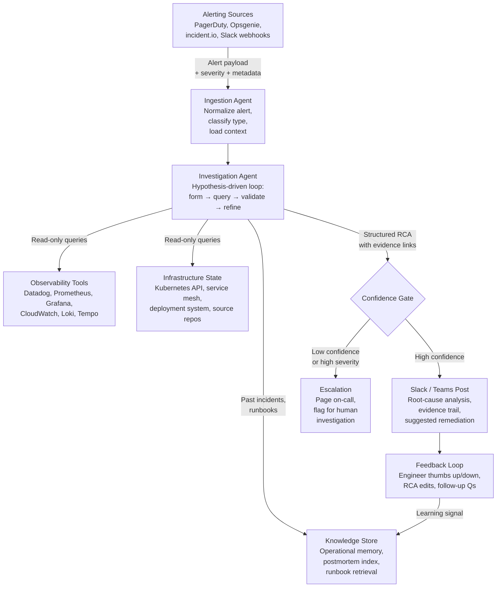

## What This Design Covers

This design covers an agentic AI system that autonomously investigates production alerts by correlating signals across logs, metrics, traces, deployments, and dependency graphs, then posts a structured root-cause analysis into the team's alerting channel within minutes. The operating model pairs a hypothesis-driven AI investigation agent with read-only access to the organization's existing observability stack. Humans retain final decision authority on all production write actions — rollbacks, scaling changes, feature flag toggles, and traffic shifts. The design boundary includes alert investigation, root-cause hypothesis generation, cross-team deployment correlation, and audit-trail production. Proactive capacity planning, security incident response, and postmortem authoring remain outside the first release. The architecture draws on published deployments from Cleric AI at BlaBlaCar (553 investigations tracked, 78% actionable), Datadog Bits AI SRE (2,000+ customer environments), Microsoft Azure SRE Agent (35,000+ incidents mitigated internally), and AWS DevOps Agent (94% root-cause accuracy reported in preview). [S1][S3][S5][S6]

## Recommended Operating Model

| Decision Area | Recommendation |
|---------------|----------------|
| **Autonomy Model** | Full autonomy for alert ingestion, multi-tool investigation, hypothesis formation, and root-cause analysis posting. Human approval required for all production write actions (rollback, restart, scale, feature flag toggle). Optional policy-bounded auto-remediation for pre-approved low-risk actions (e.g., restart a known-flaky pod) only after pilot validation. [S1][S5] |
| **System of Record** | The observability platform (Datadog, Prometheus/Grafana, New Relic, CloudWatch) remains authoritative for telemetry. The incident management platform (PagerDuty, incident.io, Opsgenie) remains the system of record for incident lifecycle, severity, and ownership. The AI agent is an investigation layer, not a replacement for either. [S3][S7] |
| **Human Decision Points** | On-call engineer reviews the AI-generated RCA before taking remediation action. Incident commander decides severity escalation. Domain experts validate cross-team hypotheses. Security reviews any investigation that touches authentication or PII-bearing logs. [S1] |
| **Primary Value Driver** | Speed and coverage. Investigation time drops from 30+ minutes of manual triage to 2–5 minutes of autonomous analysis. Senior SRE capacity (20–30% of which is consumed by investigation) is returned to reliability engineering. Alert coverage expands from the fraction that humans can investigate to near-complete coverage of recurring alert types. [S1][S2][S3] |

## Architecture

### System Diagram

### Component Responsibilities

| Component | Role | Notes |
|-----------|------|-------|
| Ingestion Agent | Receives alerts from PagerDuty, Opsgenie, incident.io, or Slack webhooks. Normalizes the alert payload, classifies alert type (latency, error rate, saturation, crash loop), and loads relevant context (service ownership, recent deployments, past incidents for this service). | Runs 24/7 with no human prompting. Must handle alert storms without queuing delays. Azure SRE Agent and PagerDuty SRE Agent both use incident platform connectors for this step. [S5][S7] |
| Investigation Agent | Executes a hypothesis-driven diagnostic loop: forms an initial root-cause hypothesis from the alert and context, queries observability tools to test it, validates or refutes, then branches into deeper sub-hypotheses until the search space is exhausted or a high-confidence root cause is found. | This is the core AI component. Datadog's Bits AI SRE uses this exact pattern — "each validated hypothesis triggers deeper sub-hypotheses, and branches are explored or pruned based on supporting evidence." Investigations complete in 3–4 minutes. [S3][S4][S9] |
| Knowledge Store | Maintains operational memory: past investigation results, postmortem summaries, runbook content, service dependency maps, and team-specific patterns. Provides RAG retrieval for the investigation agent. | Cleric calls this "operational memory" and reports that it makes every investigation faster than the last. Azure SRE Agent describes it as "knowledge that never leaves." Both learn from engineer feedback. [S1][S2][S5] |
| Confidence Gate | Evaluates the investigation output against confidence thresholds. High-confidence RCAs with supporting evidence are posted directly. Low-confidence results or high-severity incidents are escalated to human investigators with the partial analysis attached. | Prevents the agent from posting low-quality analysis that erodes trust. Confidence scoring should be calibrated during pilot using engineer feedback ratings. |
| Feedback Loop | Captures engineer reactions (thumbs up/down, RCA edits, follow-up questions) and feeds them back into the knowledge store. Tracks investigation quality metrics over time. | Cleric tracks feedback via LangSmith and reports that investigation success rate improves measurably after engineer feedback. [S1][S2] |

## End-to-End Flow

| Step | What Happens | Owner |
|------|---------------|-------|
| 1 | An alert fires from the observability platform (SLO breach, error-rate spike, pod crash loop, latency threshold exceeded). The alert is routed to the AI agent via webhook or incident platform integration simultaneously with the normal on-call page. | Alerting System |
| 2 | The ingestion agent normalizes the alert, identifies the affected service and owning team, loads recent deployment history (last 24h of commits, feature flag changes, infrastructure changes), and retrieves any past investigations or postmortems for this service and alert type from the knowledge store. | Ingestion Agent [S5] |
| 3 | The investigation agent forms an initial hypothesis based on the alert type and context (e.g., "latency spike caused by a recent deployment introducing a slow database query"). It queries the observability stack — pulling metrics, logs, traces, and Kubernetes pod state — to test the hypothesis. It validates, refutes, or refines, then branches into sub-hypotheses. This loop repeats until a root cause is identified or the search space is exhausted. | Investigation Agent [S3][S9] |
| 4 | The agent posts a structured root-cause analysis into the Slack/Teams alerting channel. The RCA includes: the hypothesis chain, supporting evidence (log excerpts, metric graphs, trace spans, deployment diffs), confidence level, and suggested remediation action. If confidence is low or severity is high, the agent escalates to the on-call engineer with the partial analysis. | Confidence Gate + Slack/Teams [S1][S3] |
| 5 | The on-call engineer reviews the RCA, takes remediation action (rollback, restart, scale, feature flag toggle), and provides feedback on the investigation quality. The feedback is stored in the knowledge store. The incident lifecycle continues through the incident management platform. | On-Call Engineer + Feedback Loop |

## AI Responsibilities and Boundaries

| Workflow Area | AI Does | Deterministic System Does | Human Owns |
|---------------|---------|---------------------------|------------|
| Alert investigation | Autonomously correlates logs, metrics, traces, deployments, and dependency state across the full observability stack. Forms and tests root-cause hypotheses. Produces a structured RCA with evidence links in 2–5 minutes. [S1][S3] | Alerting rules, SLO thresholds, and routing policies remain in the observability platform. PagerDuty/Opsgenie handles on-call rotation and escalation timers. | Reviews and validates the AI-generated RCA. Decides whether the root cause is correct before acting on it. |
| Remediation | Suggests specific remediation actions (rollback to commit X, restart pod Y, disable feature flag Z) with rationale. For pre-approved low-risk actions, may execute autonomously with full audit trail. [S5][S6] | Deployment system enforces rollback procedures. Kubernetes enforces pod restart policies. Feature flag system enforces toggle access controls. | Approves all high-risk remediation actions. Decides severity escalation. Owns the incident timeline. |
| Knowledge capture | Records investigation results, engineer feedback, and resolution patterns in the knowledge store. Retrieves relevant past incidents during future investigations. [S1][S2] | Incident management platform maintains the official incident record, postmortem, and action items. Source control maintains runbooks and service documentation. | Writes the postmortem narrative. Assigns and tracks remediation action items. Updates runbooks based on learnings. |

## Integration Seams

| System | Integration Method | Why It Matters |
|--------|--------------------|----------------|
| Observability platform (Datadog, Prometheus/Grafana, New Relic, CloudWatch) | Read-only API access for metrics queries, log search, trace retrieval, and dashboard data. Datadog Bits AI SRE accesses metrics, logs, traces, dashboards, changes, source code, RUM, database monitoring, network path, and continuous profiler. [S3][S4] | The observability stack is where all diagnostic evidence lives. The agent must query it the same way a human SRE would — but faster and across more data sources simultaneously. Read-only access is a hard security requirement. |
| Incident management platform (PagerDuty, incident.io, Opsgenie, ServiceNow) | Webhook or API integration for alert ingestion and incident lifecycle updates. Azure SRE Agent supports PagerDuty, ServiceNow, and Azure Monitor natively. [S5][S7] | The incident platform controls alert routing, on-call schedules, and severity classification. The AI agent augments it but does not replace the incident lifecycle. |
| Deployment and change tracking (ArgoCD, GitHub Actions, GitLab CI, Spinnaker, LaunchDarkly) | Read-only API access to recent deployments, commit history, feature flag changes, and infrastructure changes (Terraform runs). AWS DevOps Agent integrates with GitHub Actions and GitLab CI/CD to correlate deployments with incidents. [S6] | A large share of production incidents are caused by recent changes. Temporal correlation between a deployment and an alert is one of the highest-signal investigation steps. |
| Kubernetes and service mesh (Kubernetes API, Istio, Linkerd) | Read-only access to pod state, events, service topology, and mesh telemetry. BlaBlaCar runs Istio service mesh and Cleric queries Kubernetes state as part of every investigation. [S1] | Kubernetes pod state (crash loops, OOMKills, pending pods) and service mesh metrics (retry rates, circuit breaker state) are primary diagnostic signals for infrastructure-layer alerts. |
| Chat platform (Slack, Microsoft Teams) | Bot integration for posting RCA results, receiving engineer feedback, and supporting conversational follow-up. Cleric, Bits AI SRE, incident.io AI SRE, and PagerDuty SRE Agent all use Slack as the primary interaction surface. [S1][S3][S7][S8] | Slack/Teams is where on-call engineers already work during incidents. Meeting engineers in their existing workflow eliminates tool-switching friction and maximizes adoption. |

## Control Model

| Risk | Control |
|------|---------|
| AI posts an incorrect root-cause analysis, leading the on-call engineer to take the wrong remediation action | Confidence scoring on every investigation. Low-confidence results are flagged explicitly. RCA includes the full hypothesis chain and evidence links so the engineer can verify the reasoning, not just the conclusion. Engineer feedback loop tracks false-positive and false-negative rates. Target: ≥ 78% actionable rate (Cleric/BlaBlaCar baseline). [S1] |
| Agent accesses sensitive data in logs (PII, authentication tokens, request payloads) | Read-only access scoped to observability APIs — the agent queries the same interfaces human engineers use, with the same RBAC controls. Log queries should use existing redaction and masking policies. Agent operates within the customer's cloud boundary or a dedicated single-tenant deployment. No telemetry data used for cross-customer model training. [S5] |
| Agent takes an unsafe production write action (rollback, restart, scale) without approval | All production write actions require explicit human approval by default. Auto-remediation is opt-in, policy-bounded, and limited to pre-approved low-risk actions with a full audit trail. Every tool call and action is logged and traceable. [S5][S6] |
| Alert storm overwhelms the agent during a major outage, degrading investigation quality | Rate limiting and prioritization: the agent processes highest-severity alerts first and deduplicates correlated alerts. Parallel investigation capacity is bounded. During major outages, the agent provides a consolidated cross-service analysis rather than investigating each alert independently. |
| Agent investigation reveals a security incident that requires SOC handling | Alert classification in the ingestion step identifies security-relevant signals (authentication failures, privilege escalation, data exfiltration patterns) and routes them to the security team rather than proceeding with SRE-style investigation. Security incidents follow a separate response process. |

## Reference Technology Stack

| Layer | Default Choice | Reason | Viable Alternative |
|-------|----------------|--------|--------------------|
| **Model layer** | Claude or GPT-4 class model for hypothesis generation, evidence reasoning, and RCA synthesis. | Investigation requires multi-step reasoning across heterogeneous data sources (metrics, logs, traces, code diffs). Large-context models handle the volume of evidence gathered during a single investigation. Datadog and Cleric both use frontier LLMs for their investigation agents. [S3][S9] | Azure SRE Agent uses Azure OpenAI. AWS DevOps Agent uses Amazon Bedrock. PagerDuty uses a combination of ML models and LLMs. [S5][S6][S7] |
| **Orchestration** | LangGraph or custom agent loop with tool-calling. The investigation agent runs a hypothesis-driven loop with branching and pruning, which maps naturally to a graph-based orchestration framework. | The investigation pattern is not a linear pipeline — it branches, backtracks, and refines. Graph-based orchestration handles this better than sequential chains. Datadog built a custom agent harness with MCP tool integration for this reason. [S9] | Temporal for the outer workflow (alert ingestion, scheduling, retries). Semantic Kernel (used by Azure SRE Agent on Azure AI Foundry). [S5] |
| **Retrieval / memory** | Vector store (Pinecone, Weaviate, or pgvector) for runbook and postmortem retrieval. Structured database for past investigation results, service metadata, and deployment history. | The knowledge store needs semantic search for runbooks and past incidents, plus structured queries for deployment history and service ownership. Cleric's "operational memory" and Azure SRE Agent's "knowledge that never leaves" both combine these. [S1][S2][S5] | Graph database (Neo4j) for service dependency mapping and causal relationship tracking. |
| **Observability** | OpenTelemetry for agent tracing. LangSmith or Datadog LLM Observability for prompt/completion logging, tool-call tracking, and investigation quality metrics. | Every investigation must produce an auditable trace — which tools were called, what data was returned, how the hypothesis evolved. This is essential for trust, debugging, and regulatory compliance. Cleric uses LangSmith for this. Datadog built an Agent Trace view. [S2][S4] | Weights & Biases Weave, Arize Phoenix, or custom OpenTelemetry instrumentation. |

## Key Design Decisions

| Decision | Choice | Why It Fits This Use Case |
|----------|--------|---------------------------|
| Hypothesis-driven investigation rather than data summarization | The agent forms, tests, and refines root-cause hypotheses rather than dumping all available telemetry into a summary. | Summarization produces noise. Hypothesis-driven investigation mirrors how senior SREs actually work — form a theory, check the evidence, narrow or pivot. Datadog explicitly chose this approach: "the causal relationship between the monitor alert and specific telemetry data pertaining to a hypothesis, rather than looking at all of the available telemetry data at once." [S9] |
| Read-only access by default, write actions human-approved | The agent can query any observability tool but cannot modify production state without explicit approval. | Trust is the adoption bottleneck. BlaBlaCar started Cleric with zero write access and expanded scope only after months of validated read-only investigations. Azure SRE Agent and AWS DevOps Agent both default to read-only with opt-in auto-remediation. [S1][S5][S6] |
| Slack/Teams as the primary interaction surface | Investigation results are posted into the team's existing alerting channel, not a separate dashboard or portal. | On-call engineers live in Slack during incidents. Every major AI SRE product (Cleric, Bits AI SRE, incident.io AI SRE, PagerDuty SRE Agent) posts into Slack. A separate UI creates adoption friction. [S1][S3][S7][S8] |
| Operational memory that learns from feedback | The agent stores investigation results and engineer feedback, improving future investigations of similar alerts. | Cleric reached a perfect 5/5 engineer rating within three weeks of joining BlaBlaCar's IAM team, with no prior domain-specific configuration — the agent learned the team's infrastructure from investigations and feedback. This continuous learning is the difference between a static tool and a self-improving teammate. [S1][S2] |
