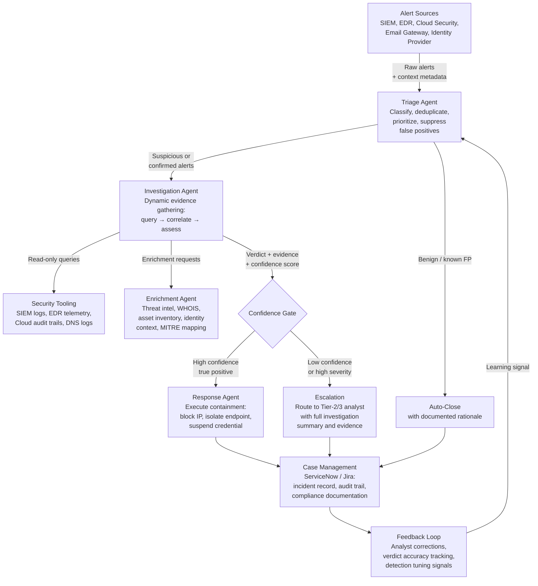

## What This Design Covers

This design covers an agentic AI system that autonomously triages, investigates, and responds to security alerts flowing through an enterprise SOC. The operating model deploys specialized AI agents — triage, investigation, enrichment, and response — that reason dynamically over each alert rather than executing static playbooks. Humans retain authority over containment actions on critical assets, severity escalation, and threat-hunting strategy. The design boundary includes alert classification, automated investigation, false-positive suppression, low-risk containment, and auditable decision trails. Advanced persistent threat response, digital forensics, malware reverse engineering, and security tool selection remain outside scope. The architecture draws on published deployments from Palo Alto Networks XSIAM (85% alert volume reduction, 244% ROI), CrowdStrike Charlotte AI (>98% triage accuracy), Microsoft Security Copilot (30% MTTR reduction), and Torq HyperSOC (89% case automation at Kenvue). [S1][S3][S5][S8]

## Recommended Operating Model

| Decision Area | Recommendation |
|---------------|----------------|
| **Autonomy Model** | Full autonomy for alert ingestion, enrichment, triage classification, and investigation. Automated containment (IP blocking, credential suspension, endpoint isolation) for pre-approved low-risk scenarios with bounded autonomy guardrails. Human approval required for containment on critical assets, severity escalation beyond P2, and any action affecting production availability. CrowdStrike Charlotte AI calls this "bounded autonomy" — the AI operates within customer-defined guardrails. [S3][S7] |
| **System of Record** | The SIEM (Splunk, Microsoft Sentinel, Elastic, QRadar) remains authoritative for security telemetry and correlation rules. The ticketing system (ServiceNow, Jira) remains the system of record for incident lifecycle and compliance audit. The AI agents are an investigation and decision layer, not a replacement for either. [S14] |
| **Human Decision Points** | Tier-2/3 analyst reviews AI verdicts on high-severity or ambiguous alerts. SOC manager approves containment actions on critical assets. Detection engineering team reviews AI-flagged tuning recommendations for detection rules. Compliance reviews audit trails quarterly. [S5][S7] |
| **Primary Value Driver** | Coverage and speed. Alert investigation time drops from 15–40 minutes to under 5 minutes. False positive suppression eliminates 80–90% of noise reaching human analysts. 24/7 autonomous triage closes the coverage gap where 62% of alerts previously went uninvestigated. Analyst capacity shifts from repetitive triage to threat hunting and detection engineering. [S1][S3][S9] |

## Architecture

### System Diagram

### Component Responsibilities

| Component | Role | Notes |
|-----------|------|-------|
| Triage Agent | Receives raw alerts from SIEM and EDR. Classifies alert type and severity, deduplicates correlated alerts, suppresses known false positives, and prioritizes by business impact and asset criticality. | Runs continuously. Must handle alert storms (10,000+ alerts/day) without queuing delays. CrowdStrike's Charlotte AI achieves >98% accuracy at this step using models trained on millions of expert triage decisions. [S3] |
| Investigation Agent | Executes dynamic, reasoning-based investigation for each suspicious alert. Queries SIEM logs, EDR telemetry, cloud audit trails, and identity events to build an evidence timeline. Produces a structured verdict with confidence score. | Core AI reasoning component. Google SecOps Triage Agent completes investigations in 60 seconds on average using this pattern — forming a dynamic plan, running searches, enriching IOCs, and delivering a verdict. [S6] |
| Enrichment Agent | Correlates IOCs against threat intelligence feeds, resolves WHOIS and DNS records, maps techniques to MITRE ATT&CK, and pulls asset ownership and identity context from CMDB and directory services. | Operates as a tool layer called by the investigation agent. Swimlane Hero AI uses dedicated Threat Intelligence and MITRE ATT&CK agents for this function. [S9] |
| Response Agent | Executes pre-approved containment actions (IP/domain blocking, endpoint isolation, credential suspension, account lockout) via SOAR or direct API calls. Logs every action with full rationale for audit. | Bounded by policy: only executes actions within customer-defined guardrails. High-risk containment requires human approval. Every action is reversible and logged. [S3][S7] |
| Feedback Loop | Captures analyst corrections on AI verdicts, tracks triage accuracy and false-positive rates over time, and routes detection tuning signals back to the triage agent and detection engineering team. | Torq's Socrates uses episodic memory to learn from past incidents and improve future investigations. [S7] |

## End-to-End Flow

| Step | What Happens | Owner |
|------|---------------|-------|
| 1 | A security alert fires from the SIEM or EDR platform (malware detection, suspicious login, data exfiltration signal, phishing indicator, policy violation). The alert is routed to the triage agent via webhook or API connector. | Alerting System |
| 2 | The triage agent classifies the alert type, checks it against known false-positive patterns, deduplicates against recent correlated alerts, and assigns a priority score based on asset criticality and threat context. Known benign alerts are auto-closed with documented rationale. Suspicious alerts proceed to investigation. | Triage Agent [S3] |
| 3 | The investigation agent gathers evidence: queries SIEM logs for related events in the surrounding time window, pulls EDR process trees and command-line activity, checks cloud audit trails, and requests IOC enrichment from the enrichment agent. It builds an evidence timeline and produces a verdict (true positive, false positive, or inconclusive) with a confidence score. | Investigation Agent + Enrichment Agent [S6][S9] |
| 4 | High-confidence true positives with pre-approved response types trigger the response agent, which executes containment (block source IP, isolate affected endpoint, suspend compromised credential). Low-confidence verdicts or high-severity alerts are escalated to a Tier-2/3 analyst with the complete investigation summary, evidence chain, and recommended actions. | Confidence Gate + Response Agent [S7] |
| 5 | Every triage decision, investigation, and response action is recorded in the case management system with full audit trail. Analysts review escalated cases and provide feedback on AI verdicts. Detection engineering uses AI-flagged tuning signals to improve detection rules. | Case Management + Feedback Loop |

## AI Responsibilities and Boundaries

| Workflow Area | AI Does | Deterministic System Does | Human Owns |
|---------------|---------|---------------------------|------------|
| Alert triage | Classifies alert severity and type, suppresses false positives, deduplicates correlated alerts, prioritizes by business impact. Handles 80–95% of Tier-1 triage autonomously. [S1][S3] | SIEM correlation rules generate the initial alerts. EDR detection engine identifies endpoint threats. Alert routing policies control which alerts reach the AI. | Reviews AI triage accuracy metrics. Adjusts triage policy thresholds. Handles alerts the AI marks as inconclusive. |
| Investigation | Queries across SIEM, EDR, cloud, identity, and threat intel to build evidence timelines. Maps to MITRE ATT&CK techniques. Produces structured verdicts with confidence scores. [S6][S9] | Threat intelligence feeds provide IOC databases. CMDB provides asset and owner context. Directory services provide identity context. | Reviews and validates AI verdicts on high-severity incidents. Leads investigation of advanced persistent threats and novel attack patterns. |
| Response | Executes pre-approved containment: IP blocking, endpoint isolation, credential suspension. Logs every action. [S7] | Firewall enforces block rules. EDR platform enforces isolation. Identity provider enforces credential revocation. SOAR orchestrates multi-step playbooks. | Approves containment on critical assets. Decides severity escalation. Leads incident response for confirmed breaches. Owns communications to stakeholders. |
| Reporting | Generates investigation summaries, audit-ready decision trails, and compliance documentation. [S5] | Ticketing system maintains incident lifecycle records. SIEM maintains log retention per compliance requirements. | Writes post-incident reviews. Presents to compliance auditors. Tracks remediation action items. |

## Integration Seams

| System | Integration Method | Why It Matters |
|--------|--------------------|----------------|
| SIEM (Splunk, Microsoft Sentinel, Elastic, QRadar) | Webhook or streaming API for alert ingestion; read-only search API for log queries during investigation. Microsoft Security Copilot integrates natively with Sentinel via plugins. [S5] | The SIEM holds all correlated security events. The AI must query it the same way an analyst would — but across more data sources simultaneously. |
| EDR (CrowdStrike Falcon, Microsoft Defender, SentinelOne) | Read-only API for endpoint telemetry, process trees, command-line history, and file activity. CrowdStrike Charlotte AI reasons natively across Falcon endpoint data. [S3] | Endpoint telemetry is the primary evidence source for malware, lateral movement, and privilege escalation investigations. |
| Threat Intelligence (MISP, Recorded Future, VirusTotal, Mandiant) | API enrichment calls for IOC lookup, reputation scoring, and campaign attribution. Google SecOps Triage Agent uses Google Threat Intelligence enrichment natively. [S6] | IOC correlation separates known-bad indicators from noise. Without enrichment, the AI cannot distinguish a suspicious IP from a confirmed C2 server. |
| Identity Provider (Microsoft Entra ID, Okta, CyberArk) | Read-only API for authentication logs, session history, privilege assignments, and MFA status. Write API (gated by policy) for credential suspension and session revocation. [S11] | Identity compromise is involved in the majority of breaches. The AI needs identity context for every investigation and must be able to act on compromised credentials. |
| Ticketing / Case Management (ServiceNow, Jira) | API for creating incident records, updating case status, and attaching investigation artifacts. [S14] | The ticketing system is the compliance audit trail. Every AI decision must be recorded there, not just in the AI platform's logs. |

## Control Model

| Risk | Control |
|------|---------|
| AI misclassifies a true positive as benign, allowing a real threat to go uninvestigated | Confidence scoring on every verdict. Verdicts below the confidence threshold are escalated to human analysts rather than auto-closed. Triage accuracy tracked continuously against analyst decisions. Target: >95% agreement with expert verdicts. Pilot starts in shadow mode where AI verdicts are compared to analyst decisions before any autonomous action. [S3][S5] |
| AI executes an overly aggressive containment action, causing business disruption | Bounded autonomy: containment actions are scoped by policy. Critical assets require human approval. All containment actions are reversible. Response agent logs every action with rationale and evidence links. SOC manager reviews automated containment actions daily during pilot. [S3][S7] |
| AI processes sensitive data in security telemetry (PII, credentials, health records) | AI agents operate within the customer's existing security boundary. Read-only API access uses the same RBAC controls as human analysts. Log queries respect existing redaction and masking policies. No security telemetry sent to external model providers in on-premises deployments. |
| Alert storm during a major incident overwhelms the AI, producing low-quality verdicts | Rate limiting and prioritization: highest-severity alerts processed first. Correlated alerts deduplicated. During sustained storms, the AI produces a consolidated cross-alert analysis rather than investigating each alert independently. Automatic escalation when queue depth exceeds thresholds. |
| AI verdict audit trail is insufficient for compliance (SOC 2, ISO 27001, NIST CSF) | Every triage decision, investigation step, evidence source, and response action is logged with timestamps, confidence scores, and source references. Audit trails written to the ticketing system in a format aligned with NIST CSF incident response categories. Compliance team reviews trails quarterly. [S14] |

## Reference Technology Stack

| Layer | Default Choice | Reason | Viable Alternative |
|-------|----------------|--------|--------------------|
| **Model layer** | GPT-4 class model (Azure OpenAI or Anthropic Claude) for investigation reasoning, evidence correlation, and verdict synthesis | Investigation requires multi-step reasoning across heterogeneous security data (logs, process trees, threat intel, identity events). Frontier models handle the volume and complexity. Microsoft Security Copilot uses GPT-4 with security-specific grounding. CrowdStrike trains purpose-built models on millions of expert decisions. [S3][S5] | Google Gemini (used by Google SecOps Triage Agent). Purpose-built security LLMs for organizations with model hosting constraints. [S6] |
| **Orchestration** | LangGraph or custom multi-agent framework with tool-calling. Each agent (triage, investigation, enrichment, response) operates as a graph node with defined hand-off protocols. | SOC triage is not a linear pipeline — the investigation agent may branch into multiple evidence-gathering paths, loop back for additional enrichment, or escalate based on emerging findings. Graph-based orchestration handles this naturally. Torq Socrates uses a multi-agent architecture with a central OmniAgent orchestrating specialized agents. [S7] | Temporal for the outer workflow (alert ingestion, scheduling, retries, durability). Swimlane Turbine for organizations already on Swimlane. [S9] |
| **Retrieval / memory** | Vector store (pgvector or Weaviate) for past investigation retrieval and detection rule context. Structured database for asset inventory, alert history, and analyst feedback. | The AI needs semantic search over past investigations to identify recurring patterns, plus structured queries for asset criticality and alert history. Torq's multi-agent architecture uses three memory types: semantic, episodic, and procedural. [S7] | Elasticsearch (already deployed in many SOCs). Graph database for attack-path relationship mapping. |
| **Observability** | OpenTelemetry for agent tracing. LangSmith or Datadog LLM Observability for prompt/completion logging, tool-call tracking, and verdict quality metrics. | Every investigation must produce an auditable trace — which tools were called, what data was returned, how the verdict was reached. Essential for trust, debugging, and compliance. [S14] | Weights & Biases Weave, Arize Phoenix, or custom OpenTelemetry instrumentation. |

## Key Design Decisions

| Decision | Choice | Why It Fits This Use Case |
|----------|--------|---------------------------|
| Dynamic reasoning-based investigation rather than static playbooks | The AI investigates each alert through dynamic evidence gathering and reasoning, not by executing pre-scripted playbook steps. | Static playbooks break on novel attack patterns and require constant maintenance. SOAR playbook fatigue is a primary reason Gartner and Forrester retired dedicated SOAR evaluations. Google SecOps Triage Agent explicitly replaced static playbooks with autonomous reasoning-based investigation. [S6] |
| Shadow mode before autonomous mode | Pilot deploys the AI in shadow mode where it produces verdicts alongside human analysts but takes no action. Accuracy is validated against expert decisions before enabling autonomous triage and response. | Trust is the adoption bottleneck in security. CrowdStrike validated Charlotte AI's >98% accuracy against Falcon Complete expert triage decisions before GA release. Starting in shadow mode lets the SOC team calibrate confidence thresholds and build trust before granting autonomy. [S3] |
| Multi-agent specialization rather than monolithic model | Separate agents for triage, investigation, enrichment, and response, each with scoped tool access and defined responsibilities. | Separation of concerns improves auditability (each agent's actions are independently traceable), limits blast radius (the response agent only has access to containment tools), and allows independent scaling. Torq and Swimlane both use multi-agent architectures in production. [S7][S9] |
| Bounded autonomy with human escalation | AI handles routine triage and low-risk containment autonomously. High-severity, high-impact, or low-confidence scenarios escalate to human analysts with full context. | Security requires graduated trust. Palo Alto XSIAM customers report 85% alert volume reduction reaching analysts — the AI handles the volume while humans handle the judgment calls. This matches the bounded autonomy framework used by CrowdStrike. [S1][S3] |
