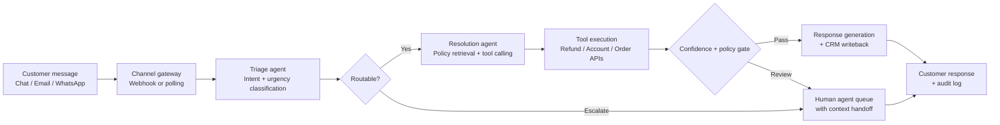

## What This Design Covers

This design covers the end-to-end path from inbound customer message to autonomous resolution or human escalation for enterprise support teams that already run a CRM or helpdesk platform. The reference pattern assumes chat and email channels, integration with order management, billing, and subscription systems, and a tiered human escalation model. The goal is to let an AI agent handle intent recognition, policy lookup, backend actions (refunds, account changes, order tracking), and response generation while deterministic rules enforce thresholds and humans own escalations that require judgment. [S1][S2][S5]

## Recommended Operating Model

| Decision Area | Recommendation |
|---------------|----------------|
| **Autonomy Model** | Semi-autonomous. The AI agent resolves routine requests end-to-end within policy-defined thresholds. Requests outside thresholds or below confidence gates route to human agents with full context. [S1][S3][S5] |
| **System of Record** | The CRM or helpdesk platform (Zendesk, Salesforce Service Cloud, Intercom) remains authoritative for ticket state, customer history, and audit trail. [S5][S8] |
| **Human Decision Points** | Humans review low-confidence resolutions, high-value refunds above threshold, emotionally sensitive cases, and compliance-flagged interactions. [S1][S3][S7] |
| **Primary Value Driver** | Cost reduction from autonomous resolution of high-volume, routine requests — not from replacing complex case handling. Klarna reported 40% cost-per-interaction reduction; Ramp achieved 90% case resolution through automation. [S1][S2] |

## Architecture

### System Diagram

### Component Responsibilities

| Component | Role | Notes |
|-----------|------|-------|
| Channel gateway | Receives messages from chat, email, and messaging platforms via webhooks or API polling. | Decouples channel-specific protocols from agent logic. Most platforms (Zendesk, Intercom, Salesforce) expose webhook APIs. [S5][S8] |
| Triage agent | Classifies intent, detects urgency, and decides whether the request is within AI scope. | A lightweight classification step prevents the resolution agent from attempting out-of-scope work. [S6][S9] |
| Resolution agent | Retrieves relevant policy, reasons over customer context, selects tools, and generates actions and responses. | This is the core agentic loop: retrieve context, plan, act, respond. Multi-turn state is held per conversation. [S3][S5][S6] |
| Tool execution layer | Exposes backend systems (billing, orders, subscriptions, CRM) as callable tools with scoped permissions. | Tools enforce what the agent can do — read-only lookups vs. write actions — independent of what the model requests. [S4][S9] |
| Policy and confidence gate | Deterministic checks on action thresholds, confidence scores, and compliance flags before any write action. | The gate sits between the agent's intent and execution, preventing unauthorized actions regardless of model confidence. [S1][S3] |
| Human escalation queue | Routes low-confidence or out-of-scope requests to human agents with conversation transcript and suggested context. | Escalation quality matters as much as resolution rate. Sierra reports that effective handoffs preserve customer trust. [S2][S7] |

## End-to-End Flow

| Step | What Happens | Owner |
|------|---------------|-------|
| 1 | Customer sends a message via chat, email, or messaging channel. The channel gateway normalizes the input and creates or updates a conversation record in the CRM. | Channel gateway [S5][S8] |
| 2 | The triage agent classifies intent (refund, order tracking, billing inquiry, account change, general question) and assesses urgency and sentiment. | Triage agent [S6][S9] |
| 3 | For routable intents, the resolution agent retrieves relevant policy from the knowledge base and customer context from the CRM. It plans a sequence of tool calls to resolve the request. | Resolution agent [S3][S5] |
| 4 | The agent executes tool calls — e.g., look up order status, calculate refund eligibility, process a subscription change — through the tool execution layer. | Tool layer + backend APIs [S4][S9] |
| 5 | A deterministic gate checks that the proposed action is within policy thresholds (refund amount, account modification type) and confidence is above the release threshold. | Policy gate [S1][S3] |
| 6 | If passed, the agent generates a customer-facing response, writes resolution notes to the CRM, and closes or updates the ticket. If gated, the conversation routes to a human agent with full context attached. | Resolution agent or human queue [S2][S7] |

## AI Responsibilities and Boundaries

| Workflow Area | AI Does | Deterministic System Does | Human Owns |
|---------------|---------|---------------------------|------------|
| Intent classification | Classifies request type, urgency, and sentiment from natural language. [S6][S9] | Enforces routing rules: blocked categories, VIP overrides, compliance-flagged accounts. | Reviews misclassified escalations and tunes routing policy. |
| Policy retrieval and reasoning | Retrieves relevant policy documents and reasons over them to determine the correct action. [S3][S5] | Enforces hard thresholds: maximum refund amounts, restricted account operations, cooling-off periods. | Authors and approves policy changes; resolves ambiguous policy edge cases. |
| Backend actions | Calls tools to execute refunds, subscription changes, order lookups, and account updates. [S4][S9] | Validates tool parameters, enforces rate limits, blocks disallowed operations, logs all mutations. | Approves high-value actions above threshold; handles actions the tool layer does not expose. |
| Response generation | Drafts customer-facing messages in brand voice with accurate, policy-compliant content. [S3][S5] | Applies content filters for PII leakage, profanity, and off-brand language. | Handles emotionally sensitive cases, legal disputes, and complaints requiring empathy. |

## Integration Seams

| System | Integration Method | Why It Matters |
|--------|--------------------|----------------|
| CRM / helpdesk (Zendesk, Salesforce, Intercom) | REST API or platform SDK for ticket CRUD, customer lookup, and conversation history | The CRM is the system of record for customer interactions. Every AI action must be logged here for audit and agent visibility. [S5][S8] |
| Order management / e-commerce platform | REST API for order status, return eligibility, shipment tracking | Order-related queries represent the highest-volume request category. Real-time order data eliminates the need for the agent to guess. [S2][S4] |
| Billing and payment system (Stripe, Adyen, internal) | REST API for transaction lookup, refund processing, subscription modification | Refund and billing actions are the highest-value autonomous actions. Scoped API keys limit what the agent can do. [S1][S4] |
| Knowledge base / policy store | Vector store or retrieval API for policy documents, FAQ, and product information | Retrieval-augmented generation grounds the agent's responses in current policy rather than training data. [S3][S5] |
| Authentication / identity provider | OAuth or SSO verification before allowing account-modifying actions | Customer identity must be verified by existing auth systems before the agent executes any write action. This remains out of the AI's scope. [S1] |

## Control Model

| Risk | Control |
|------|---------|
| Hallucinated policy or incorrect action recommendation | Ground all policy reasoning in retrieved documents using RAG; require structured output for action proposals; validate against allowed action schemas before execution. [S3][S9] |
| Unauthorized financial action (excessive refund, unauthorized account change) | Deterministic threshold gates on all write actions; tiered approval limits (e.g., refunds under $50 auto-approved, $50-$200 require confidence > 0.95, above $200 require human approval). [S1][S3] |
| Customer data exposure or PII leakage | Redact PII from model context where possible; never include full payment details in agent context; scope tool permissions to minimum required fields; log access for compliance. [S1][S7] |
| Poor escalation quality (wrong cases escalated, or escalated without context) | Include conversation transcript, classified intent, attempted actions, and failure reason in every escalation payload. Monitor escalation-to-resolution ratio as a quality signal. [S2][S7] |
| Brand and tone risk | System prompt enforces brand voice and refusal boundaries; content filter layer checks responses before delivery; CSAT monitoring detects tone drift. [S3][S5] |
| Over-reliance on AI for complex queries | Monitor resolution quality by category; maintain human-in-the-loop for categories with high error rates; Klarna's experience shows cost optimization must not override quality. [S1][S7] |

## Reference Technology Stack

| Layer | Default Choice | Reason | Viable Alternative |
|-------|----------------|--------|--------------------|
| **Model layer** | Claude 4 Sonnet or GPT-4o | Strong tool-calling support, structured outputs, and competitive latency for real-time conversation. [S4][S9] | GPT-4o-mini for high-volume triage steps where cost matters more than reasoning depth. |
| **Orchestration** | LangGraph | Explicit state graph with conditional routing fits the triage → resolve → gate → respond flow. Supports multi-turn conversation state and tool-calling loops. [S6] | OpenAI Agents SDK for teams already on the OpenAI platform; Semantic Kernel for .NET shops. [S9] |
| **Retrieval / knowledge** | Vector store (Pinecone, Weaviate, or pgvector) + RAG pipeline | Policy and FAQ retrieval must be current and searchable. Vector retrieval with reranking gives the best balance of recall and precision for policy grounding. [S3] | Intercom's Knowledge Hub or Zendesk's native content sources for teams that want to stay within their helpdesk platform. [S5][S8] |
| **Observability** | LangSmith or OpenTelemetry + custom dashboards | Trace every conversation turn, tool call, and gate decision. LangSmith provides purpose-built agent tracing; OpenTelemetry works for teams with existing observability stacks. [S6] | Arize Phoenix or Weights & Biases for teams with ML-focused observability preferences. |

## Key Design Decisions

| Decision | Choice | Why It Fits This Use Case |
|----------|--------|---------------------------|
| Single resolution agent with tools, not multi-agent swarm | One agent with a well-scoped tool set per conversation | Customer service conversations follow a relatively linear flow: classify, retrieve, act, respond. A single agent with tools is simpler to trace and debug than multi-agent handoffs. Multi-agent adds complexity without clear benefit for this pattern. [S6][S9] |
| Deterministic gate between agent intent and action execution | All write actions pass through a rules engine before execution | Klarna's experience shows that impressive resolution metrics can mask quality issues. A deterministic gate ensures policy compliance regardless of model confidence, and provides a clear audit point. [S1][S3] |
| RAG over fine-tuning for policy knowledge | Retrieve policy at inference time rather than baking it into model weights | Policies change frequently (seasonal promotions, updated refund windows, new products). RAG ensures the agent always reasons over current policy without retraining. [S3][S5] |
| Phased channel rollout starting with chat | Launch on chat first, then email, then messaging platforms | Chat has the tightest feedback loop and highest volume of routine requests. Email requires different response formatting and latency expectations. Starting with chat de-risks the first deployment. [S5][S8] |
| Hybrid model following Klarna's lessons | Design for AI-first resolution with built-in human rebalancing | Klarna's public pivot from AI-only to hybrid demonstrates that sustainable deployment requires quality monitoring and human escalation paths from day one — not as an afterthought. [S1][S7] |
