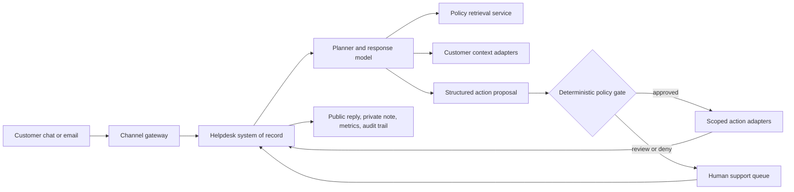

## What This Design Covers

This design covers authenticated chat and email support where the enterprise already has a helpdesk, policy content, and API access to billing, order, and account systems. The model is AI-first for repetitive, policy-bound requests, with deterministic controls before any write and human fallback for low-confidence or high-risk cases. Voice, fraud review, and identity proofing stay with existing systems and teams. [S1][S2][S3][S5]

## Recommended Operating Model

| Decision Area | Recommendation |
|---------------|----------------|
| **Autonomy Model** | Use bounded autonomy for refunds, subscription changes, order status, account updates, and policy FAQs. Require a deterministic gate before any financial or account mutation. |
| **System of Record** | Keep the incumbent helpdesk authoritative for ticket state, public replies, private notes, and operator metrics. Do not create a parallel case store inside the AI runtime. |
| **Human Decision Points** | Humans own identity ambiguity, high-value credits, legal complaints, distressed customers, unsupported intents, and any case where the AI cannot ground the action in current policy. |
| **Primary Value Driver** | Remove queue time and agent handle time on repetitive tickets, not specialist support. |

## Architecture

### System Diagram

### Component Responsibilities

| Component | Role | Notes |
|-----------|------|-------|
| Channel gateway | Normalizes inbound events from chat and email and verifies signatures. | Keeps channel auth and retries outside the model path. |
| Helpdesk system of record | Stores the customer thread, internal notes, assignment state, and ticket metrics. | This is the operator surface. |
| Policy retrieval service | Returns policy passages filtered by product, market, and effective date. | Retrieve mutable policy at run time. |
| Planner and response model | Interprets the issue, proposes the next step, and drafts the customer reply. | Emit a typed action proposal. |
| Deterministic policy gate | Enforces confidence thresholds, allowed intents, value limits, and disclosure rules. | This is the control boundary between reasoning and execution. |
| Scoped action adapters | Execute narrow operations such as refund creation or subscription updates. | One adapter per mutation keeps blast radius small. |
| Human escalation queue | Receives the transcript, retrieved policy, proposed action, and failure reason. | Human takeover must be fast and complete. |

## End-to-End Flow

| Step | What Happens | Owner |
|------|---------------|-------|
| 1 | A customer message enters through chat or email and is written to the existing helpdesk conversation. | Channel gateway and helpdesk |
| 2 | The planner classifies the intent, checks whether the request is in scope, and decides what context is needed. | Planner model |
| 3 | The workflow retrieves current policy plus customer, order, and billing context from trusted systems. | Retrieval and context adapters |
| 4 | The model emits a structured proposal: resolve, clarify, or escalate. | Planner model |
| 5 | The deterministic gate validates policy fit, confidence, identity status, value limits, and disclosure requirements. | Policy gate |
| 6 | Approved actions run through scoped adapters; otherwise the case is handed to a human with full context and a draft note. | Action adapters or human queue |

## AI Responsibilities and Boundaries

| Workflow Area | AI Does | Deterministic System Does | Human Owns |
|---------------|---------|---------------------------|------------|
| Intake and intent detection | Interprets the customer goal, urgency, and whether clarification is needed. | Applies hard routing for banned categories and unsupported channels. | Reviews misroutes and adjusts supported scope. |
| Policy-grounded reasoning | Reads retrieved policy and proposes the next step or escalation path. | Enforces thresholds, market rules, and intent allowlists. | Owns policy writing and exception handling. |
| Action preparation | Maps the conversation into structured parameters for refunds, subscription changes, or account updates. | Validates identifiers, eligibility, and action-specific inputs before execution. | Approves high-risk financial or reputational decisions. |
| Customer communication | Drafts concise replies and handoff summaries in the approved tone. | Applies disclosure, redaction, delivery, and retention policies. | Handles legal, distressed, or relationship-repair cases. |

## Integration Seams

| System | Integration Method | Why It Matters |
|--------|--------------------|----------------|
| Helpdesk platform | Webhooks plus ticket update APIs for comments, audits, and metrics | This is where the AI trail must live so operators can inspect and continue the case. |
| Policy and help content | Ingestion pipeline plus retrieval endpoint filtered by product, market, and date | Retrieval quality is operationally material. |
| Billing platform | Server-side refund and subscription adapters | Billing writes are high-value actions that need narrow scopes and deterministic retries. |
| Order and account services | Read-first internal APIs | The model should consume trusted facts, not infer operational state from conversation text. |
| Identity and consent services | Verification status lookup before any account-modifying path | The AI can use identity state, but proofing stays in existing trusted flows. |

## Control Model

| Risk | Control |
|------|---------|
| Incorrect or stale policy use | Retrieve policy at run time and require a typed proposal before any action. |
| Unsafe refunds or subscription writes | Gate every write with value thresholds, allowlists, and adapter validation. Use idempotency keys on POST requests. |
| Excessive personal-data exposure | Pass only the minimum data required for the current step and avoid retaining extra workflow state. |
| Opaque automation | Tell users when they are interacting with AI where required, and keep human escalation explicit. |
| Weak auditability | Persist private notes and rely on helpdesk audits and metrics as the operational history. |

## Reference Technology Stack

| Layer | Default Choice | Reason | Viable Alternative |
|-------|----------------|--------|--------------------|
| **Model layer** | OpenAI Responses API with `gpt-5.4-mini` for frontline turns and `gpt-5.4` for harder exception paths | Current OpenAI guidance recommends this split for harder versus lower-latency work. [S8] | Intercom Fin Procedures for teams that want more productized support automation. |
| **Orchestration** | LangGraph | The workflow is a small state machine with fixed branches. | Native workflow tooling in the incumbent support platform. |
| **System of record** | Zendesk Support APIs | Ticket comments, audits, and metrics cover the minimum operator surface. | Salesforce Service Cloud or Intercom if those already own the support operation. |
| **Retrieval and policy memory** | Versioned policy corpus with ephemeral workflow state | Mutable policy belongs in retrieval, while customer-specific state should stay short-lived outside the helpdesk. | Helpdesk-native knowledge sources with strict tagging and governance. |
| **Action layer** | Stripe adapters plus internal order and account services | Common support mutations already exist as APIs; the design should wrap them. | Equivalent billing and commerce platforms using the same narrow-tool pattern. |

## Key Design Decisions

| Decision | Choice | Why It Fits This Use Case |
|----------|--------|---------------------------|
| Autonomy boundary | Start with authenticated, repetitive intents only | This is where the published evidence is strongest. |
| Execution boundary | Separate reasoning from execution with a deterministic gate | Refunds and account changes must stay inside hard rules. |
| Operating surface | Keep the helpdesk as the single case workspace | Operators need one place for notes, audits, metrics, and manual takeover. |
| Knowledge strategy | Retrieve current policy instead of fine-tuning on policy content | Support content changes too often for weight-based policy control. |
| Rollout sequence | One helpdesk instance, one billing system, one region, top intents first | Narrow scope is the fastest way to prove quality and economics. |
