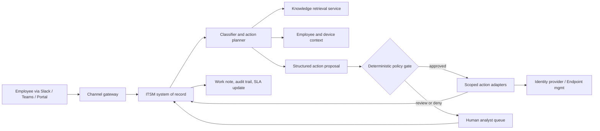

## What This Design Covers

This design covers autonomous resolution of repetitive L1/L2 IT service desk requests — password resets, account unlocks, software provisioning, access management, and VPN troubleshooting — where the enterprise already operates an ITSM platform, an identity provider, and an endpoint management system. The model is AI-first for high-volume, runbook-bound requests, with deterministic controls before any identity or endpoint mutation and human fallback for low-confidence, high-risk, or out-of-scope cases. L3 infrastructure incidents, security investigations, and hardware procurement stay with existing teams. [S1][S2][S3][S4]

## Recommended Operating Model

| Decision Area | Recommendation |
|---------------|----------------|
| **Autonomy Model** | Use bounded autonomy for password resets, account unlocks, software provisioning, access group changes, and knowledge-grounded troubleshooting. Require a deterministic gate before any identity or endpoint mutation. |
| **System of Record** | Keep the incumbent ITSM platform authoritative for ticket state, work notes, assignment, SLA tracking, and audit history. Do not create a parallel case store inside the AI runtime. |
| **Human Decision Points** | Humans own privileged access approvals, security-sensitive account changes, hardware issues requiring physical intervention, L3 infrastructure incidents, and any request where the AI cannot ground the action in a current runbook or policy. |
| **Primary Value Driver** | Eliminate queue time and analyst handle time on repetitive L1 tickets — especially password resets (20-50% of volume) and routine provisioning — not specialist L3 support. [S1][S5][S6] |

## Architecture

### System Diagram

### Component Responsibilities

| Component | Role | Notes |
|-----------|------|-------|
| Channel gateway | Normalizes inbound messages from Slack, Teams, email, and the self-service portal. | Keeps channel authentication and message formatting outside the model path. |
| ITSM system of record | Stores the ticket, work notes, assignment state, SLA timers, and audit trail. | This is where analysts and managers operate. All AI actions write back here. |
| Knowledge retrieval service | Returns runbook passages and known-error articles filtered by category, application, and platform. | Grounds the AI response in current procedures rather than stale training data. |
| Classifier and action planner | Classifies intent, checks scope, retrieves context, and proposes the next action or escalation. | Emits a typed action proposal — not free text — for the gate to inspect. |
| Deterministic policy gate | Enforces confidence thresholds, allowed intents, identity verification status, and action-specific rules. | The control boundary between reasoning and execution. |
| Scoped action adapters | Execute narrow operations: password reset, group membership change, software assignment, account unlock. | One adapter per mutation keeps blast radius small and audit clear. |
| Human escalation queue | Receives the transcript, retrieved runbook, proposed action, and failure reason for analyst takeover. | Handoff must include enough context for the analyst to continue without re-triaging. |

## End-to-End Flow

| Step | What Happens | Owner |
|------|---------------|-------|
| 1 | An employee describes an IT issue through Slack, Teams, email, or the self-service portal. A ticket is created or updated in the ITSM system. | Channel gateway and ITSM |
| 2 | The classifier identifies intent, checks whether the request is in scope, and determines what context is needed (employee record, device status, entitlements). | Classifier model |
| 3 | The workflow retrieves the relevant runbook or knowledge article plus employee and device context from trusted systems. | Retrieval and context adapters |
| 4 | The planner emits a structured proposal: resolve autonomously, ask a clarifying question, or escalate to a human. | Planner model |
| 5 | The deterministic gate validates identity verification status, confidence, action-specific rules, and scope boundaries. | Policy gate |
| 6 | Approved actions run through scoped adapters (password reset, software install, group change). Denied or low-confidence cases route to a human analyst with full context. | Action adapters or human queue |

## AI Responsibilities and Boundaries

| Workflow Area | AI Does | Deterministic System Does | Human Owns |
|---------------|---------|---------------------------|------------|
| Intake and classification | Interprets the employee issue, detects intent, assigns category and priority. | Applies hard routing for out-of-scope categories (security incidents, hardware procurement). | Reviews misclassifications and adjusts the supported-intent taxonomy. |
| Runbook-grounded reasoning | Reads retrieved runbook and proposes the resolution step or escalation path. | Enforces confidence thresholds, identity verification, and intent allowlists. | Owns runbook authoring, exception handling, and policy changes. |
| Action execution | Maps the conversation into structured parameters for identity, endpoint, or provisioning operations. | Validates employee ID, device ID, entitlement eligibility, and action-specific inputs before execution. | Approves privileged access grants, security-sensitive changes, and bulk operations. |
| Employee communication | Drafts concise status updates and resolution confirmations in approved tone. | Applies disclosure rules and redaction of sensitive fields (temporary passwords, tokens). | Handles escalated conversations, complaints, and complex multi-system troubleshooting. |

## Integration Seams

| System | Integration Method | Why It Matters |
|--------|--------------------|----------------|
| ITSM platform (ServiceNow / Jira SM) | REST API for ticket creation, updates, work notes, and SLA queries | All AI activity must be recorded in the ticket trail so analysts and managers see one consistent history. [S8] |
| Identity provider (Entra ID / Okta) | Microsoft Graph API for password resets and account unlocks; Okta APIs for group and app assignment | Identity mutations are the highest-volume automatable actions and the highest-risk if done wrong. [S9][S14] |
| Endpoint management (Intune / SCCM / Jamf) | Microsoft Graph API for software assignment and device compliance queries | Software provisioning and device status checks are the second-largest L1 category after identity issues. [S10] |
| Collaboration platform (Slack / Teams) | Bot framework or webhook for conversational intake and status updates | Employees expect to get help where they already work, not through a separate portal. |
| Knowledge base | Ingestion pipeline plus retrieval endpoint filtered by category, application, and platform | Retrieval quality directly determines whether the AI can resolve or must escalate. |

## Control Model

| Risk | Control |
|------|---------|
| Incorrect identity mutation (wrong user's password reset, unauthorized access grant) | Verify employee identity through SSO session or MFA challenge before any identity write. Require exact employee ID match between requestor and target. |
| Stale or wrong runbook guidance | Retrieve runbook at run time, never from cached training data. Require the action proposal to cite the source article. |
| Excessive scope (AI attempts L3 actions or security-sensitive changes) | Maintain a strict allowlist of supported intents and action types. Reject anything outside the list. |
| Credential or token exposure in logs | Never log temporary passwords, reset tokens, or MFA secrets. Redact sensitive fields before writing work notes. |
| Weak auditability | Write a structured work note to the ITSM ticket for every AI action, including the action proposed, the gate decision, and the execution result. [S15] |

## Reference Technology Stack

| Layer | Default Choice | Reason | Viable Alternative |
|-------|----------------|--------|--------------------|
| **Model layer** | OpenAI `gpt-5.4-mini` for classification and routine planning; `gpt-5.4` for complex multi-step troubleshooting | Smaller model handles high-volume L1 classification at lower latency; larger model reserved for harder cases. [S11] | Anthropic Claude or Azure OpenAI for teams with existing cloud commitments. |
| **Orchestration** | LangGraph | The workflow is a state machine with fixed branches and explicit gate checks — a good fit for graph-based orchestration. [S13] | Native workflow tooling in ServiceNow Flow Designer for teams that prefer platform-native orchestration. |
| **System of record** | ServiceNow Table API (Incident, Request, RITM tables) | ServiceNow dominates enterprise ITSM and exposes the REST APIs needed for ticket lifecycle management. [S8] | Jira Service Management REST API or BMC Helix for organizations on those platforms. |
| **Identity and endpoint** | Microsoft Graph API (Entra ID, Intune) | Microsoft identity and endpoint management is the most common enterprise stack. [S9][S10] | Okta APIs plus Jamf for organizations on that identity and device management stack. |

## Key Design Decisions

| Decision | Choice | Why It Fits This Use Case |
|----------|--------|---------------------------|
| Autonomy boundary | Start with password resets, account unlocks, and software provisioning only | These are the highest-volume, most standardized L1 tasks with the strongest published evidence for autonomous resolution. [S2][S3][S4] |
| Execution boundary | Separate reasoning from execution with a deterministic gate | Identity and endpoint mutations create direct security and compliance impact if wrong. The gate enforces rules the model cannot override. |
| Operating surface | Keep the ITSM platform as the single ticket workspace | Analysts need one place for work notes, SLA tracking, audit history, and manual takeover. |
| Knowledge strategy | Retrieve current runbooks at run time instead of fine-tuning on IT procedures | Runbooks change frequently as infrastructure evolves. Retrieval-first keeps the system current without retraining. |
| Rollout sequence | One ITSM instance, one identity provider, top three L1 intents, then expand | Narrow scope is the fastest way to prove resolution quality and build analyst trust. [S2] |
