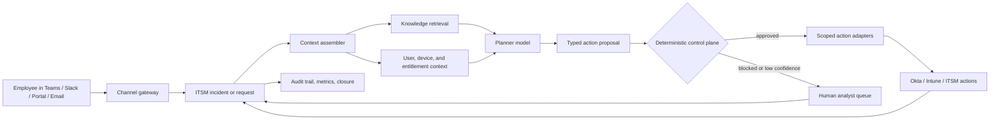

## What This Design Covers

This design covers repetitive, policy-bound IT requests where the enterprise has ITSM, identity, endpoint, and knowledge systems in place. The model is bounded autonomy: AI handles intent understanding, response drafting, and action planning, while deterministic services stay in charge of verification, approvals, ticket state, and every write. The first production boundary is password reset or unlock, device recovery, and handoff for everything else. [S1][S2][S3][S4][S5][S6][S7][S8][S9][S10]

## Recommended Operating Model

| Decision Area | Recommendation |
|---------------|----------------|
| **Autonomy Model** | Use bounded autonomy for low-risk, runbook-backed tasks. The AI may answer, classify, and trigger approved actions only after deterministic verification passes. |
| **System of Record** | Keep the incumbent ITSM platform authoritative for incident state, service-request state, work notes, approvals, closure, and audit history. |
| **Human Decision Points** | Humans own privilege grants, non-standard software or access requests, possible security incidents, failed identity verification, and low-confidence plans. |
| **Primary Value Driver** | Remove queue time and analyst handle time from repetitive identity, endpoint, and knowledge-retrieval requests that arrive all day and across time zones. |

## Architecture

### System Diagram

### Component Responsibilities

| Component | Role | Notes |
|-----------|------|-------|
| Channel gateway | Normalizes chat, portal, and email events into one envelope. | Keeps auth out of the model path. |
| ITSM system of record | Stores incident state, work notes, approvals, and closure. | ServiceNow is the reference design. |
| Context assembler | Pulls ticket history, employee context, device state, and KB content. | The model sees trusted facts. |
| Planner model | Selects one supported intent and emits a typed action proposal or escalation. | It reasons; it does not hold admin credentials. |
| Deterministic control plane | Validates confidence, verification state, allowlists, and action prerequisites. | This is the execution boundary. |
| Scoped action adapters | Execute narrow actions such as unlock user, reset password, or reboot device. | One adapter per verb. |
| Human analyst queue | Receives the transcript, evidence, proposed next step, and failure reason. | Avoid rediscovery. |

## End-to-End Flow

| Step | What Happens | Owner |
|------|---------------|-------|
| 1 | An employee starts a support interaction; the gateway creates or updates the ITSM record. | Channel gateway and ITSM |
| 2 | The context layer retrieves ticket history, identity status, device ownership, and KB content. | Context assembler |
| 3 | The model classifies the intent and emits a proposal or escalation. | Planner model |
| 4 | The control plane checks the action catalog plus verification and device constraints. | Deterministic control plane |
| 5 | If approved, the adapter executes the change. If blocked, the case is routed to the correct resolver group. | Scoped adapter or human queue |
| 6 | The ITSM record is updated with the outcome, reply, metrics, and closure or escalation state. | ITSM and analytics |

## AI Responsibilities and Boundaries

| Workflow Area | AI Does | Deterministic System Does | Human Owns |
|---------------|---------|---------------------------|------------|
| Intake and intent detection | Interprets the request and decides whether it is in scope. | Hard-routes security keywords, outage events, and unsupported channels. | Reviews misroutes and adjusts scope. |
| Knowledge-grounded guidance | Summarizes the right runbook and drafts the reply. | Filters KB by resolver group and effective date. | Maintains the KB and runbooks. |
| Action preparation | Extracts the fields needed for one approved action. | Validates user IDs, device IDs, and policy rules. | Approves exceptions and non-standard changes. |
| Identity-sensitive operations | Recommends an unlock or reset path when verification context exists. | Enforces verification state and invokes the IdP-native flow. | Defines verification policy and handles failures. |
| Human handoff | Produces a summary with evidence and blocked condition. | Routes to queue; keeps audit trail. | Resolves incidents. |

## Integration Seams

| System | Integration Method | Why It Matters |
|--------|--------------------|----------------|
| ITSM platform | Event intake plus narrow REST writeback for comments, work notes, assignment, and closure | The AI trail has to live where analysts already work. |
| Identity provider | Server-side lifecycle and credential APIs behind an internal action service | Identity actions are both the fastest win and the most sensitive writes. |
| Endpoint management | Managed-device action APIs for reboot, sync, or policy refresh | Device recovery is common L1 work. |
| Knowledge corpus | Scheduled ingestion and retrieval endpoint with article metadata and effective dates | Retrieval quality drives outcomes. |

## Control Model

| Risk | Control |
|------|---------|
| Wrong plan for a noisy ticket | Require a typed proposal and stop below the confidence threshold. |
| Unsafe identity or access mutation | Require prior verification state and use allowlisted actions only. |
| Prompt injection from ticket text or KB content | Separate untrusted text from trusted context and never expose raw admin tools. |
| Stale runbook content | Version articles and route to humans when freshness is uncertain. |
| Weak auditability | Persist every proposal, validation result, and action outcome under the ticket ID. |
| Incident swarm during a major outage | Detect duplicate patterns and switch to broadcast or queue-only mode. |

## Reference Technology Stack

| Layer | Default Choice | Reason | Viable Alternative |
|-------|----------------|--------|--------------------|
| **Model layer** | OpenAI Responses API with `gpt-5.4-mini` for frontline turns and `gpt-5.4` for harder exception paths | One API surface for structured outputs and tools. [S13][S14][S15][S16] | A vendor-native assistant. |
| **Orchestration** | LangGraph | Good fit for explicit answer, verify, execute, and escalate branches. [S17] | An ITSM-native workflow engine. |
| **ITSM action layer** | ServiceNow incident and request records with Scripted REST wrappers | Keeps one operator surface and one audit trail. [S6][S7] | Jira Service Management with the same narrow-adapter pattern. |
| **Identity automation** | Okta Management API behind an internal control-plane service | Fits common unlock and reset flows without exposing admin APIs to the model. [S8][S9][S11] | Microsoft Entra ID or on-prem AD behind an equivalent adapter. |
| **Endpoint actions** | Microsoft Graph device management actions for Intune-managed devices | Fits the narrow-action pattern for common device recovery work. [S10] | SCCM, Jamf, or another endpoint tool behind the same contract. |
| **Retrieval and memory** | Versioned runbook and KB index plus short-lived workflow state | Keeps mutable support content out of model weights. | Helpdesk-native KB search with strong tagging. |

## Key Design Decisions

| Decision | Choice | Why It Fits This Use Case |
|----------|--------|---------------------------|
| First-release scope | Start with password reset or unlock, device recovery, KB-guided answers, and routing | The published evidence is strongest on repetitive identity and triage work. |
| Execution boundary | Put a deterministic control plane between the model and every write | Direct model-to-admin execution is unnecessary and hard to defend. |
| System of record | Keep all state, notes, and closure decisions inside the incumbent ITSM platform | Managers need one place for SLA, reopen, and productivity metrics. |
| Identity handling | Consume verification state from the IdP and existing proofing flow | Password and access operations are both high value and high risk. |
| Rollout model | Use shadow mode first, then enable auto-execution for one resolver group and a short action allowlist | This proves plan quality before production writes affect employees. |
