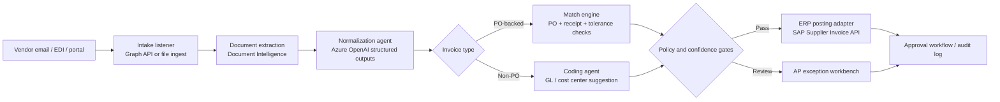

## What This Design Covers

This design covers the invoice-to-post path for AP teams that already run an ERP, but still rely on manual review for invoice ingestion, coding, and exception routing. The reference pattern assumes a shared mailbox or supplier intake channel, a procurement and PO system, and SAP S/4HANA or a comparable ERP as the system of record. The goal is to let AI handle extraction, normalization, coding suggestions, and low-risk routing while deterministic services and human approvers stay in charge of controls and exceptions. [S1][S5][S16]

## Recommended Operating Model

| Decision Area | Recommendation |
|---------------|----------------|
| **Autonomy Model** | Semi-autonomous. Routine invoices can pass touchless once they meet confidence, matching, and policy thresholds. [S1][S2][S5] |
| **System of Record** | The ERP remains authoritative for vendor master data, PO status, approvals, and posted invoices. [S16][S17] |
| **Human Decision Points** | Humans review low-confidence extractions, mismatched PO invoices, policy exceptions, and invoices over approval thresholds. [S3][S5][S7] |
| **Primary Value Driver** | Labor reduction comes from faster invoice extraction, coding, email triage, and exception routing, not from removing finance controls. [S1][S2][S6] |

## Architecture

### System Diagram

### Component Responsibilities

| Component | Role | Notes |
|-----------|------|-------|
| Intake listener | Pulls invoices and attachments from email, EDI, or portals. | Shared mailbox intake is a real AP bottleneck and should be handled separately from posting logic. [S6][S14] |
| Document extraction | Turns PDFs, scans, and mixed invoice formats into machine-readable fields and tables. | Azure Document Intelligence exposes a `prebuilt-invoice` model for AP processing. [S10] |
| Normalization agent | Converts extracted data into one validated invoice schema. | Azure OpenAI structured outputs is the right control point because downstream finance services need stable fields, not free text. [S9] |
| Match engine | Performs deterministic duplicate checks, PO matching, receipt checks, and tolerance enforcement. | PO matching should stay rule-aware and tightly bounded. [S7][S16] |
| Coding agent | Suggests GL, department, location, project, and tax values for non-PO invoices. | This is where the published AP gains are strongest. [S1][S2][S3] |
| ERP posting adapter | Creates or updates supplier invoices in the ERP once the invoice is cleared for posting. | SAP's Supplier Invoice API supports create, list, release, reverse, and delete operations. [S16][S17] |
| Exception workbench | Queues low-confidence, mismatched, or policy-sensitive invoices for AP review. | Human review stays focused on exceptions instead of full-volume handling. [S3][S5] |

## End-to-End Flow

| Step | What Happens | Owner |
|------|---------------|-------|
| 1 | The intake listener retrieves invoice files and message metadata from the AP inbox or inbound channel. | Integration service [S6][S14] |
| 2 | Document extraction pulls header fields, line items, tax details, and bank details from the source document. | Document extraction service [S10][S11] |
| 3 | The normalization agent converts those fields into a strict invoice packet with confidence scores and missing-field flags. | Azure OpenAI structured output step [S9] |
| 4 | Deterministic services run vendor lookup, duplicate detection, PO and receipt matching, and approval-policy checks. | Finance rules layer [S7][S16] |
| 5 | Non-PO invoices get a coding recommendation; PO-backed invoices either pass or route to mismatch review. | Coding agent plus match engine [S2][S7] |
| 6 | Cleared invoices are posted to ERP and routed to the normal approval path; exceptions go to the AP workbench with evidence attached. | ERP adapter and AP reviewers [S5][S17] |

## AI Responsibilities and Boundaries

| Workflow Area | AI Does | Deterministic System Does | Human Owns |
|---------------|---------|---------------------------|------------|
| Invoice reading | Extracts fields, tables, and probable document type across mixed formats. [S9][S10] | Stores source files, enforces schema, rejects malformed packets. | Resolves unreadable or ambiguous documents. |
| Non-PO coding | Suggests account, department, project, and tax values from prior patterns and policy context. [S1][S2][S3] | Applies allowed value lists, blocks illegal combinations, enforces company-specific policies. | Approves high-risk coding and corrects model drift. |
| PO matching | Helps identify the right PO context and likely match candidates. [S7] | Enforces tolerance logic, receipt checks, duplicate rules, and posting rules. | Resolves true mismatches and disputed invoices. |
| Email handling | Tags vendor emails, drafts replies, and detects duplicate or bank-change related messages. [S6] | Fetches ERP facts and logs outbound communications. | Sends sensitive replies and resolves account-change risk. |

## Integration Seams

| System | Integration Method | Why It Matters |
|--------|--------------------|----------------|
| AP inbox / Outlook shared mailbox | Microsoft Graph message and attachment APIs | Most invoice intake still starts in email; this must be first-class, not an afterthought. [S6][S14] |
| ERP | SAP Supplier Invoice OData API | Posting, release, reversal, and supplier-invoice retrieval belong in the system of record. [S16][S17] |
| Procurement / receiving data | ERP or procurement API lookups | PO, goods receipt, and tolerance decisions depend on authoritative purchasing data. [S7][S16] |
| Approval workflow | Existing ERP or spend-management workflow | Approval policy and segregation of duties must stay in the established control path. [S5][S16] |
| Event backbone | Azure Service Bus queues or topics | Month-end invoice spikes justify durable queueing and fan-out between extraction, matching, and exception handling. [S15] |

## Control Model

| Risk | Control |
|------|---------|
| Field hallucination or malformed extraction | Use schema-bound structured outputs plus deterministic validation before any writeback. [S9] |
| Incorrect PO or coding decision | Require tolerance checks, allowed-value validation, and exception routing before posting. [S7][S16] |
| Over-automation of approvals | Limit touchless flow to invoices that meet confidence and policy thresholds; keep approval limits with named humans. [S1][S5] |
| Audit and compliance gaps | Persist source documents, extracted packets, approval decisions, and ERP writeback payloads. [S16] |
| Intake overload during peaks | Decouple intake from processing with queues so the AP team does not size infrastructure for month-end peaks only. [S15] |

## Reference Technology Stack

| Layer | Default Choice | Reason | Viable Alternative |
|-------|----------------|--------|--------------------|
| **Model layer** | Azure OpenAI GPT-4o with structured outputs | Stable schema generation and enterprise-friendly hosting. [S9] | Smaller Azure deployment for triage-only steps. |
| **Document understanding** | Azure Document Intelligence `prebuilt-invoice` | Purpose-built invoice extraction and table parsing. [S10] | AI Builder plus custom document models for Power Platform-centric teams. [S11] |
| **Orchestration** | LangGraph | Explicit state, conditional routing, and a clean separation between nodes. [S12] | Semantic Kernel plugins where the team already standardizes on .NET service patterns. [S13] |
| **Eventing** | Azure Service Bus | Durable queues for burst handling and fan-out. [S15] | Existing enterprise queue or workflow bus. |

## Key Design Decisions

| Decision | Choice | Why It Fits This Use Case |
|----------|--------|---------------------------|
| Orchestration pattern | Graph-based workflow instead of one general agent | AP processing has predictable branch points: PO versus non-PO, pass versus review, duplicate versus clean. A graph keeps those branches explicit. [S12] |
| Posting boundary | AI never posts directly without deterministic validation | Finance controls are rule-heavy and auditable; model outputs should propose, not bypass, those checks. [S5][S16] |
| Intake strategy | Treat email and attachments as a product surface | Vendor email is part of the operational workload, not just a transport channel. The evidence from VicInbox makes that clear. [S6] |
| Reference seam | Build first against one ERP API | A clean SAP or comparable ERP adapter is easier to validate than a broad multi-ERP abstraction in phase one. [S16][S17] |
