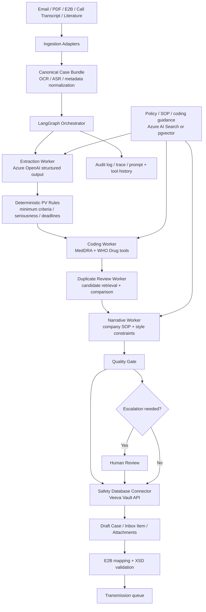

# UC-500: Autonomous Adverse Event Report Processing in Pharmacovigilance — Solution Design

## Solution Overview

The right architecture for pharmacovigilance case intake is not a single "do everything" agent. Public implementations that publish useful detail are converging on a hybrid pattern instead: multiple specialized AI workers for intake, triage, translation, and reporting, wrapped in deterministic compliance checks and human review. Tech Mahindra describes a multi-agent case-intake system; ArisGlobal has moved the same direction with NavaX intake, translation, and multi-agent suites; Pfizer's peer-reviewed pilot showed AI is viable for extraction and case-validity assessment, but not yet strong enough to remove controlled review from every step.

For this use case, the recommended design is a graph-orchestrated, semi-autonomous workflow. LLM workers handle the parts humans currently do by reading and synthesizing messy evidence: extracting case facts from free text, proposing MedDRA and drug-dictionary mappings, comparing likely duplicates, and drafting the case narrative. Deterministic services handle everything that must be inspectable and reproducible: minimum-criteria checks, deadline rules, dictionary search, case-state transitions, XML schema validation, and submission handoff.

The reference integration seam targets Veeva Vault Safety because its public documentation exposes the intake inbox, object-record APIs, attachments, and E2B mapping/validation flow. The same pattern ports to other incumbent safety systems by swapping the connector layer, not the AI layer.

---

## Architecture

### Architecture Diagram

### Component Overview

| # | Component | Technology / Service | Role |
|---|-----------|----------------------|------|
| 1 | Ingestion adapters | Exchange / Graph API / SFTP / file watcher | Collect source reports without changing upstream channels. |
| 2 | Canonical bundle normalizer | Python service plus OCR/ASR where needed | Converts email, PDF, scan, and transcript inputs into a single case bundle for AI processing. |
| 3 | Orchestrator | LangGraph `StateGraph` | Manages persistent case state, branching, retries, and human interrupts. |
| 4 | Extraction worker | Azure OpenAI structured outputs | Produces schema-valid intake JSON with evidence spans. |
| 5 | Coding tools | Internal MedDRA and WHO Drug Dictionary services | Returns ranked terminology candidates; the model never invents codes. |
| 6 | Duplicate candidate service | Safety DB search + fuzzy matching service | Retrieves likely duplicates before the model compares them. |
| 7 | Narrative worker | Azure OpenAI + SOP retrieval | Drafts regulator-style narrative from structured fields and evidence. |
| 8 | Knowledge store | Azure AI Search or pgvector | Supplies SOPs, coding policies, and narrative exemplars for retrieval. |
| 9 | Safety-system connector | Veeva Vault API + Intake Inbox Item API | Writes draft records, uploads attachments, and advances lifecycle actions. |
| 10 | Submission validator | Safety DB E2B mapping + XSD validation | Validates outbound XML before transmission. |
| 11 | Human review queue | Safety database work queue or review UI | Approves serious, ambiguous, and low-confidence cases. |

---

## Data Flow

### AI Data Flow

| Stage | What enters the LLM | What comes out | What happens next |
|-------|---------------------|----------------|-------------------|
| Intake extraction | Canonical case bundle, source snippets, extraction schema, minimum-criteria instructions | Structured `IntakePacket` JSON with evidence spans and confidence | Rules engine checks four minimum ICSR criteria and seriousness flags. |
| Coding | Extracted verbatims, retrieved policy snippets, tool results from MedDRA / WHO Drug services | Proposed coded terms, rationale, unresolved ambiguities | Deterministic mapper writes only approved dictionary codes. |
| Duplicate review | Current case summary, top candidate cases from safety DB | Duplicate disposition and comparison rationale | Borderline matches route to human review. |
| Narrative drafting | Final structured case, house narrative template, SOP excerpts | Submission-ready English narrative draft | QC worker checks completeness and tone; reviewer approves when needed. |
| Quality critique | Draft case, required-field checklist, prior node outputs | Missing fields, contradictions, and escalation reason | Graph either auto-writes or pauses for review. |

---

## Agent Pattern

| Aspect | Choice |
|--------|--------|
| **Pattern** | Hybrid multi-agent orchestrator-worker with deterministic rule gates and retrieval augmentation |
| **Orchestration** | Graph-based, stateful, event-driven |
| **Human-in-the-Loop** | Mandatory escalation for serious, fatal, ambiguous, or low-confidence cases |
| **State Management** | Persistent case state with checkpointing and resumable review threads |
| **Autonomy Level** | Semi-autonomous: touchless only for low-risk routine cases |

### Why This Pattern?

This problem is heterogeneous. Intake extraction, terminology coding, duplicate detection, and narrative writing are different cognitive jobs. Public implementations that publish their design choices are splitting these jobs instead of forcing one giant agent to do all of them: Tech Mahindra explicitly describes a multi-agent architecture, and ArisGlobal now markets dedicated agents and agent suites rather than a monolith.

The regulated parts of the workflow also argue against a single-agent design. A pure ReAct agent can reason and call tools, but it mixes policy, branching, and action selection inside one prompt loop, which makes validation harder. A pure RAG pipeline is not enough either, because the system must write to real systems, manage multi-step state, and stop for reviewers. A graph with narrow worker prompts gives clearer validation boundaries: each worker owns one output contract, while deterministic nodes enforce submission policy, deadlines, and schema compliance.

Pfizer's pilot is a useful caution: machine learning clearly helped with extraction and validity classification, but published performance still left edge-case headroom, especially for some entity types and case-level completeness. That is exactly why this design allows touchless routing for low-risk cases while keeping hard interrupts around serious cases, causality disputes, low-confidence coding, and final writeback.

---

## Tools & Frameworks

### AI / ML Stack

| Component | Technology | Why Chosen |
|-----------|------------|------------|
| **LLM Provider** | Azure OpenAI | Enterprise identity, private networking, and first-party structured outputs. |
| **Worker orchestration** | LangGraph | Durable graph state, conditional routing, and native interrupt/resume for reviewer gates. |
| **Structured extraction** | Azure OpenAI structured outputs | Enforces JSON schema compliance for intake packets and QC results. |
| **Retrieval** | Azure AI Search or pgvector | Retrieval is needed for SOPs and narrative templates, not for core case facts. |

### Infrastructure Stack

| Component | Technology | Why Chosen |
|-----------|------------|------------|
| **Compute** | Containerized Python worker on AKS / App Service | Stateless workers are enough; graph state lives in the checkpointer. |
| **Storage** | Blob storage + safety-system attachments | Retain source material and generated artifacts without duplicating the system of record. |
| **Queue** | Service Bus | Smooths bursty report volume and retry handling. |
| **Monitoring** | Application Insights / OpenTelemetry | Trace prompt, tool, and validation outcomes. |

---

## Security & Compliance

| Concern | Approach |
|---------|----------|
| **Authentication** | Managed identity or short-lived service credentials for all AI and connector services. |
| **Authorization** | Restrict AI workers to narrow tool scopes; do not give the model raw database credentials. |
| **PII Handling** | Keep the full case bundle inside the validated environment; expose only the minimum fields required to each worker. |
| **Audit Trail** | Persist prompts, tool calls, evidence spans, reviewer decisions, and writeback payloads per case. |
| **Model Governance** | Use schema-first outputs, tool allowlists, and deterministic validations before any database write. |
| **Submission Safety** | Never let the model generate final XML directly; use the safety platform's mapped E2B export and XSD validation. |

---

## Scalability & Performance

| Dimension | Approach |
|-----------|----------|
| **Throughput** | Queue-based fan-out across routine cases; Tech Mahindra reports 150-200 cases/day for its multi-agent intake solution. |
| **Latency Target** | Routine case to submission-ready draft in under 30 minutes; serious-case triage prioritized immediately. |
| **Scaling Strategy** | Scale normalization and AI workers horizontally; keep reviewers only on escalated cases. |
| **Rate Limits** | Disable parallel tool calls for strict structured-output nodes and use queue backpressure during model throttling. |
| **Caching** | Cache SOP retrieval, dictionary lookups, and case-template fragments; never cache raw patient-specific outputs across cases. |

---

## Cost Estimate

| Component | Unit Cost | Monthly Estimate |
|-----------|-----------|------------------|
| **LLM API calls** | Metered token usage | `$10k-$20k` estimated |
| **Orchestrator / API compute** | Container runtime + queue consumers | `$3k-$7k` estimated |
| **Retrieval / storage / audit** | Search, blob, trace retention | `$2k-$5k` estimated |
| **Residual reviewer effort** | Escalated cases only | `$90k-$130k` estimated |
| **Total** |  | **`$105k-$162k` estimated** |

