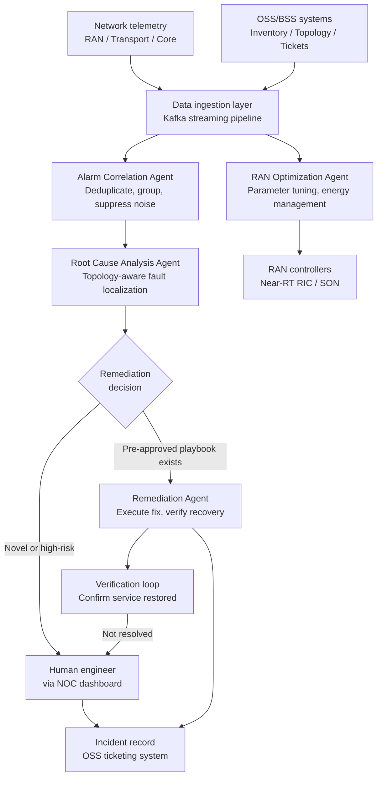

## What This Design Covers

This design covers autonomous network fault management and RAN optimization for a telecom operator managing 100,000+ network elements across RAN, transport, and core domains. A multi-agent system correlates alarms, identifies root cause, executes pre-approved remediation, and optimizes RAN parameters — operating at TM Forum Level 3-4 autonomy. Human operators set policy boundaries and retain full override authority. The design draws on production deployments at AT&T (410+ agents), Deutsche Telekom (RAN Guardian), Vodafone Idea (Nokia MantaRay SON), and Rakuten (nationwide RIC). [S1][S2][S3][S5][S6]

## Recommended Operating Model

| Decision Area | Recommendation |
|---------------|----------------|
| **Autonomy Model** | TM Forum Level 3 (conditional automation) progressing to Level 4 (high automation). Agents handle alarm correlation, root cause analysis, and pre-approved remediation autonomously within a single domain. Cross-domain actions and novel fault patterns escalate to human engineers. Ericsson/TDC NET achieved the first Level 4 certification in June 2025. [S8][S9] |
| **System of Record** | OSS trouble ticketing system (e.g., ServiceNow, BMC Remedy) for the incident lifecycle. Network Management System (NMS) for configuration and inventory. Agents read from and write back to these systems — they do not replace them. |
| **Human Decision Points** | Engineers approve new remediation playbooks, handle novel multi-domain faults, set RAN optimization policy envelopes, review post-incident summaries, and manage vendor escalations. 100% override capability at all times. |
| **Primary Value Driver** | MTTR reduction through automated correlation and remediation (Deutsche Telekom: hours to ~1 minute for major events [S3]), combined with NOC labor efficiency from eliminating manual alarm triage (AT&T: 90% cost reduction on AI inference via fine-tuned SLMs [S2]). Secondary: 15-20% RAN energy savings via autonomous optimization [S6][S7]. |

## Architecture

### System Diagram

### Component Responsibilities

| Component | Role | Notes |
|-----------|------|-------|
| Data Ingestion Layer | Streams SNMP traps, syslog, performance counters, and configuration change events from all network domains into a unified event bus. | Kafka-based; must handle 500K-2M raw alarms/day with burst capacity during alarm storms. |
| Alarm Correlation Agent | Deduplicates and groups related alarms using topology relationships and temporal proximity. Reduces alarm volume by 80-95%. | Vodafone Idea's MantaRay SON executes 700,000 autonomous adjustments daily across 1M+ cells. [S5] |
| Root Cause Analysis Agent | Uses network topology graph, historical incident data, and recent change logs to identify probable root cause. Ranks hypotheses by confidence score. | Deutsche Telekom's RAN Guardian identifies events across hundreds of mobile sites and proposes fixes in minutes. [S3] |
| Remediation Agent | Matches root cause to pre-approved playbooks and executes automated fixes (cell resets, traffic rerouting, parameter rollbacks). Verifies recovery before closing. | Every playbook includes rollback steps; KPI verification within 5 minutes. |
| RAN Optimization Agent | Continuously adjusts antenna tilt, power levels, handover parameters, and sleep schedules based on traffic patterns and KPI targets. | Rakuten demonstrated 25% energy savings via RIC; 15-20% in nationwide production. [S6][S7] |
| NOC Dashboard | Displays agent decisions in real time. Engineers override, approve, or reject any action. Full audit trail of all agent activity. | Deutsche Telekom describes this as "the first operator to rely on a highly developed AI agent in network management." [S3] |

## End-to-End Flow

| Step | What Happens | Owner |
|------|---------------|-------|
| 1 | Network elements emit alarms, performance counters, and change events into the Kafka streaming pipeline. | Data Ingestion Layer |
| 2 | Alarm Correlation Agent groups related alarms, suppresses duplicates, and produces correlated alarm groups with severity and affected topology. | Alarm Correlation Agent [S5] |
| 3 | Root Cause Analysis Agent analyzes each correlated group against topology, recent changes, and historical patterns. Produces ranked root cause hypotheses with confidence scores. | RCA Agent [S3][S10] |
| 4 | If a pre-approved playbook matches the top hypothesis above the confidence threshold, Remediation Agent executes the fix autonomously. Below threshold or novel faults escalate to human engineers with full context. | Remediation Agent / Human Engineer |
| 5 | Remediation Agent verifies service recovery via KPI checks. Unresolved incidents escalate with the remediation attempt history attached. | Verification Loop |
| 6 | Post-incident summary is auto-generated and written to the OSS ticketing system. Feedback data updates correlation and RCA models. | Incident Closer [S3][S4] |

## AI Responsibilities and Boundaries

| Workflow Area | AI Does | Deterministic System Does | Human Owns |
|---------------|---------|---------------------------|------------|
| Alarm triage | Deduplicates, correlates across domains, suppresses noise (80-95% reduction). [S5] | Vendor MIBs define alarm severity and category. NMS enforces alarm forwarding rules. | Sets correlation policy. Reviews suppression rates. Audits false-negative samples. |
| Root cause analysis | Ranks probable causes using topology graph, temporal correlation, and historical patterns. [S3][S10] | Network inventory maintains authoritative topology. Change management system logs all recent changes. | Validates novel root causes. Approves addition of new patterns to the knowledge base. |
| Remediation | Executes pre-approved playbooks. Verifies recovery. Triggers rollback on failure. [S3] | Change management enforces change windows and rollback limits. Protection systems prevent unsafe configurations. | Approves new playbooks. Handles novel faults. Manages vendor escalations. |
| RAN optimization | Adjusts parameters within policy envelopes for capacity and energy targets. [S6][S7][S9] | SON/RIC enforces min/max parameter bounds and coverage constraints. | Sets optimization targets, coverage requirements, and energy/performance trade-off policy. |

## Integration Seams

| System | Integration Method | Why It Matters |
|--------|--------------------|----------------|
| NMS / EMS | SNMP trap receiver, syslog collector, NETCONF/YANG for configuration | Authoritative source for alarm ingestion and network element state. Must normalize vendor-specific formats to common schema. |
| OSS Trouble Ticketing | REST API (ServiceNow, BMC Remedy) | Maintains incident audit trail. Agents create, update, and close tickets — required for regulatory compliance and SLA reporting. |
| Network Inventory / Topology | Graph database synced via REST API or NETCONF notifications | Root cause analysis depends on accurate, current topology. Sub-second graph queries during fault localization. |
| RAN Controllers | O-RAN A1/E2 interfaces; vendor SON APIs as fallback | Real-time control loop for RAN optimization. O-RAN standardizes multi-vendor interoperability; Rakuten's RIC operates on A1. [S6][S7] |
| Performance Management | Streaming counters or bulk PM file export | KPI monitoring for remediation verification and RAN optimization feedback loops. |

## Control Model

| Risk | Control |
|------|---------|
| Incorrect root cause leads to wrong remediation | Confidence threshold (default: 85%) required before auto-remediation. Below threshold, escalate to human with ranked hypotheses. Shadow mode comparison during pilot. |
| Automated remediation causes service degradation | Every playbook includes rollback steps. KPI verification within 5 minutes post-action. Auto-rollback if degradation detected. Zero automated actions on P1 services without human approval. |
| Alarm suppression hides real faults | Suppressed alarms preserved in audit trail. Periodic false-negative review by NOC engineers. Shadow mode comparison against human decisions during pilot phase. |
| RAN parameter change causes coverage hole | Parameter changes bounded within operator-defined envelopes. Gradual application with continuous KPI monitoring. Immediate rollback on coverage KPI breach. [S9] |
| Unauthorized or unaudited network changes | All agent actions logged with full audit trail. RBAC on playbook execution. Change management integration prevents changes outside approved windows. |

## Reference Technology Stack

| Layer | Default Choice | Reason | Viable Alternative |
|-------|----------------|--------|--------------------|
| **Model layer** | Fine-tuned SLMs (4-7B parameters) for alarm analysis and RCA | AT&T demonstrated comparable accuracy to large models at 90% cost reduction when processing 27B tokens/day. Domain-specific fine-tuning captures operator vocabulary and topology patterns. [S2] | Large foundation models (Claude, GPT-4) as fallback for complex multi-domain RCA. |
| **Orchestration** | LangGraph multi-agent framework | Supports stateful agent graphs, tool use, human-in-the-loop checkpoints, and conditional routing. AT&T runs 410+ agents on LangChain-based architecture. [S1][S2] | Custom Python microservices; AutoGen; Google ADK (Deutsche Telekom uses Vertex AI). [S3][S4] |
| **Retrieval / memory** | Vector store + graph database (Neo4j) for topology | Topology-aware retrieval is essential for root cause analysis. Graph structure matches natural network element relationships. | Knowledge graph with SPARQL; PostgreSQL with pgvector for simpler deployments. |
| **Observability** | OpenTelemetry + time-series DB (InfluxDB or Prometheus) | Telecom operations generate massive telemetry volumes. Purpose-built time-series storage handles ingestion rates that general-purpose databases cannot. | Elastic Stack for log aggregation; Grafana LGTM stack. |

## Key Design Decisions

| Decision | Choice | Why It Fits This Use Case |
|----------|--------|---------------------------|
| Domain-specialized agents over monolithic model | Separate agents for correlation, RCA, remediation, and RAN optimization, coordinated via orchestrator. | Each agent uses domain-specific context and tools. Allows independent model updates and scaling. Deutsche Telekom's MINDR uses this pattern with Google's A2A protocol. [S3][S4] |
| Fine-tuned SLMs over large foundation models | Small language models (4-7B) fine-tuned on operator-specific data for routine analysis. | AT&T showed 90% cost reduction with comparable accuracy at 27B tokens/day. Telecom alarm volumes make large-model inference cost-prohibitive for routine operations. [S2] |
| Pre-approved playbook model over open-ended remediation | Agents execute only from a curated, human-approved playbook registry. | Limits blast radius on production networks. New playbooks require human review and approval. Progressive autonomy as playbook library grows — start with 20-30, expand to hundreds. |
| TM Forum Level 3 target with Level 4 aspiration | Start with conditional automation (single-domain, pre-approved actions). Expand to Level 4 (cross-domain closed-loop) as confidence builds. | Aligns with industry trajectory. First Level 4 certification achieved June 2025 (Ericsson/TDC NET). Most operators are at Level 2-3 today. [S8][S9] |
