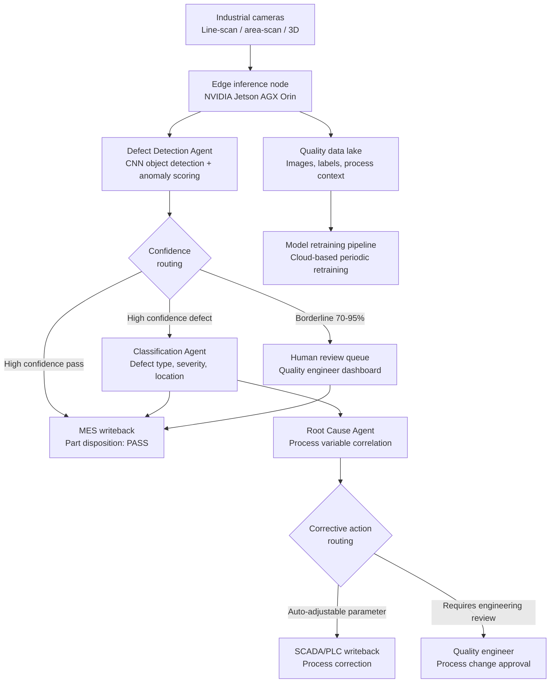

## What This Design Covers

This design covers autonomous inline quality inspection for a discrete manufacturing line producing 500–2,000 units per shift, where each unit requires visual defect detection at production speed. A multi-agent edge vision system detects surface and structural defects, classifies severity, correlates defect patterns to upstream process variables for root cause analysis, and triggers corrective actions through MES integration. Human quality engineers retain authority over disposition of borderline defects, approval of new defect classes, and process change decisions. The design draws on production deployments at BMW (AIQX across 30 plants), Siemens Amberg (99.9990% quality rate), Audi (1.5M spot welds per shift), and Foxconn (NxVAE unsupervised defect detection). [S1][S2][S3][S4]

## Recommended Operating Model

| Decision Area | Recommendation |
|---------------|----------------|
| **Autonomy Model** | Fully autonomous for pass/fail decisions within trained defect classes at high confidence (>95%). Borderline cases (70–95% confidence) queue for human review. New or unknown defect types always escalate. Progressive autonomy as the defect library grows. |
| **System of Record** | Manufacturing Execution System (MES) remains authoritative for production orders, part genealogy, and disposition records. The AI system writes inspection results back to MES — it does not replace it. |
| **Human Decision Points** | Quality engineers review borderline defects, approve new defect class additions to the model, authorize process parameter changes from root cause recommendations, and manage supplier quality escalations. |
| **Primary Value Driver** | Moving from 1–5% sampling to 100% inline inspection while improving detection accuracy from ~80% (human) to 99%+ (AI). BMW achieved up to 60% reduction in escaped defects. Secondary: 30–50% reduction in scrap/rework through faster root cause identification. [S1][S5] |

## Architecture

### System Diagram

### Component Responsibilities

| Component | Role | Notes |
|-----------|------|-------|
| Camera Array | Captures high-resolution images at line speed using industrial line-scan, area-scan, or 3D cameras with controlled lighting. | Camera selection depends on defect type: surface finish requires diffuse lighting; dimensional checks require structured light or 3D scanning. Axis P14 and Q1798-LE series used at BMW. [S1] |
| Edge Inference Node | Runs detection and classification models locally with sub-200ms latency per frame. Buffers images and results for upstream sync. | NVIDIA Jetson AGX Orin provides 275 TOPS at 60W. Handles YOLOv8 at 75+ FPS at INT8 precision. One node per inspection station. [S7] |
| Defect Detection Agent | Applies object detection and anomaly detection models to each captured frame. Outputs bounding boxes, defect scores, and anomaly maps. | Combines supervised detection (known defect classes) with unsupervised anomaly scoring (unknown defects). Foxconn NxVAE uses unsupervised reconstruction for anomaly detection. [S4] |
| Classification Agent | Categorizes detected defects by type, severity, and precise location on the part. Maps to quality standards (IPC-A-610 classes or IATF 16949 criteria). | Severity classification determines disposition: cosmetic vs. functional vs. safety-critical. [S10][S11] |
| Root Cause Agent | Correlates defect patterns against upstream process variables (temperature, pressure, speed, tool wear, material lot) to identify probable causes. | Siemens Amberg evaluates 50 million process data items daily for closed-loop quality feedback. [S3] |
| MES Integration Layer | Writes inspection results, disposition decisions, and corrective actions back to MES. Reads production order context and part genealogy. | OPC-UA is the standard protocol for MES/SCADA communication in modern manufacturing. [S12] |

## End-to-End Flow

| Step | What Happens | Owner |
|------|---------------|-------|
| 1 | Part enters inspection station. Cameras capture images under controlled lighting. Trigger signal from PLC synchronizes capture with line speed. | Camera Array / PLC |
| 2 | Edge inference node runs defect detection model. Each frame produces bounding boxes with confidence scores and an anomaly heat map. Latency target: <200ms. | Defect Detection Agent [S7] |
| 3 | High-confidence pass (>95%, no anomalies) routes directly to MES as PASS. High-confidence defect routes to Classification Agent. Borderline cases (70–95%) queue for human review with the image and model explanation. | Confidence Router |
| 4 | Classification Agent assigns defect type, severity class, and location coordinates. Part is dispositioned as rework, scrap, or conditional pass based on deterministic severity rules. | Classification Agent [S10] |
| 5 | Root Cause Agent runs statistical correlation between recent defect patterns and upstream process variables. If a known correctable parameter is drifting, it pushes a correction to SCADA/PLC. Novel correlations escalate to quality engineering. | Root Cause Agent [S3] |
| 6 | All inspection data — images, predictions, dispositions, process context — is written to the quality data lake. Cloud retraining pipeline periodically updates models with new labeled data including human-reviewed borderline cases. | Data Pipeline / Retraining |

## AI Responsibilities and Boundaries

| Workflow Area | AI Does | Deterministic System Does | Human Owns |
|---------------|---------|---------------------------|------------|
| Defect detection | Identifies and localizes defects in every frame at production speed. Flags anomalies outside trained classes. [S1][S4] | PLC triggers camera capture at correct position. Lighting controller maintains consistent illumination. | Reviews borderline detections. Validates new defect types for model inclusion. |
| Defect classification | Assigns defect type, severity, and location. Generates explanation overlay on image. [S10] | MES enforces disposition rules per severity class (e.g., safety-critical defects always scrap). Quality standards define severity thresholds. | Overrides classification on borderline cases. Approves changes to severity-to-disposition mapping. |
| Root cause analysis | Correlates defect trends with process variable drift. Recommends parameter adjustments. [S3] | SPC system maintains control chart limits. SCADA enforces parameter bounds. | Approves process changes. Investigates novel root causes. Manages supplier quality issues. |
| Process correction | Pushes minor parameter adjustments within pre-approved bounds (e.g., temperature offset ±2°C). | PLC enforces hard limits on all actuators. Safety interlocks prevent unsafe states. | Approves new auto-correction rules. Sets parameter adjustment bounds. Handles equipment failures. |

## Integration Seams

| System | Integration Method | Why It Matters |
|--------|--------------------|----------------|
| MES (SAP ME, Siemens Opcenter, Rockwell Plex) | OPC-UA for real-time; REST API for batch | Authoritative record for part disposition, production orders, and genealogy. Every inspection result must be traceable to a specific part and production context. [S12] |
| SCADA / PLC | OPC-UA or EtherNet/IP | Closed-loop correction requires writing to process controllers. Also provides trigger signals and process variable context for root cause analysis. |
| ERP (SAP, Oracle) | REST API via MES | Scrap/rework disposition flows to cost accounting. Supplier quality data feeds procurement decisions. |
| Quality data lake | MQTT from edge nodes; cloud storage API | Stores every image and inference result for traceability, regulatory audit, and model retraining. Siemens Amberg captures 50M data items/day. [S3] |
| Model registry / retraining pipeline | Container registry; CI/CD pipeline | Edge models must be versioned, validated on holdout data, and deployed without line stoppage. Siemens uses AWS cloud for training with Industrial Edge for deployment. [S6] |

## Control Model

| Risk | Control |
|------|---------|
| False negative (missed defect escapes to customer) | Dual-model architecture: supervised detector plus unsupervised anomaly scorer. Unknown anomalies always flag for human review. Periodic blind insertion of known-defective parts to measure escape rate. |
| False positive (good parts rejected, inflating scrap) | Confidence threshold tuning per defect class. Target <2% false positive rate. Borderline queue lets humans correct over-rejections. Retraining incorporates corrections. |
| Model drift from process or material changes | Automated drift detection comparing inference score distributions against baseline. Retraining triggered when distribution shift exceeds threshold. Siemens retrains with 80% less time using cloud pipeline. [S6] |
| Edge node failure stops production line | Fallback to deterministic rule-based vision (Cognex/Keyence) or manual inspection within 30 seconds. Edge nodes deployed in warm-standby pairs at critical stations. |
| Incorrect root cause leads to wrong process adjustment | Auto-corrections bounded within narrow, pre-approved parameter ranges. All adjustments logged and reversible. Novel correlations require human approval before any process change. |
| Regulatory non-compliance (IATF 16949, IPC-A-610) | Full audit trail: every inspection image, model version, confidence score, and disposition decision stored. Documented backup inspection methods as required by IATF 16949. [S10][S11] |

## Reference Technology Stack

| Layer | Default Choice | Reason | Viable Alternative |
|-------|----------------|--------|--------------------|
| **Model layer** | YOLOv8/v9 (detection) + autoencoder anomaly model, optimized with Intel OpenVINO or TensorRT | BMW AIQX uses OpenVINO. YOLOv8 achieves 75+ FPS on Jetson AGX Orin at INT8. Autoencoder handles unknown defect types without labeled data. [S1][S7] | Landing AI LandingLens (managed platform with few-shot training); Google Cloud Visual Inspection AI (up to 300x fewer labeled images needed). [S8][S9] |
| **Edge hardware** | NVIDIA Jetson AGX Orin (275 TOPS, 60W) | Production-proven for industrial vision. Sufficient throughput for multi-camera stations. Large developer ecosystem (2M+ developers). [S7] | Siemens Industrial Edge (integrated with Siemens MES ecosystem); Intel-based IPC with OpenVINO (lower cost, lower throughput). [S3][S6] |
| **Orchestration** | Python microservices on edge; MQTT event bus between agents | Low latency required (sub-200ms total pipeline). MQTT is lightweight and standard in industrial IoT. Agent coordination is simple enough that a framework like LangGraph adds unnecessary complexity at the edge. | ROS 2 (if robotic handling is integrated); Apache Kafka (if event volumes exceed MQTT broker capacity). |
| **Observability** | Prometheus + Grafana for inference metrics; quality data lake for image/result storage | Inference latency, throughput, confidence distributions, and drift metrics must be monitored continuously. Standard stack with strong industrial adoption. | Elastic Stack; InfluxDB for high-cardinality time-series data. |

## Key Design Decisions

| Decision | Choice | Why It Fits This Use Case |
|----------|--------|---------------------------|
| Edge-first inference over cloud-based | All real-time detection and classification runs on edge hardware at the inspection station. Cloud is used only for retraining and analytics. | Production lines require <200ms latency and cannot tolerate network dependency. Siemens Amberg runs edge AI for inline decisions; BMW streams to cloud but accepts higher latency for non-blocking checks. [S1][S3] |
| Supervised detection + unsupervised anomaly scoring | Combine a trained object detector for known defect classes with an unsupervised anomaly model that flags anything unusual. | Known defects get precise classification. Unknown defects (new failure modes, material changes) are caught by the anomaly scorer and routed to humans. Foxconn NxVAE demonstrated this approach improves accuracy from 95% to 99%. [S4] |
| 100% inline inspection over statistical sampling | Inspect every unit rather than sampling per ISO 2859. | AI vision cost per inspection is near-zero at production speed. 100% inspection catches sporadic defects that sampling misses. BMW and Siemens both moved from sampling to 100% inline. [S1][S3][S13] |
| Narrow auto-correction bounds over open-ended remediation | Root Cause Agent can only push corrections within pre-approved parameter ranges. Larger changes require human approval. | Limits blast radius on production equipment. Progressive autonomy — bounds widen as confidence in the correlation model grows. Similar pattern to telecom playbook-based remediation. |
| Quality standard mapping in classification | Classification Agent outputs map directly to IPC-A-610 classes or IATF 16949 severity categories. | Regulatory compliance requires defect disposition traceable to published standards. Deterministic severity-to-disposition rules downstream of AI classification maintain auditability. [S10][S11] |
