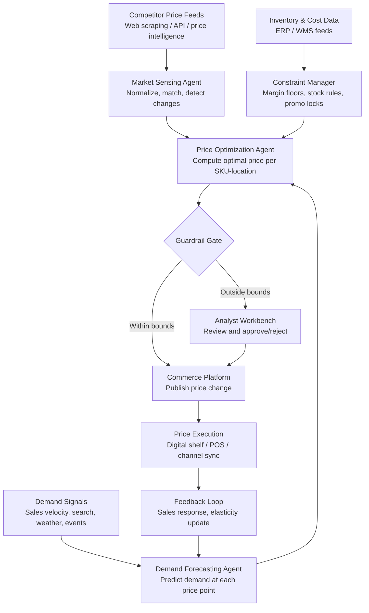

## What This Design Covers

This design covers an autonomous dynamic pricing system that continuously adjusts prices across a product catalog based on competitor prices, demand signals, inventory levels, and business constraints. The recommended operating model uses a multi-agent architecture where specialized agents handle market sensing, demand forecasting, price optimization, and guardrail enforcement. The system executes routine price changes autonomously within configured bounds; pricing analysts review exceptions and set strategy. The design targets mid-to-large retailers or e-commerce operators managing 10,000+ SKUs, but the architecture applies to airlines and hospitality with domain-specific substitutions. [S1][S3][S8]

## Recommended Operating Model

| Decision Area | Recommendation |
|---------------|----------------|
| **Autonomy Model** | Autonomous within guardrails. The system executes price changes that pass all margin, regulatory, and velocity checks without human approval. Changes outside guardrails queue for analyst review. Amazon operates this way at scale — 2.5M price changes per day would be impossible with human-in-the-loop approval. [S1][S2] |
| **System of Record** | The commerce platform (e.g., Shopify, SAP Commerce, custom PIM) remains authoritative for published prices. The pricing engine writes recommendations; the commerce platform publishes them. |
| **Human Decision Points** | Pricing analysts set strategy (target margins, competitive positioning rules, promotional calendars). They review guardrail exceptions, approve category-level policy changes, and monitor KPI dashboards. They do not approve individual SKU price changes. [S3] |
| **Primary Value Driver** | Revenue uplift of 2–5% and margin improvement of 5–10% through continuous optimization versus weekly/monthly manual repricing cycles. Secondary: 40+ hours/week of analyst time reclaimed from spreadsheet repricing. [S3][S8][S9] |

## Architecture

### System Diagram

### Component Responsibilities

| Component | Role | Notes |
|-----------|------|-------|
| Market Sensing Agent | Ingests competitor prices from scraping services or price intelligence APIs (Prisync, Competera, Intelligence Node). Normalizes product matches and detects meaningful price movements. | Filters noise — ignores changes below a configurable threshold. Runs on configurable cadence per category (hourly for electronics, daily for staples). [S3][S4] |
| Demand Forecasting Agent | Predicts demand curves at multiple price points using historical sales, seasonality, external signals (weather, events, holidays), and cross-elasticity between substitutes. | Uses gradient-boosted models (XGBoost/LightGBM) for tabular demand data. LLM assists with interpreting unstructured signals (event calendars, weather forecasts). Target: 90%+ forecast accuracy. [S4][S9] |
| Price Optimization Agent | Computes the optimal price per SKU-location that maximizes the objective function (revenue, margin, or blended) subject to constraints. | Solves a constrained optimization problem. Inputs: demand curve, competitor position, inventory level, margin floor, promotional calendar. Outputs: recommended price + confidence score. [S3][S8] |
| Guardrail Gate | Deterministic rule engine that validates every price recommendation against business constraints before execution. | Checks: margin floor, maximum change velocity (e.g., no more than 5% change per day), regulatory price-display rules, promotional lock periods, MAP compliance. Rejects or escalates violations. [S10] |
| Feedback Loop | Measures actual sales response after each price change and feeds elasticity updates back into the demand model. | Closes the learning loop. Compares predicted vs. actual demand at the executed price. Updates elasticity estimates incrementally. |

## End-to-End Flow

| Step | What Happens | Owner |
|------|---------------|-------|
| 1 | Market Sensing Agent detects a competitor price change on a tracked SKU. Alternatively, a scheduled optimization cycle triggers for a product category. | Market Sensing Agent / Scheduler |
| 2 | Demand Forecasting Agent retrieves current sales velocity, inventory position, and external signals. Produces a demand curve at candidate price points. | Demand Forecasting Agent |
| 3 | Price Optimization Agent evaluates candidate prices against the demand curve, applies the business objective function, and selects the optimal price. Attaches a confidence score and reasoning summary. | Price Optimization Agent |
| 4 | Guardrail Gate validates the recommendation: margin floor, velocity cap, MAP compliance, promotional lock, regulatory rules. Passes or escalates. | Guardrail Gate (deterministic) |
| 5 | Approved prices publish to the commerce platform, which syncs to digital shelf labels, website, marketplace listings, and POS. | Commerce Platform |
| 6 | Feedback Loop captures sales response over the next measurement window (typically 24–72 hours). Updates elasticity estimates. Flags anomalies for analyst review. | Feedback Loop |

## AI Responsibilities and Boundaries

| Workflow Area | AI Does | Deterministic System Does | Human Owns |
|---------------|---------|---------------------------|------------|
| Market monitoring | Matches competitor products, classifies price movements as meaningful vs. noise, detects patterns across categories. [S3] | Enforces scraping schedules and rate limits. Validates data quality thresholds. | Selects which competitors to track and sets monitoring priority per category. |
| Demand forecasting | Predicts demand at candidate price points. Incorporates unstructured signals (events, weather). Estimates cross-elasticity between substitutes. [S4] | Enforces minimum training data requirements. Flags forecast drift beyond confidence bounds. | Reviews forecast accuracy reports. Overrides forecasts when domain knowledge contradicts the model (e.g., known supply disruption). |
| Price computation | Generates the optimal price recommendation and explains the rationale. Balances revenue, margin, and competitive position. [S8] | Enforces hard constraints: margin floors, MAP, velocity caps, regulatory rules. Never executes a price the guardrail gate rejects. [S10] | Sets the objective function weights (revenue vs. margin). Defines guardrail parameters. Approves escalated recommendations. |
| Execution and learning | Measures sales response. Updates elasticity estimates. Detects anomalies in price-response patterns. | Publishes prices to channels. Maintains audit trail of every price change with timestamp, rationale, and outcome. | Reviews anomaly alerts. Adjusts strategy based on KPI dashboards. Owns promotional planning. |

## Integration Seams

| System | Integration Method | Why It Matters |
|--------|--------------------|----------------|
| Price intelligence service (Competera, Prisync, Intelligence Node) | REST API with webhook notifications for significant changes | Competitor price data is the primary trigger for reactive repricing. Webhook-based notification reduces polling overhead. [S3][S4] |
| Commerce platform (Shopify, SAP Commerce, custom PIM) | REST API or event-driven (Kafka) for price writeback | System of record for published prices. Write path must be atomic — partial price updates create channel inconsistency. |
| ERP / inventory management (SAP, Oracle, NetSuite) | REST API or database view for cost and stock data | Margin floor calculations require current landed cost. Stock-based rules (e.g., raise price when inventory < 2 weeks) need real-time position. |
| Digital shelf label system (SES-imagotag, Pricer) | API or middleware integration | Walmart is deploying digital shelf labels across all 4,600 US stores by end of 2026. Physical price display must sync within minutes of a price change. [S2] |
| Analytics / BI platform | Event stream (Kafka) for price change events and outcomes | Pricing analysts need dashboards showing price changes, competitive position, margin impact, and forecast accuracy. Audit trail for regulatory compliance. |

## Control Model

| Risk | Control |
|------|---------|
| Price war escalation — automated systems match each other downward in a race to the bottom | Velocity caps limit maximum price decrease per day per SKU (e.g., 5%). Margin floor is a hard constraint the system cannot breach. Circuit breaker pauses automated repricing if category-level margin drops below threshold within 24 hours. [S10] |
| Regulatory non-compliance — algorithmic pricing violating price-display, anti-discrimination, or competition law | Guardrail gate enforces jurisdiction-specific rules: EU Digital Fairness Act transparency requirements, US Robinson-Patman considerations, MAP agreements. Full audit trail of every price decision with rationale. [S10][S11] |
| Demand forecast error leading to revenue loss | A/B testing framework validates price changes on a holdout group before full rollout. Forecast accuracy monitored continuously; model retrained when drift exceeds threshold. Analyst override available for any SKU. |
| Customer trust erosion from visible price volatility | Maximum change frequency configurable per channel (e.g., online prices may change hourly; in-store labels change at most daily). Price consistency rules across channels prevent arbitrage perception. |
| Competitor data quality — incorrect match or stale data | Product matching confidence score required above 0.85 for automated action. Below threshold, the match queues for analyst verification. Staleness timeout flags data older than the configured freshness window. |

## Reference Technology Stack

| Layer | Default Choice | Reason | Viable Alternative |
|-------|----------------|--------|--------------------|
| **Model layer** | XGBoost/LightGBM for demand forecasting; linear programming solver for price optimization | Gradient-boosted models excel at tabular demand data with mixed feature types. LP solver handles constrained optimization efficiently at scale. [S4][S9] | Prophet for seasonality-heavy categories; reinforcement learning (contextual bandits) for continuous exploration-exploitation. |
| **Orchestration** | Apache Kafka + Flink for event-driven pipeline | Price changes are event-driven (competitor move, stock change, schedule trigger). Flink handles streaming aggregation and windowing. Matches Uber's proven architecture pattern. [S6] | Temporal for durable workflow orchestration if batch-oriented; AWS Step Functions for simpler deployments. |
| **Retrieval / memory** | PostgreSQL for price history and decision audit; Redis for real-time state cache | Price decision audit trail requires ACID guarantees. Redis provides sub-millisecond lookup for current competitor prices and inventory positions. | TimescaleDB for time-series price history; DynamoDB for serverless deployments. |
| **Observability** | OpenTelemetry traces per pricing decision; Grafana dashboards | Every price recommendation must be traceable from trigger through computation to execution outcome. Regulatory requirement for audit trail. [S10][S11] | Datadog or Splunk for enterprises with existing observability stacks. |

## Key Design Decisions

| Decision | Choice | Why It Fits This Use Case |
|----------|--------|---------------------------|
| Autonomous execution within guardrails, not human-in-the-loop | Prices that pass all guardrail checks execute without human approval | Amazon makes 2.5M price changes per day. Even a mid-size retailer with 50,000 SKUs cannot have analysts approve individual changes. The guardrail gate provides the safety boundary. [S1][S2] |
| Event-driven architecture, not batch | Price changes trigger on events (competitor move, stock change) plus scheduled sweeps | Batch repricing on weekly cycles leaves revenue on the table. Event-driven lets the system respond to competitor changes within minutes rather than days. [S1][S6] |
| Separate demand forecasting from price optimization | Two distinct agents with a clean contract between them | Demand forecasting is a prediction problem (ML). Price optimization is a constrained optimization problem (solver). Separating them allows independent model updates and testing. [S4] |
| Deterministic guardrail gate, not AI-based approval | Hard-coded business rules for margin, velocity, regulatory constraints | Guardrails must be predictable and auditable. An AI-based approval system introduces the same risks it is meant to prevent. Deterministic rules are easier to explain to regulators. [S10][S11] |
| Start with a single high-impact category | Pilot on electronics or fashion (high price elasticity, frequent competitor changes) before expanding | Proves ROI on the category with the highest sensitivity to price. Builds confidence before rolling out to lower-elasticity staples. Matches McKinsey's recommended rollout approach. [S8] |
