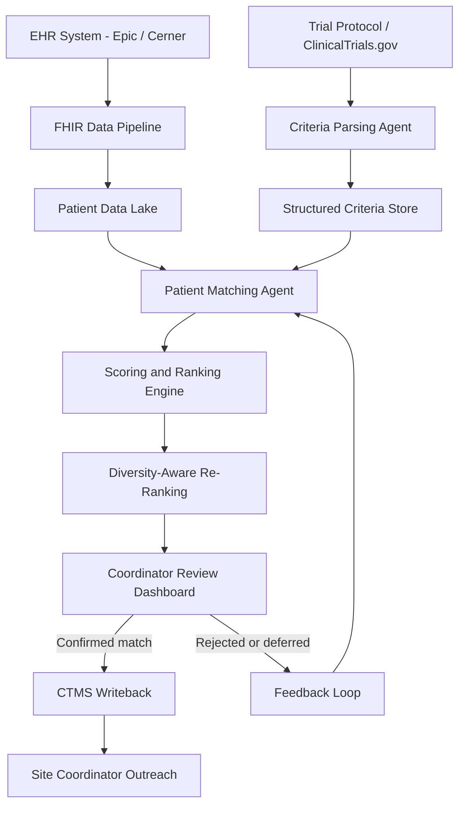

## What This Design Covers

This design addresses the end-to-end workflow of matching patients in electronic health records to clinical trial eligibility criteria, from criteria parsing through ranked candidate delivery to site coordinators. The recommended operating model uses agentic AI to autonomously screen structured and unstructured EHR data, score patient-trial matches, and surface ranked candidates — while keeping eligibility confirmation and enrollment decisions with clinical staff. The design boundary covers criteria decomposition, EHR data extraction, patient scoring, diversity-aware ranking, and coordinator review dashboards. It excludes protocol authoring, regulatory submission, and post-enrollment retention.

## Recommended Operating Model

| Decision Area | Recommendation |
|---------------|----------------|
| **Autonomy Model** | AI screens and ranks autonomously; clinical coordinators confirm top candidates; investigators make final enrollment decisions |
| **System of Record** | Clinical Trial Management System (CTMS) remains authoritative for enrollment status; EHR remains authoritative for patient data |
| **Human Decision Points** | Eligibility confirmation after AI pre-screen, informed consent, investigator enrollment decision, diversity committee review |
| **Primary Value Driver** | Speed: reducing patient identification from weeks of manual chart review to hours of AI-assisted screening while maintaining match accuracy above 95% |

## Architecture

### System Diagram

### Component Responsibilities

| Component | Role | Notes |
|-----------|------|-------|
| Criteria Parsing Agent | Decomposes free-text eligibility criteria from protocols into structured, machine-evaluable rules | Handles inclusion/exclusion criteria, temporal constraints, lab value ranges, and medication history requirements |
| FHIR Data Pipeline | Extracts patient demographics, diagnoses, labs, medications, procedures, and clinical notes from EHR via FHIR R4 | Runs on schedule or triggered by new trial activation; applies HIPAA Safe Harbor de-identification before AI processing |
| Patient Matching Agent | Evaluates each patient against each parsed criterion using structured data and LLM-based extraction from clinical notes | Produces per-criterion match/exclude/uncertain verdicts with evidence citations from source records |
| Scoring and Ranking Engine | Aggregates criterion-level verdicts into trial-level eligibility scores; ranks candidates by match strength | Deterministic scoring formula combining criterion weights, confidence scores, and data recency |
| Diversity-Aware Re-Ranking | Adjusts candidate ranking to surface underrepresented populations per FDA diversity action plan targets | Rule-based layer using demographic data; does not override eligibility — only adjusts presentation order |
| Coordinator Review Dashboard | Presents ranked candidates with per-criterion evidence, enabling accept/reject/defer decisions | Captures coordinator feedback to improve matching over time |
| CTMS Writeback | Records confirmed matches, tracks screening status, and manages enrollment pipeline | Integration with Medidata Rave, Veeva Vault CTMS, or equivalent |

## End-to-End Flow

| Step | What Happens | Owner |
|------|---------------|-------|
| 1 | New trial activated: protocol uploaded or pulled from ClinicalTrials.gov; Criteria Parsing Agent decomposes eligibility into structured rules | Criteria Parsing Agent |
| 2 | FHIR Data Pipeline extracts patient records from EHR, applies de-identification, and loads into patient data lake | FHIR Pipeline |
| 3 | Patient Matching Agent evaluates candidates against parsed criteria, extracting evidence from structured fields and unstructured clinical notes | Patient Matching Agent |
| 4 | Scoring engine aggregates per-criterion verdicts; diversity re-ranking adjusts presentation order; ranked list delivered to dashboard | Scoring Engine + Rules |
| 5 | Site coordinator reviews top candidates, confirms or rejects matches, provides feedback on uncertain cases | Clinical Coordinator |
| 6 | Confirmed matches written to CTMS; coordinator initiates outreach and informed consent process; investigator makes enrollment decision | Coordinator + Investigator |

## AI Responsibilities and Boundaries

| Workflow Area | AI Does | Deterministic System Does | Human Owns |
|---------------|---------|---------------------------|------------|
| Criteria interpretation | Parse free-text eligibility into structured rules; resolve ambiguous medical terminology | Validate parsed criteria against protocol template schema; enforce mandatory field completeness | Final approval of parsed criteria before screening begins |
| Patient data extraction | Extract clinical facts from unstructured notes (diagnoses, lab values, medication history) | Retrieve structured FHIR resources (demographics, coded diagnoses, lab results) | Data quality escalation when EHR records are incomplete |
| Eligibility scoring | Score each patient-criterion pair with confidence level; generate natural-language evidence summary | Aggregate scores using weighted formula; apply hard exclusion rules (age, geography) | Eligibility confirmation for all candidates before outreach |
| Diversity monitoring | Flag when candidate pool demographics diverge from diversity targets | Calculate demographic distributions; generate compliance reports | Diversity committee decisions on site selection and outreach strategy |

## Integration Seams

| System | Integration Method | Why It Matters |
|--------|--------------------|----------------|
| EHR (Epic, Cerner, or equivalent) | FHIR R4 REST API via SMART on FHIR authorization | Patient data is the primary input; FHIR standardizes access across EHR vendors and enables CDS Hooks for real-time alerts |
| ClinicalTrials.gov | REST API for protocol retrieval | Source of eligibility criteria for external trials; updated regularly with amendments |
| CTMS (Medidata Rave, Veeva Vault) | REST API for enrollment status writeback | System of record for trial enrollment; must reflect AI-screened and coordinator-confirmed status |
| Identity / consent management | OAuth 2.0 + institutional IRB integration | HIPAA compliance requires scoped access; IRB approval gates which trials can use AI screening |

## Control Model

| Risk | Control |
|------|---------|
| Incorrect exclusion of eligible patient (false negative) | High-sensitivity threshold: default to "uncertain" rather than "exclude" when evidence is ambiguous; all uncertain cases routed to coordinator review |
| Incorrect inclusion of ineligible patient (false positive) | Human confirmation required before any outreach; screen failure rate tracked as release gate metric |
| PHI exposure during AI processing | HIPAA Safe Harbor de-identification applied before LLM processing; processing within institutional BAA-covered infrastructure; audit logging on all data access |
| Bias in patient selection or systematic exclusion of populations | Diversity-aware re-ranking layer; demographic parity monitoring; periodic audit comparing AI-identified cohorts against site catchment demographics |
| Criteria misinterpretation leading to systematic screening errors | Parsed criteria reviewed by clinical coordinator before screening begins; A/B comparison against manual screening on pilot trials |

## Reference Technology Stack

| Layer | Default Choice | Reason | Viable Alternative |
|-------|----------------|--------|--------------------|
| **Model layer** | Claude (Anthropic) via API | Strong structured output for criterion-level extraction; long context handles multi-page clinical notes; safety-oriented design fits healthcare | GPT-4o (OpenAI), Med-PaLM 2 (Google) |
| **Orchestration** | LangGraph (multi-agent) | Graph-based workflow fits the parse → match → score → review pipeline; supports human-in-the-loop nodes for coordinator confirmation | CrewAI, custom state machine |
| **Retrieval / memory** | pgvector + FHIR resource index | Criterion matching requires retrieval over patient records; vector search enables semantic matching against clinical notes | Pinecone, Weaviate |
| **Observability** | LangSmith + application audit logging | Trace every matching decision for clinical audit trail; latency monitoring for screening SLAs | Datadog, custom audit logger |

## Key Design Decisions

| Decision | Choice | Why It Fits This Use Case |
|----------|--------|---------------------------|
| AI screens, human confirms | No autonomous enrollment — AI produces ranked candidates, coordinators confirm | Regulatory and ethical risk of enrolling wrong patient is high; informed consent requires human interaction; matches Cleveland Clinic operating model |
| De-identify before LLM processing | HIPAA Safe Harbor applied at pipeline boundary, not inside agent | Eliminates PHI exposure risk in model API calls; simpler compliance posture than relying on BAA alone |
| Criterion-level verdicts, not binary match | Each criterion scored independently with evidence citation | Coordinators can quickly identify which criteria are uncertain and focus review time; matches TrialGPT's published approach |
| Diversity re-ranking as separate layer | Rule-based demographic adjustment after eligibility scoring | Keeps eligibility determination objective; diversity optimization is transparent and auditable; supports FDA diversity action plan compliance |
| FHIR R4 as data contract | All EHR access through FHIR resources, not direct database queries | Vendor-neutral; supports Epic, Cerner, and other certified EHRs; enables CDS Hooks integration for real-time trial alerts at point of care |
