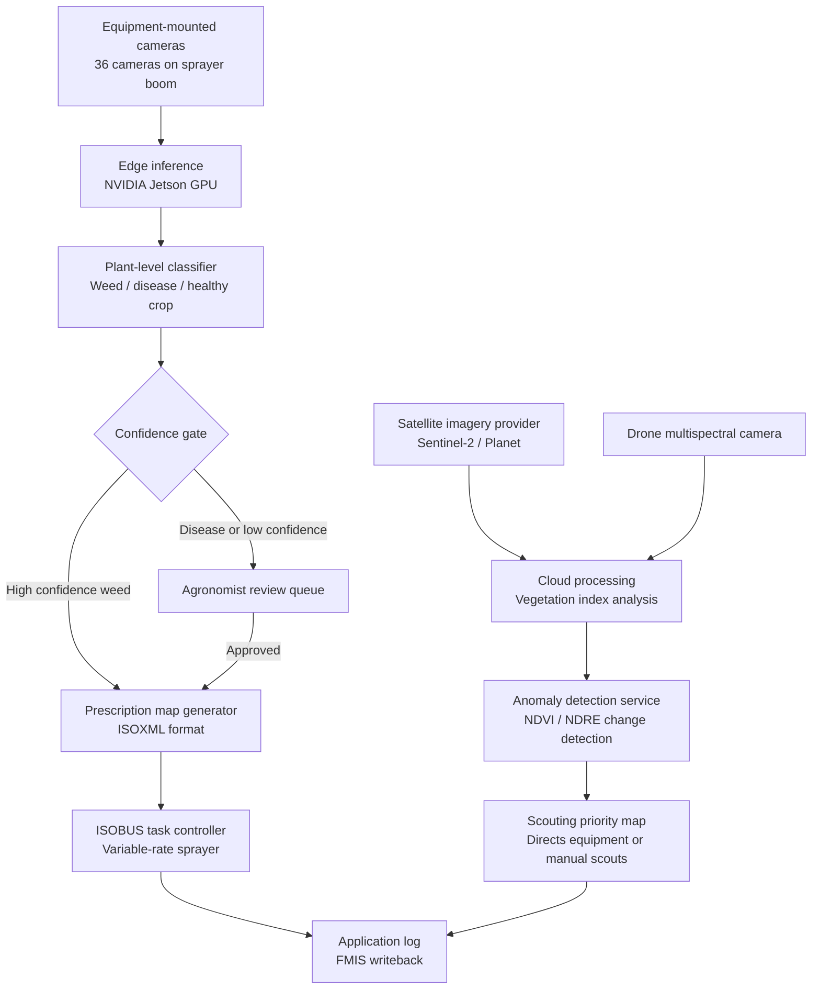

## What This Design Covers

This design covers the detect-to-treat path for commercial farming operations that already use sprayer equipment and a farm management information system but rely on manual scouting and broadcast chemical application for crop protection. The reference pattern assumes satellite or drone imagery for field-level monitoring, equipment-mounted cameras for plant-level detection, and ISOBUS-compatible sprayers for targeted application. The goal is to let computer vision handle detection and classification while deterministic systems generate prescription maps and human agronomists retain authority over treatment decisions for novel or high-severity situations. [S1][S3][S4]

## Recommended Operating Model

| Decision Area | Recommendation |
|---------------|----------------|
| **Autonomy Model** | Semi-autonomous. Routine weed detection and targeted spraying can proceed without human review when model confidence exceeds threshold. Disease diagnoses and novel pest detections route to an agronomist for confirmation before treatment. [S1][S3] |
| **System of Record** | The farm management information system remains authoritative for field boundaries, crop plans, application records, and compliance logs. [S6] |
| **Human Decision Points** | Agronomists review low-confidence detections, approve fungicide and insecticide treatment plans, and override prescription maps when field conditions require it. [S4][S8] |
| **Primary Value Driver** | Input cost reduction from targeted application (50% herbicide savings demonstrated at scale) combined with yield protection from earlier detection. [S1] |

## Architecture

### System Diagram

### Component Responsibilities

| Component | Role | Notes |
|-----------|------|-------|
| Satellite monitoring service | Ingests multispectral imagery on a 3-5 day cadence and computes vegetation indices across all managed fields. | Provides broad coverage between equipment passes; detects field-scale anomalies using NDVI and NDRE. [S7] |
| Edge inference module | Runs trained CNN models on equipment-mounted camera feeds at 20+ frames per second during field operations. | John Deere's deployment uses 36 cameras scanning 2,500 sq ft/sec on NVIDIA Jetson processors. [S1][S3] |
| Plant-level classifier | Distinguishes weeds, diseases, pests, and healthy crop at sub-meter resolution and assigns confidence scores. | Models trained on 1M+ labeled field images; detection accuracy exceeds 90% for common weed species. [S3][S7] |
| Prescription map generator | Converts classified detections into geo-referenced ISOXML prescription maps specifying product, rate, and location. | Must comply with ISO 11783-10 task controller data interchange format. [S6] |
| Agronomist review interface | Queues low-confidence detections and disease diagnoses with supporting imagery for human confirmation. | Keeps treatment authority with licensed advisors where required by pesticide regulations. |
| FMIS integration adapter | Writes application records, detection logs, and compliance data back to the farm management system. | Closes the audit loop for chemical usage reporting and regulatory compliance. |

## End-to-End Flow

| Step | What Happens | Owner |
|------|---------------|-------|
| 1 | Satellite imagery is ingested on a regular cadence; vegetation indices flag fields with anomalous health patterns. | Cloud monitoring service [S7] |
| 2 | Anomaly areas are prioritized for ground-level inspection via equipment passes or drone overflights. | Scouting priority engine |
| 3 | Equipment-mounted cameras capture plant images during sprayer operation; edge GPU classifies each plant in real time. | Edge inference module [S1][S3] |
| 4 | High-confidence weed detections trigger immediate nozzle activation; disease or low-confidence results queue for agronomist review. | Confidence gate and review queue |
| 5 | Approved treatment plans generate ISOXML prescription maps delivered to the sprayer task controller via ISOBUS. | Prescription generator and ISOBUS adapter [S6] |
| 6 | Application records — product, rate, location, timestamp — write back to the FMIS for compliance and analysis. | FMIS adapter |

## AI Responsibilities and Boundaries

| Workflow Area | AI Does | Deterministic System Does | Human Owns |
|---------------|---------|---------------------------|------------|
| Field monitoring | Computes vegetation indices and flags anomalous zones from satellite imagery. [S7] | Schedules imagery ingestion, stores time-series data, enforces field boundary geometry. | Decides which flagged fields to prioritize for ground inspection. |
| Plant-level detection | Classifies individual plants as weed, disease, pest, or healthy crop with confidence scores. [S1][S3] | Applies confidence threshold gate; routes low-confidence results to review. | Confirms disease diagnoses and novel pest identifications. |
| Treatment planning | Recommends product and rate based on detection type, severity, crop stage, and weather forecast. [S8] | Enforces label rate limits, buffer zone rules, and product compatibility constraints. | Approves fungicide and insecticide plans; overrides any prescription. |
| Application execution | No role during physical application. | Controls nozzle activation via ISOBUS task controller based on prescription map. [S6] | Monitors equipment operation and stops application if field conditions change. |

## Integration Seams

| System | Integration Method | Why It Matters |
|--------|--------------------|----------------|
| Satellite imagery provider (Sentinel-2, Planet) | REST API for scene ordering and tile download | Provides the broad monitoring layer; refresh cadence determines early-warning speed. [S7] |
| Weather service API | REST API for forecast and historical data | Disease risk models depend on temperature, humidity, and precipitation forecasts. [S8] |
| FMIS (farm management information system) | File-based or REST API data exchange | System of record for field boundaries, crop plans, and application logs. |
| Sprayer equipment | ISOBUS (ISO 11783) task controller protocol | Prescription maps must conform to ISOXML format for cross-manufacturer equipment compatibility. [S6] |
| Drone flight management | MAVLink or vendor SDK for flight planning and image download | Fills the resolution gap between satellite monitoring and equipment-mounted cameras. |

## Control Model

| Risk | Control |
|------|---------|
| Misclassification leading to crop damage from incorrect herbicide application | Confidence threshold gate: only high-confidence weed detections trigger automatic spraying; everything else routes to human review. [S1][S3] |
| Over-application exceeding label rates or buffer zone violations | Deterministic prescription generator enforces maximum application rates from product labels and geo-fences buffer zones around water features and field boundaries. |
| Model drift as weed populations or crop varieties change across seasons | Seasonal model revalidation using labeled field samples; performance dashboard tracks detection accuracy and false-positive rate per crop and region. |
| Data privacy and farm-level confidentiality | Field data stored with grower-controlled access; no cross-farm data sharing without explicit consent; on-premises edge processing keeps raw imagery local. [S4] |

## Reference Technology Stack

| Layer | Default Choice | Reason | Viable Alternative |
|-------|----------------|--------|--------------------|
| **Model layer** | PyTorch with YOLO-variant object detection | Proven in real-time agricultural detection; John Deere uses custom CNN variants trained on 1M+ images. [S3] | TensorFlow Lite for lighter edge footprint. |
| **Edge inference** | NVIDIA Jetson Orin | Successor to Xavier used in See & Spray; supports 20+ fps inference at field speed. [S3] | Intel Movidius for lower-power drone payloads. |
| **Geospatial processing** | GDAL and Rasterio for imagery; ISOXML generator for prescriptions | Industry-standard geospatial libraries; ISOXML is the only cross-manufacturer prescription format. [S6] | QGIS server for teams preferring GUI-based map editing. |
| **Observability** | Application telemetry with per-field detection and application logs | Needed for seasonal model performance tracking and regulatory compliance reporting. | Commercial precision ag platforms (xarvio, Cropwise) that include built-in dashboards. [S4][S8] |

## Key Design Decisions

| Decision | Choice | Why It Fits This Use Case |
|----------|--------|---------------------------|
| Two-tier monitoring | Satellite for field-level anomaly detection, equipment cameras for plant-level classification | Satellite alone lacks the resolution for individual plant treatment; cameras alone cannot cover idle fields. Combining both closes the detection gap. [S7] |
| Edge-first inference | Run detection models on equipment-mounted GPUs, not in the cloud | Sprayers travel at 12-15 mph and must make nozzle decisions in under 50 ms; round-trip cloud latency is not viable for real-time application. [S1][S3] |
| Weed-only autopilot, disease requires review | Automatic spraying for high-confidence weed detections; agronomist sign-off for disease treatment | Weed misclassification risk is bounded (worst case: unnecessary spot spray). Disease misdiagnosis can lead to wrong product, crop damage, or resistance buildup. [S1] |
| ISOXML as the integration contract | Generate prescriptions in ISO 11783-10 format regardless of equipment brand | Avoids vendor lock-in; ISOBUS is the only standard supported across John Deere, CLAAS, CNH, and AGCO equipment. [S6] |
