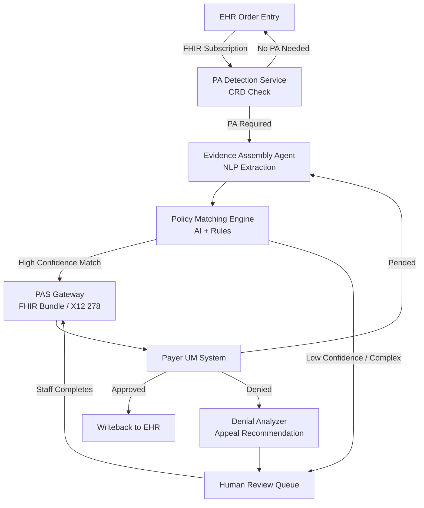

## What This Design Covers

This design describes an AI-assisted system that detects when a clinical order requires prior authorization, assembles the supporting clinical evidence from the EHR, matches it against payer medical necessity criteria, and submits the request electronically. The system auto-adjudicates routine cases, routes complex cases to human reviewers with pre-assembled evidence packages, and tracks pending authorizations through resolution. The EHR remains the system of record. Physicians retain treatment authority; the AI handles the administrative proof of medical necessity.

## Recommended Operating Model

| Decision Area | Recommendation |
|---------------|----------------|
| **Autonomy Model** | AI auto-submits and tracks routine PA requests that meet payer criteria with high confidence; complex, borderline, or high-acuity cases route to human review with a pre-assembled evidence package |
| **System of Record** | EHR (Epic, Oracle Health, MEDITECH) holds the authorization status, clinical documentation, and patient record; the PA agent writes back decisions but does not own data |
| **Human Decision Points** | Clinical staff review AI-flagged exceptions, incomplete documentation cases, and all denial appeals; medical directors approve policy override requests; physicians retain final treatment authority |
| **Primary Value Driver** | Elimination of manual evidence gathering and payer-specific formatting -- the step that consumes most of the 12 staff-hours/week per practice |

## Architecture

### System Diagram

### Component Responsibilities

| Component | Role | Notes |
|-----------|------|-------|
| **PA Detection Service** | Monitors EHR order events and checks coverage requirements via CRD queries | Deterministic; uses payer-published rules to decide if PA is required |
| **Evidence Assembly Agent** | Extracts relevant clinical data from the patient record using NLP | LLM-powered; reads chart notes, lab results, imaging reports, medication history |
| **Policy Matching Engine** | Maps extracted clinical evidence against payer-specific medical necessity criteria | Hybrid: rules engine for structured criteria, LLM for unstructured policy interpretation |
| **PAS Gateway** | Translates the assembled PA request into Da Vinci PAS FHIR bundles or X12 278 transactions | Deterministic translation; handles payer-specific submission formats |
| **Human Review Queue** | Presents exception cases with pre-assembled evidence for staff completion | UI layer; shows confidence scores, missing evidence gaps, and recommended actions |
| **Denial Analyzer** | Parses denial reasons and recommends appeal strategies based on historical patterns | LLM-assisted analysis of denial codes and suggested evidence to strengthen resubmission |

## End-to-End Flow

| Step | What Happens | Owner |
|------|--------------|-------|
| 1 | Physician places an order in the EHR; the PA Detection Service receives the event and queries the payer's CRD endpoint to determine if authorization is required | PA Detection Service (deterministic) |
| 2 | Evidence Assembly Agent extracts relevant clinical documentation from the patient record -- diagnoses, treatment history, lab values, imaging findings -- and structures it for submission | Evidence Assembly Agent (AI) |
| 3 | Policy Matching Engine evaluates the extracted evidence against the payer's medical necessity criteria and assigns a confidence score | Policy Matching Engine (AI + rules) |
| 4 | High-confidence matches are auto-submitted via the PAS Gateway as a FHIR bundle or X12 278 transaction; low-confidence cases route to the Human Review Queue | PAS Gateway (deterministic) or Human Review Queue |
| 5 | Payer responds with approval, pend (request for additional information), or denial; approvals write back to the EHR; pends re-enter evidence assembly; denials route to the Denial Analyzer | PAS Gateway + Denial Analyzer |
| 6 | Staff review denial analysis, approve appeal strategy, and resubmit with strengthened clinical evidence | Clinical staff (human) |

## AI Responsibilities and Boundaries

| Workflow Area | AI Does | Deterministic System Does | Human Owns |
|---------------|---------|---------------------------|------------|
| **PA detection** | Nothing -- detection is rule-based | CRD query against payer coverage rules; benefit eligibility check | Exception review when coverage status is ambiguous |
| **Evidence assembly** | Extract and summarize clinical findings from unstructured chart notes, labs, imaging | Structure extracted data into FHIR-compliant resources | Review and supplement when AI flags documentation gaps |
| **Policy matching** | Interpret unstructured medical policy language; score match confidence | Apply structured criteria (CPT/ICD code lookups, age/gender rules) | Final decision on borderline cases; override AI recommendation when clinically justified |
| **Submission** | Nothing -- submission is deterministic | Format and transmit FHIR bundle or X12 278 to payer endpoint | None for auto-submitted cases; staff complete and submit exception cases |
| **Denial response** | Analyze denial reason codes; recommend appeal evidence and strategy | Route denial to appropriate queue based on denial category | Approve appeal strategy; conduct peer-to-peer reviews; decide whether to escalate |

## Integration Seams

| System | Integration Method | Why It Matters |
|--------|--------------------|----------------|
| **EHR (Epic / Oracle Health / MEDITECH)** | FHIR R4 via SMART-on-FHIR OAuth2; CDS Hooks for order-event triggers | Source of clinical documentation and order data; writeback target for authorization status |
| **Payer UM Systems** | Da Vinci PAS FHIR API (CMS-0057-F mandate) with X12 278 fallback via clearinghouse | Submission and response channel; must support both FHIR-native payers and legacy X12 payers |
| **Medical Policy Repository** | REST API or document ingestion from payer-published clinical criteria | Source of truth for necessity rules; must refresh when payers update policies |
| **Clearinghouse (Availity, Change Healthcare)** | EDI X12 278 / FHIR translation gateway | Required for payers that do not yet support Da Vinci PAS directly; handles format translation |

## Control Model

| Risk | Control |
|------|---------|
| **NLP extraction error** -- AI misreads or omits clinical findings from chart notes | Confidence scoring on extraction; cases below threshold route to human review; structured data (lab values, ICD codes) validated against EHR discrete fields |
| **Policy misinterpretation** -- AI matches against wrong criteria or outdated policy | Versioned policy repository with payer-published effective dates; deterministic CPT/ICD rule layer catches structured criteria before LLM interprets unstructured text |
| **Automated denial harm** -- payer-side AI denies without individualized review | System operates on the provider side (submitting, not denying); denial analyzer recommends appeals but never auto-submits without staff approval; audit log captures every auto-submission |
| **PHI exposure** -- patient data leaks during AI processing | All LLM inference runs within a HIPAA-compliant environment (BAA-covered cloud or on-premise); no PHI sent to consumer-grade APIs; data minimization in prompts |
| **Regulatory non-compliance** -- state laws restrict automated PA decisions | Configurable jurisdiction rules; states that prohibit fully automated denials do not affect provider-side auto-submission; payer-side adjudication remains outside system scope |

## Reference Technology Stack

| Layer | Default Choice | Reason | Viable Alternative |
|-------|----------------|--------|--------------------|
| **Model layer** | Claude Sonnet or GPT-4o (HIPAA BAA) | Strong clinical NLP, structured output, HIPAA-eligible deployment | Azure OpenAI Service (GPT-4o); Google MedPaLM; Llama 3 (self-hosted for data sovereignty) |
| **Orchestration** | LangGraph (Python) | Stateful multi-step workflows with branching (auto-submit vs. human queue); checkpoint/resume for pended cases | Temporal; custom state machine |
| **Retrieval / memory** | Vector store (pgvector) for medical policy search + EHR FHIR queries for clinical data | Policy documents require semantic search; clinical data comes structured from EHR APIs | Pinecone; Weaviate; Elasticsearch with dense vectors |
| **Interoperability** | HAPI FHIR (Java) or fhir.resources (Python) for FHIR R4 bundle construction | Reference FHIR implementation with Da Vinci PAS profile support | Microsoft FHIR Server; Google Cloud Healthcare API |
| **Observability** | LangSmith + application logging to ELK or Datadog | Trace every LLM call, confidence score, and submission outcome for audit | Weights & Biases; Arize AI; custom audit tables |

## Key Design Decisions

| Decision | Choice | Why It Fits This Use Case |
|----------|--------|---------------------------|
| **Provider-side agent, not payer-side adjudicator** | AI assists the provider in assembling and submitting PA requests; it does not make coverage decisions | Avoids regulatory risk of automated denials; aligns with state laws restricting AI-only payer decisions; provider-side automation has clearer ROI path |
| **Hybrid rules + LLM for policy matching** | Structured criteria (CPT codes, age limits, diagnosis codes) handled by rules engine; unstructured policy language interpreted by LLM | Most PA criteria have a structured component that does not need AI; LLM adds value only for free-text policy interpretation and clinical note extraction |
| **Human-in-the-loop for all denials and appeals** | Denial analysis and appeal recommendations are AI-generated but require staff approval before resubmission | Appeals involve clinical judgment and may escalate to peer-to-peer review; automated appeals risk regulatory and legal exposure |
| **FHIR-first with X12 fallback** | Build primary integration using Da Vinci PAS FHIR APIs; fall back to X12 278 via clearinghouse for non-FHIR payers | CMS-0057-F mandates FHIR APIs by 2027; building FHIR-first avoids re-architecture; X12 fallback covers the transition period |
