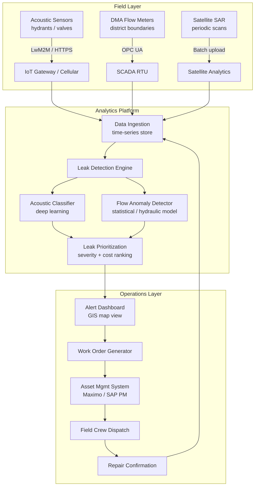

## What This Design Covers

Water utilities lose 20–30% of treated water to leaks in underground distribution networks. This design describes an AI-driven continuous monitoring system that ingests acoustic and flow sensor data, classifies leaks, prioritizes them by severity, and generates repair work orders — replacing reactive, crew-walked survey campaigns with persistent network-wide surveillance. The design boundary covers the distribution network from treatment plant outlet to customer meter. Wastewater, treatment process optimization, and customer-premise detection are excluded.

## Recommended Operating Model

| Decision Area | Recommendation |
|---------------|----------------|
| **Autonomy Model** | AI autonomous for detection and classification; human-in-the-loop for repair dispatch and excavation authorization |
| **System of Record** | Utility GIS and asset management platform (e.g., IBM Maximo, SAP PM, or Cityworks) remain authoritative for asset state and work orders |
| **Human Decision Points** | Repair prioritization override, excavation approval, capital replacement decisions, regulatory NRW audit sign-off |
| **Primary Value Driver** | Continuous coverage converts months-long leak run times into hours-to-days detection, recovering water revenue and avoiding emergency break costs |

## Architecture

### System Diagram

### Component Responsibilities

| Component | Role | Notes |
|-----------|------|-------|
| **Acoustic Sensors** | Capture pipe vibration audio at hydrant/valve contact points | Battery-powered, cellular-connected; NSF/ANSI 61 certified for potable water contact |
| **DMA Flow Meters** | Measure bulk flow at district metered area boundaries | Existing SCADA infrastructure; provides minimum night flow baselines |
| **Leak Detection Engine** | Orchestrates classification and anomaly detection models | Runs on cloud or on-premises depending on utility data residency policy |
| **Acoustic Classifier** | Deep learning model trained on verified leak audio signatures | FIDO reports 1.7M+ training samples and >92% accuracy; classifies leak vs. non-leak and estimates size |
| **Flow Anomaly Detector** | Statistical model on DMA flow data to flag new real losses | Siemens SIWA approach: trained on historical flow/pressure, detects anomalies as small as 0.5 L/s |
| **Leak Prioritization** | Ranks confirmed leaks by estimated loss rate, asset criticality, and repair cost | Feeds the alert dashboard and drives work order sequencing |
| **Work Order Generator** | Creates repair work orders with GIS coordinates and severity metadata | Writes to the asset management system via API |

## End-to-End Flow

| Step | What Happens | Owner |
|------|--------------|-------|
| 1 | Sensors continuously stream acoustic recordings and flow readings to the ingestion layer on a configurable interval (typically every 15 min to 1 hour) | Sensor network |
| 2 | Acoustic classifier scores each recording against the trained leak-signature model; flow anomaly detector compares DMA readings against learned baselines | Leak Detection Engine (AI) |
| 3 | Confirmed leak events are deduplicated, geolocated to sub-meter accuracy, and ranked by estimated water loss rate and proximity to critical infrastructure | Prioritization module |
| 4 | High-severity alerts surface on the operator dashboard with a GIS map overlay; the system drafts a work order with location, estimated leak size, and recommended action | Dashboard + Work Order Generator |
| 5 | Operations manager reviews, approves, and dispatches the work order to the field crew | Human operator |
| 6 | Field crew locates and repairs the leak; repair confirmation is logged, and the system updates its baseline model | Field crew + Detection Engine |

## AI Responsibilities and Boundaries

| Workflow Area | AI Does | Deterministic System Does | Human Owns |
|---------------|---------|---------------------------|------------|
| **Leak detection** | Classifies acoustic signatures; detects flow anomalies | Sensor hardware captures raw data; SCADA aggregates flow readings | Reviews flagged alerts before crew dispatch |
| **Leak localization** | Estimates sub-meter coordinates using correlator and sensor triangulation data | GIS renders location on the pipe asset map | Authorizes excavation at the indicated location |
| **Severity ranking** | Estimates loss rate and repair priority from leak size, pipe material, and asset age | Asset management system provides pipe inventory and maintenance history | Overrides AI-suggested priority when operational context requires it |
| **Work order creation** | Drafts work order with pre-populated fields | Asset management system enforces work order schema and approval routing | Approves or edits the work order before dispatch |
| **Baseline learning** | Updates flow baselines and acoustic model weights after confirmed repairs | Time-series store retains raw sensor data for audit | Signs off on NRW audit reports using AWWA M36 methodology |

## Integration Seams

| System | Integration Method | Why It Matters |
|--------|--------------------|----------------|
| **SCADA / RTU** | OPC UA or Modbus TCP | DMA flow meters and pressure sensors already report through SCADA; reuse avoids duplicate sensor infrastructure |
| **GIS (ESRI ArcGIS)** | REST API (ArcGIS Feature Service) | All leak locations must render on the utility's authoritative pipe network map for crew dispatch |
| **Asset Management (IBM Maximo / SAP PM)** | REST API or pre-built connector | Work orders, asset records, and repair history live here; the AI must read asset context and write work orders |
| **Hydraulic Model (EPANET / InfoWater)** | File export or API | Provides pressure zone context and simulated flow behavior that improves anomaly detection accuracy |
| **IoT / Sensor Platform** | HTTPS / LwM2M / MQTT | Acoustic sensors from vendors like FIDO connect via cellular IoT; the platform must normalize heterogeneous sensor payloads |

## Control Model

| Risk | Control |
|------|---------|
| **False positive leak alert** leading to unnecessary excavation | Two-stage confirmation: AI classifies, then operator reviews before dispatch; pilot data shows 92%+ accuracy reduces wasted digs |
| **False negative** allowing a large leak to run undetected | DMA-level flow balance acts as a second detection layer; any unexplained flow increase triggers investigation even without an acoustic hit |
| **Sensor drift or failure** creating blind spots | Heartbeat monitoring with configurable staleness threshold (e.g., no data in 4 hours triggers maintenance alert) |
| **Model degradation** over time as pipe network changes | Periodic retraining on confirmed repair data; AWWA M36 water audit performed annually to cross-check AI-reported losses against utility-wide water balance |
| **Data residency / privacy** | On-premises deployment option for utilities with strict data policies (as VA SYD chose); customer metering data anonymized before ingestion |

## Reference Technology Stack

| Layer | Default Choice | Reason | Viable Alternative |
|-------|----------------|--------|--------------------|
| **Acoustic sensors** | FIDO Leak Locate | Proven 92%+ accuracy, 1.7M+ signature library, GPT-4-assisted classification, cellular IoT | Echologics (Mueller), Gutermann |
| **Flow anomaly detection** | Siemens SIWA Leak Finder | Production-proven at VA SYD; OPC UA native; detects 0.5 L/s leaks | TaKaDu (Xylem), Innovyze InfoSurge |
| **Satellite detection** | ASTERRA (L-band SAR) | Covers large areas per scan; 80% hit rate in field verification; complements acoustic for trunk mains | Utilis (Mueller), Rezatec |
| **Time-series storage** | InfluxDB or Azure Data Explorer | Purpose-built for high-frequency sensor telemetry; integrates with IoT ingestion pipelines | TimescaleDB, AWS Timestream |
| **Orchestration / analytics** | Python (scikit-learn, PyTorch) on Azure IoT / AWS IoT Greengrass | Flexible model training and inference; cloud-native or edge-deployable | Google Cloud IoT Core, on-prem Kubernetes |
| **Observability** | Grafana + Prometheus | Standard for IoT fleet monitoring; dashboards for sensor health, model accuracy, and NRW KPIs | Datadog, Splunk |

## Key Design Decisions

| Decision | Choice | Why It Fits This Use Case |
|----------|--------|---------------------------|
| **DMA-first deployment** | Deploy flow meters at DMA boundaries first, then backfill acoustic sensors within high-loss DMAs | Provides immediate network-wide visibility at low cost; acoustic sensors are then targeted where they add the most value |
| **Multi-modal detection** | Combine acoustic classification with flow anomaly detection rather than relying on one modality | Acoustic excels at pinpointing location; flow balance excels at catching leaks on plastic pipes that transmit little sound |
| **Human-in-the-loop for dispatch** | AI drafts work orders but does not auto-dispatch crews | Excavation is expensive and disruptive; false positives must be filtered by operators who know local conditions |
| **Vendor-agnostic sensor ingestion** | Normalize sensor payloads into a common schema at the ingestion layer | Utilities often deploy sensors from multiple vendors across different network zones; lock-in to one vendor limits future flexibility |
| **Annual AWWA M36 cross-check** | Run a formal water audit annually to validate AI-reported NRW against the utility-wide water balance | Regulators require auditable NRW numbers; the AI's continuous estimates need periodic ground-truth calibration |
