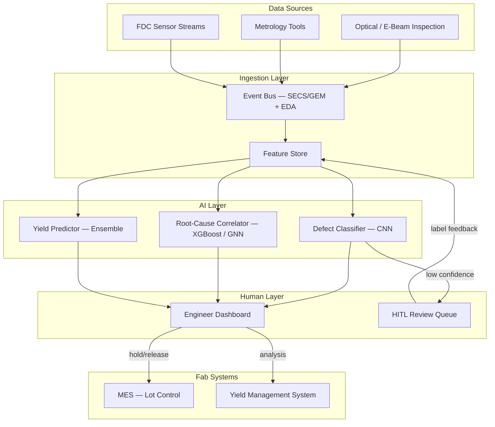

## What This Design Covers

This design addresses automated defect classification, root-cause correlation, and yield prediction for advanced-node semiconductor fabs. The operating model replaces manual wafer-map review and ad-hoc database querying with a streaming AI pipeline that classifies defects in near real time, proposes root causes to engineers, and feeds disposition decisions back as training data. The boundary is inline yield analysis — from inspection data ingestion through engineer-approved process action. Design-phase DFM, computational lithography, and equipment predictive maintenance are out of scope.

## Recommended Operating Model

| Decision Area | Recommendation |
|---------------|----------------|
| **Autonomy Model** | AI classifies defects and proposes root causes autonomously; human engineers approve all hold-lot, recipe-change, and disposition decisions |
| **System of Record** | Existing yield management system (e.g., KLA Klarity, PDF Solutions Exensio) remains authoritative for yield data and lot history |
| **Human Decision Points** | Lot hold/release, process recipe changes, novel defect pattern confirmation, model retraining approval |
| **Primary Value Driver** | Compressing excursion-to-root-cause time from days to hours, reducing scrap wafers per event by 60–80% |

## Architecture

### System Diagram

### Component Responsibilities

| Component | Role | Notes |
|-----------|------|-------|
| Event Bus | Ingest equipment data via SECS/GEM (SEMI E5/E30/E37) and EDA (SEMI E120/E134) protocols | Must handle 5–20 TB/day per fab with sub-minute latency |
| Feature Store | Normalize, version, and serve time-series features (FDC traces, metrology values, wafer-map bitmaps) | Partitioned by tool, lot, and process step for fast retrieval |
| Defect Classifier | Classify wafer-map patterns into known defect categories; flag novel patterns for HITL review | CNN or Vision Transformer trained on labeled wafer-map images |
| Root-Cause Correlator | Correlate classified defects with upstream FDC and metrology features to rank candidate process steps | Gradient-boosted trees or graph neural networks over tool–step–defect relationships |
| Yield Predictor | Forecast end-of-line die yield from in-process features at early layers | Ensemble model; enables early hold decisions before full processing cost is committed |
| Engineer Dashboard | Present classified defects, root-cause hypotheses, and yield forecasts; capture disposition decisions | Integrates with existing yield management UI where possible |
| HITL Review Queue | Route low-confidence or novel classifications to domain experts; capture expert labels as retraining data | Target: <5% of wafers routed to human review at steady state |

## End-to-End Flow

| Step | What Happens | Owner |
|------|--------------|-------|
| 1 | Inspection and metrology tools emit defect maps and measurements via SECS/GEM and EDA to the event bus | Equipment / Fab automation |
| 2 | Ingestion pipeline normalizes data, extracts features, and writes to the feature store | Data engineering |
| 3 | Defect classifier scores each wafer map; high-confidence results go to the dashboard, low-confidence to HITL queue | AI pipeline |
| 4 | Root-cause correlator ranks upstream process steps most likely responsible for each defect signature | AI pipeline |
| 5 | Yield engineer reviews AI-proposed root cause, approves or overrides lot hold/release, and triggers process correction | Yield engineering |
| 6 | Disposition decisions and expert labels flow back to the feature store for model retraining | AI pipeline + engineering |

## AI Responsibilities and Boundaries

| Workflow Area | AI Does | Deterministic System Does | Human Owns |
|---------------|---------|---------------------------|------------|
| Defect classification | Classify wafer-map patterns, assign confidence scores | SPC system flags out-of-control parameters independently | Confirm novel defect types; approve new class labels |
| Root-cause analysis | Rank candidate process steps; highlight correlated FDC traces | FDC system applies rule-based limits for known excursions | Accept or reject root-cause hypothesis; authorize recipe change |
| Yield prediction | Forecast lot-level die yield from partial in-process data | MES enforces hold rules once engineer triggers hold | Decide whether to hold, scrap, or continue processing a lot |
| Continuous learning | Propose retraining when drift detected; ingest new labels | Version control enforces model promotion gates | Approve model promotion to production |

## Integration Seams

| System | Integration Method | Why It Matters |
|--------|--------------------|----------------|
| Inspection tools (KLA, ASML/HMI) | SECS/GEM + EDA streaming via SEMI E134 data collection plans | Primary defect data source; must capture full wafer maps, not just summary statistics |
| FDC platform (INFICON, PDF Solutions) | REST API or shared database for trace-level sensor data | Supplies the process-parameter features the root-cause correlator needs |
| MES (Applied SmartFactory, Camstar) | Bidirectional API for lot status queries and hold/release commands | AI recommendations are only actionable if they can trigger lot holds in MES |
| Yield Management System (KLA Klarity, Exensio) | Database or API for historical yield data and lot genealogy | Provides training labels (end-of-line yield) and the system of record for audit |

## Control Model

| Risk | Control |
|------|---------|
| Misclassification leads to false negative — defective lot escapes | Confidence threshold: lots below 95% classification confidence route to human review; SPC limits remain active as independent guard |
| AI proposes incorrect root cause, engineer applies wrong fix | AI outputs are ranked hypotheses, not directives; all recipe changes require engineering sign-off and split-lot verification |
| Model drift after process node or recipe change | Automated drift detection on classification accuracy; model retrained on rolling 90-day window with mandatory validation against labeled hold-out set |
| Data exfiltration of proprietary process data | All inference runs on-premises; no external API calls; model training uses fab-local GPUs behind air gap |
| Audit trail gaps for automotive/defense customers | Every classification, disposition, and model version logged with timestamps; traceable under IATF 16949 requirements |

## Reference Technology Stack

| Layer | Default Choice | Reason | Viable Alternative |
|-------|----------------|--------|--------------------|
| **Model layer** | PyTorch (CNN/ViT for defect classification) + XGBoost (root-cause correlation) | PyTorch dominates vision model research; XGBoost handles tabular FDC data efficiently | TensorFlow; LightGBM |
| **Orchestration** | Apache Kafka + custom Python pipeline | Kafka handles high-throughput streaming from hundreds of tools; Python integrates with ML stack | Apache Flink; MQTT bridge |
| **Feature store** | Feast on PostgreSQL/Parquet | Open-source, supports both batch and online serving; fits air-gapped deployment | Tecton; custom HBase store |
| **Observability** | MLflow + Grafana | MLflow tracks model versions and metrics; Grafana dashboards for pipeline health | Weights & Biases (if network policy allows); Prometheus |

## Key Design Decisions

| Decision | Choice | Why It Fits This Use Case |
|----------|--------|---------------------------|
| On-premises only, no cloud inference | All processing stays inside the fab network | Fab process data is among the most closely guarded IP in the industry; foundry customers contractually prohibit data egress |
| Human-in-the-loop for all lot dispositions | AI proposes, human disposes | A single wrong lot release at 3nm can cost $1M+ in downstream processing of defective dies; the cost of a human review loop (minutes) is negligible compared to the cost of an escape |
| Separate models per defect type vs. one monolithic model | Per-defect-type specialist models | Intel's production deployment uses 16+ specialist models; specialist models can be updated independently when one process step changes without retraining the entire pipeline |
| Streaming ingestion, not batch | Sub-minute data pipeline from tool to classifier | Batch analysis (next-day review) is the root cause of the scrap problem; the entire value proposition depends on real-time containment |
