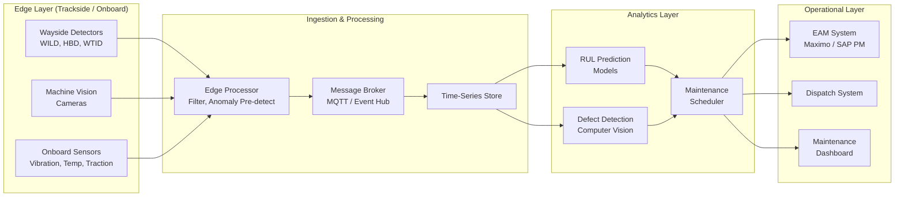

## What This Design Covers

This design describes an AI-driven predictive maintenance platform for railway operators that fuses wayside sensor data, onboard telemetry, and machine vision into a unified analytics layer. The platform predicts remaining useful life for rolling stock and infrastructure components, generates prioritized maintenance recommendations, and schedules interventions within track-possession constraints. Human engineers retain authority over all safety-critical decisions. The design boundary covers data ingestion through work order generation; it does not cover autonomous train operation, passenger-facing systems, or capital planning.

## Recommended Operating Model

| Decision Area | Recommendation |
|---------------|----------------|
| **Autonomy Model** | AI recommends and prioritizes; humans approve safety-critical work orders. Low-risk alerts (e.g., depot consumables) can auto-dispatch after pilot validation. |
| **System of Record** | Enterprise Asset Management system (IBM Maximo or SAP PM) remains authoritative for asset registry, work order history, and compliance records. |
| **Human Decision Points** | Maintenance engineers approve predicted failures before work orders dispatch. Dispatchers approve track-possession requests. Safety teams validate any change to inspection regime. |
| **Primary Value Driver** | Shifting from time-based to condition-based maintenance — extending component useful life while reducing unplanned failures and emergency repair costs. |

## Architecture

### System Diagram

### Component Responsibilities

| Component | Role | Notes |
|-----------|------|-------|
| Edge Processor | Filters raw sensor streams, runs anomaly pre-detection, reduces data volume before cloud transfer | Critical for trains generating 50,000 data points every 0.2 seconds; without edge processing, a single day of video can take 10 days to process centrally |
| Message Broker | Decouples edge ingestion from analytics; buffers during connectivity gaps | MQTT for onboard; cloud event hub for wayside |
| Time-Series Store | Stores sensor history, track geometry readings, and maintenance event logs for model training and inference | Must handle tens of millions of readings per day per major operator |
| RUL Prediction Models | Predicts remaining useful life for wheels, bearings, rails, switches, and signaling components | Separate models per asset class; retrained on operator-specific degradation curves |
| Defect Detection (CV) | Classifies wheel tread cracks, rail surface defects, and overhead catenary wear from camera images | Runs at edge where bandwidth permits; otherwise on batch-uploaded imagery |
| Maintenance Scheduler | Ranks predicted failures by network risk, matches to track-possession windows, generates draft work orders | Accounts for parts availability, crew location, and timetable constraints |
| EAM System | System of record for assets, work orders, parts inventory, and compliance documentation | Existing Maximo or SAP PM instance; AI writes draft work orders via API |
| Dispatch System | Manages real-time train scheduling and track access authorizations | Receives early warning of degradation that may affect service |

## End-to-End Flow

| Step | What Happens | Owner |
|------|--------------|-------|
| 1 | Wayside detectors, onboard sensors, and machine vision cameras generate raw readings as trains traverse the network | Sensor infrastructure |
| 2 | Edge processors filter noise, run threshold checks, and transmit anomaly-flagged and sampled data to the ingestion layer | Edge compute |
| 3 | RUL models score component health against degradation curves; CV models classify defect images | AI platform |
| 4 | Maintenance scheduler ranks predictions by failure probability and network impact, generates draft work orders with recommended possession windows | AI platform |
| 5 | Maintenance planners review recommendations, approve or modify work orders, and coordinate track access with dispatchers | Maintenance engineer + dispatcher |
| 6 | Field crews execute repairs; completion data flows back to EAM and retrains prediction models | Maintenance crew + EAM |

## AI Responsibilities and Boundaries

| Workflow Area | AI Does | Deterministic System Does | Human Owns |
|---------------|---------|---------------------------|------------|
| Sensor ingestion | Anomaly pre-detection and filtering at edge | Threshold-based alarms for immediate safety hazards (e.g., hot bearing above critical temp) | Emergency stop decisions |
| Failure prediction | Estimates remaining useful life per component; classifies defect severity | Enforces regulatory inspection intervals regardless of AI prediction | Approves transition from time-based to condition-based regime for each asset class |
| Work order generation | Drafts prioritized work orders with recommended scheduling windows | EAM validates parts availability and crew eligibility | Maintenance planner approves, modifies, or rejects each work order |
| Network impact assessment | Estimates service disruption risk if maintenance is deferred | Dispatch system enforces timetable and possession rules | Dispatcher authorizes track access |

## Integration Seams

| System | Integration Method | Why It Matters |
|--------|--------------------|----------------|
| EAM (Maximo / SAP PM) | REST API for work order creation, asset registry reads, and maintenance history queries | System of record for compliance audit trail; all AI recommendations must be traceable here |
| Dispatch / Traffic Management | Event-based alerts via message queue; read-only access to timetable data | Scheduling maintenance requires real-time awareness of train movements and possession windows |
| GIS / Track Database | Batch sync for asset location and linear referencing; query API for geospatial context | Predictions must map to specific track segments, mileposts, or asset serial numbers |
| Wayside Detector Network | MQTT or proprietary protocols at edge; normalized telemetry into message broker | 4,000+ detectors across a major freight network; protocol normalization is a prerequisite |
| Onboard Train Systems | Edge gateway aggregating OPC-UA or CAN bus data from traction, braking, and HVAC subsystems | Each train type has different sensor configurations; adapter layer abstracts vendor differences |

## Control Model

| Risk | Control |
|------|---------|
| False negative (missed failure prediction) | Regulatory inspection intervals remain in force as a safety floor; AI supplements but does not replace mandated inspections under FRA 49 CFR Part 213 or ERA TSI |
| False positive (unnecessary maintenance) | Human review gate before work order dispatch; pilot phase tracks false positive rate and sets threshold before scaling |
| Model drift as fleet ages or operating conditions change | Continuous monitoring of prediction accuracy; automated retraining triggers when accuracy drops below threshold |
| Sensor failure or data gap | Edge processor flags data quality issues; fallback to time-based schedule for affected assets until sensor coverage is restored |
| Unauthorized modification of safety-critical predictions | Role-based access control; audit log of all model outputs, human approvals, and overrides |

## Reference Technology Stack

| Layer | Default Choice | Reason | Viable Alternative |
|-------|----------------|--------|--------------------|
| **Edge compute** | NVIDIA IGX with Azure IoT Edge | Industrial-grade AI compute with functional safety certification; proven in Hitachi Rail HMAX deployment | AWS IoT Greengrass, Google Coral |
| **Ingestion / streaming** | Azure Event Hubs + Stream Analytics | Handles millions of events/sec; native edge-to-cloud pipeline with built-in windowed aggregations | Apache Kafka, AWS Kinesis |
| **Time-series storage** | Azure Data Explorer (ADX) | Optimized for high-throughput sensor telemetry with fast ad-hoc queries for root-cause analysis | InfluxDB, TimescaleDB |
| **ML platform** | Azure Machine Learning | Manages model lifecycle (train, deploy, monitor) with edge deployment support | MLflow + custom serving, SageMaker |
| **EAM integration** | IBM Maximo REST API | Dominant EAM in rail; native support for linear assets, maintenance plans, and regulatory compliance records | SAP PM, Hexagon EAM |
| **Observability** | Azure Monitor + Grafana | End-to-end tracing from sensor to work order; Grafana dashboards for operations teams | Datadog, Elastic Observability |

## Key Design Decisions

| Decision | Choice | Why It Fits This Use Case |
|----------|--------|---------------------------|
| Edge-first processing | Run anomaly detection and image pre-classification at trackside/onboard before cloud transfer | A single Hitachi Rail train generates 50,000 data points every 0.2 seconds; centralized processing alone cannot keep up, and bandwidth from moving trains is constrained |
| Separate models per asset class | Independent RUL models for wheels, bearings, track, switches, and signaling | Degradation physics differ fundamentally between asset types; a single model cannot capture rail fatigue and bearing vibration with equal fidelity |
| EAM as system of record (not AI platform) | AI writes recommendations into EAM; EAM remains the compliance-auditable record | Railway regulators require traceable maintenance records; the EAM already satisfies this requirement |
| Condition-based overlay on regulatory floor | AI enables condition-based scheduling but never skips a mandated inspection interval | FRA and ERA mandate minimum inspection frequencies; early adopters add AI on top rather than seeking regulatory exemptions |
| Phased rollout by asset class | Start with rolling stock wheels and bearings (highest data density, clearest failure modes), then expand to track and signaling | Wheels and bearings have the most mature sensor coverage and the most published evidence of ML prediction accuracy |
