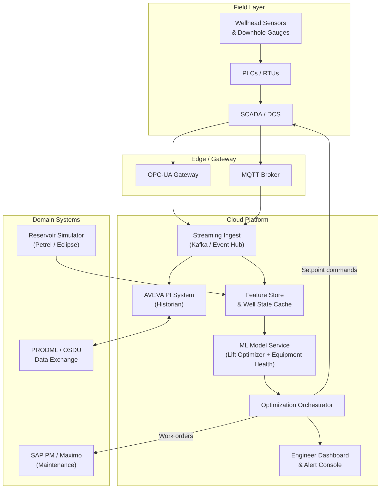

## What This Design Covers

This design describes an AI-driven operating model for upstream oil and gas production optimization. It covers real-time well-level lift optimization, predictive equipment health monitoring, and field-level resource allocation across a portfolio of producing wells. The design assumes brownfield integration with existing SCADA, historian, and reservoir simulation systems. It does not cover exploration, drilling automation, or midstream/downstream operations.

## Recommended Operating Model

| Decision Area | Recommendation |
|---------------|----------------|
| **Autonomy Model** | Graduated: advisory-only during pilot, then closed-loop autonomous control for routine lift adjustments on mature wells; human-in-the-loop for workovers, well shutdowns, and field development changes |
| **System of Record** | AVEVA PI System (or equivalent historian) remains the authoritative time-series store; reservoir simulation tools (Petrel, Eclipse) remain authoritative for subsurface models |
| **Human Decision Points** | Production engineers approve workover orders, well shut-ins, and changes to field-level injection strategy; AI executes gas-lift and ESP setpoint adjustments within engineer-defined operating envelopes |
| **Primary Value Driver** | Incremental barrel recovery from existing wells through continuous lift optimization and reduced unplanned downtime via predictive equipment health |

## Architecture

### System Diagram

### Component Responsibilities

| Component | Role | Notes |
|-----------|------|-------|
| **Streaming Ingest** | Normalizes and routes sensor data from OPC-UA and MQTT sources into historian and feature store | Must handle intermittent connectivity from remote/offshore sites |
| **Feature Store & Well State Cache** | Maintains current and historical well state vectors (pressures, rates, lift parameters, equipment health scores) | Feeds ML models at inference time; updated every 1-5 minutes per well |
| **ML Model Service** | Runs lift optimization models (physics-informed + ML hybrid) and equipment health anomaly detection per well | Separate model instances per lift type (gas-lift, ESP, rod pump) |
| **Optimization Orchestrator** | Applies field-level constraints (shared gas-lift capacity, injection water budget), resolves conflicting well-level recommendations, and routes actions | Enforces operating envelopes and escalation rules before issuing setpoint commands |
| **Engineer Dashboard** | Surfaces recommendations, alerts, and audit trails; provides override controls | Exception-based: engineers act on flagged items, not every well |

## End-to-End Flow

| Step | What Happens | Owner |
|------|---------------|-------|
| 1 | Sensor readings flow from wellheads through SCADA and OPC-UA into the streaming ingest layer every 1-5 minutes | SCADA / Edge gateway |
| 2 | Feature store updates each well's state vector; ML models run inference to produce lift setpoint recommendations and equipment health scores | ML Model Service |
| 3 | Orchestrator aggregates well-level recommendations, applies field constraints (gas-lift supply, quota limits), and checks each action against the operating envelope | Optimization Orchestrator |
| 4a | Routine lift adjustments within envelope: orchestrator writes setpoint commands back to SCADA/DCS | Orchestrator (autonomous) |
| 4b | Anomalies, workover recommendations, or out-of-envelope actions: orchestrator routes alert to engineer dashboard for approval | Production Engineer |
| 5 | All actions (autonomous and human-approved) are logged with before/after states, predicted vs. actual production impact, and model version | Audit log / Historian |

## AI Responsibilities and Boundaries

| Workflow Area | AI Does | Deterministic System Does | Human Owns |
|---------------|---------|---------------------------|------------|
| **Lift optimization** | Predicts optimal gas-lift injection rate or ESP speed per well using hybrid physics-ML models | SCADA enforces hardware safety limits (max pressure, min flow); orchestrator enforces operating envelope | Engineer sets envelope bounds; approves changes outside envelope |
| **Equipment health** | Detects anomalous sensor patterns indicating pump degradation, valve fouling, or tubing leaks | Maintenance system (SAP PM) schedules work orders per priority rules | Engineer approves workover scope and timing |
| **Field-level allocation** | Recommends optimal distribution of shared gas-lift, injection water, and crew resources across wells | Constraint solver enforces physical capacity limits and regulatory quotas | Field operations manager approves reallocation of shared resources |
| **Decline forecasting** | Generates updated production decline curves incorporating recent well behavior | Reservoir simulator provides physics-based reservoir models | Reservoir engineer validates AI forecasts against subsurface understanding |

## Integration Seams

| System | Integration Method | Why It Matters |
|--------|--------------------|----------------|
| **SCADA / DCS** | OPC-UA for reads; OPC-UA write-back for setpoint commands; MQTT for edge telemetry | The control path: all sensor data enters and all autonomous actions exit through SCADA |
| **AVEVA PI System** | PI Web API (REST) for historical queries; PI-to-PI replication for multi-site | Historian is the system of record for time-series; all models depend on historical context |
| **Reservoir Simulator** | File-based export (Eclipse DATA files) or RESQML via OSDU; batch integration on simulation update cycles | Provides physics-based reservoir constraints that the AI must respect |
| **Maintenance System** | REST API to SAP PM or Maximo for work order creation and equipment master data lookup | Predicted failures must translate into actionable maintenance workflows |
| **OSDU / PRODML** | OSDU REST APIs for well master data and production volumes; PRODML schemas for inter-system data exchange | Emerging industry standard; future-proofs data interoperability across operators and service companies |

## Control Model

| Risk | Control |
|------|---------|
| **AI recommends unsafe setpoint** | Operating envelope per well defines hard limits on pressure, rate, and temperature; SCADA safety interlocks remain active regardless of AI commands; any command outside envelope requires engineer approval |
| **Model drift degrades recommendations** | Continuous model monitoring compares predicted vs. actual production; automatic fallback to last-known-good setpoints if prediction error exceeds threshold for 4+ hours |
| **Autonomous action causes reservoir damage** | Closed-loop control is restricted to lift parameters; reservoir management decisions (injection patterns, well shut-ins) always require human approval |
| **Sensor data quality issues** | Feature store flags stale, flatlined, or out-of-range readings; orchestrator holds actions for affected wells until data quality is restored |
| **Connectivity loss to remote site** | Edge gateway caches last-approved setpoints; wells continue on cached parameters until connectivity restores; no new autonomous changes during outage |

## Reference Technology Stack

| Layer | Default Choice | Reason | Viable Alternative |
|-------|----------------|--------|--------------------|
| **Model layer** | Physics-informed neural networks (hybrid physics + ML) per lift type | Combines first-principles well models with data-driven learning; generalizes better to new wells than pure ML | Gradient-boosted trees for equipment health scoring; deep reinforcement learning for multi-well allocation |
| **Orchestration** | Custom optimization orchestrator with constraint solver | Must enforce field-level physical constraints (gas capacity, quotas) that off-the-shelf LLM orchestrators cannot handle | Baker Hughes Leucipa or C3.ai platform for operators preferring vendor-managed SaaS |
| **Data platform** | AVEVA PI System + Apache Kafka for streaming | PI is the de facto historian in upstream O&G (installed at most major operators); Kafka handles high-throughput ingest | OSDU Data Platform for greenfield deployments; Azure Data Explorer for cloud-native time-series |
| **Observability** | Model performance dashboards tracking predicted-vs-actual production per well; alert routing via PagerDuty or equivalent | Production impact of model errors is measured in barrels; must detect drift quickly | C3.ai Reliability platform for operators already on C3 stack |

## Key Design Decisions

| Decision | Choice | Why It Fits This Use Case |
|----------|--------|---------------------------|
| **Graduated autonomy** | Start advisory, graduate to closed-loop per well after validation period | Operators will not trust autonomous well control without demonstrated accuracy on their specific assets; ADNOC's RoboWell followed this pattern |
| **Hybrid physics-ML models** | Combine nodal analysis physics with ML correction terms | Pure ML models struggle with new wells lacking training data; physics priors from well models provide reasonable starting points that ML refines with production history |
| **Per-well model instances** | Train and deploy separate model instances per well (or per well cluster for similar completions) | Each well has unique reservoir, completion, and lift characteristics; a single global model cannot capture this heterogeneity at the precision needed for setpoint control |
| **Field-level constraint solver** | Deterministic optimization layer on top of AI recommendations | Shared infrastructure (gas-lift compressors, injection manifolds) imposes hard physical constraints that must be satisfied jointly; this is not an AI judgment call |
| **SCADA write-back via OPC-UA** | Use existing OPC-UA infrastructure for setpoint commands | Avoids building a parallel control path; leverages existing safety interlocks in the SCADA/DCS layer that operators already trust |
