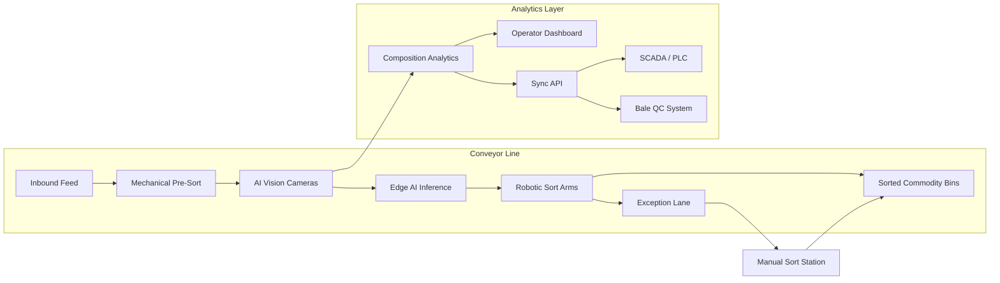

## What This Design Covers

This design describes how AI computer vision and robotic sorting replace manual quality-control picks on MRF conveyor lines, while real-time composition analytics give operators continuous visibility into material streams. The design boundary starts where material hits the main conveyor and ends at the baler. Curbside collection, chemical recycling, and landfill operations are out of scope.

## Recommended Operating Model

| Decision Area | Recommendation |
|---------------|----------------|
| **Autonomy Model** | AI-guided robots sort autonomously for known material categories; items below the model's confidence threshold are diverted to a manual exception lane |
| **System of Record** | The facility's existing SCADA/PLC system remains authoritative for conveyor speed, equipment state, and production totals; AI analytics overlay composition and quality data |
| **Human Decision Points** | Operators approve sort-plan changes when material mix shifts significantly; maintenance staff handle robot faults; quality leads validate bale purity before shipment |
| **Primary Value Driver** | Higher commodity revenue through improved bale purity and increased material recovery from streams that previously went to landfill |

## Architecture

### System Diagram

### Component Responsibilities

| Component | Role | Notes |
|-----------|------|-------|
| **AI Vision Cameras** | Capture high-resolution images of items on the conveyor belt at line speed | Mounted above conveyors; hyperspectral or RGB depending on material granularity needed |
| **Edge AI Inference** | Run object detection and material classification models locally with sub-15ms latency | GPU-equipped edge units co-located with each camera station; no cloud round-trip for pick decisions |
| **Robotic Sort Arms** | Execute pick-and-place actions guided by the vision system's material classification and grip-point targeting | Delta or articulated arms from Omron, ABB, or FANUC; 80+ picks/min sustained |
| **Composition Analytics** | Aggregate vision data across all camera positions to produce real-time material composition, mass estimates, and quality metrics | Runs on-premise or hybrid; feeds operator dashboards and downstream integrations |
| **Operator Dashboard** | Display live composition, throughput, contamination rates, and robot health per sort line | Web-based; accessible from control room and mobile devices on the plant floor |
| **Sync API** | Push real-time composition and quality data to SCADA, bale QC systems, and commodity trading platforms | REST or OPC UA depending on target system |

## End-to-End Flow

| Step | What Happens | Owner |
|------|--------------|-------|
| 1 | Mixed material enters the sort line after mechanical pre-sort (screens, ballistic separators) | Conveyor system (PLC) |
| 2 | AI vision cameras capture images of every item on the belt; edge inference classifies each item by material type, brand, color, and condition | AI vision system |
| 3 | For each identified item above the confidence threshold, the system computes an optimal grip point and sends a pick command to the nearest robotic arm | Edge AI + robot controller |
| 4 | Robotic arms execute positive or negative sorts, placing items in commodity-specific bins or removing contaminants | Robotic sort arms |
| 5 | Items below the confidence threshold pass to a manual exception lane where human sorters handle them | Human sorters |
| 6 | Composition analytics aggregate data from all camera positions and push live quality metrics to the operator dashboard and SCADA | Analytics platform |

## AI Responsibilities and Boundaries

| Workflow Area | AI Does | Deterministic System Does | Human Owns |
|---------------|---------|---------------------------|------------|
| **Material identification** | Classify each item by material type and subcategory (e.g., PET clear, HDPE natural, OCC cardboard) using computer vision | PLC controls conveyor speed and belt tracking | Operator validates classification accuracy through periodic manual audits |
| **Pick execution** | Compute grip point and issue pick command to robot arm | Robot controller executes motion path within safety envelope | Maintenance staff clear jams and service end-effectors |
| **Composition monitoring** | Track material composition, contamination rate, and recovery rate in real time | SCADA logs production totals and equipment state | Quality lead decides whether to reclassify a bale or divert a stream |
| **Sort-plan adjustment** | Recommend sort-plan changes when inbound material mix deviates from baseline | PLC applies approved parameter changes to conveyor and diverter settings | Operations manager approves sort-plan changes that affect commodity targets |

## Integration Seams

| System | Integration Method | Why It Matters |
|--------|--------------------|----------------|
| **SCADA / PLC** | OPC UA or Modbus TCP from Sync API to existing PLC | Conveyor speed adjustments must be coordinated with pick timing; the PLC remains the safety authority |
| **Bale QC system** | REST API from analytics platform to bale tracking software | Bale-level composition certificates unlock premium commodity pricing |
| **ERP / commodity trading** | File export or REST API for daily production and quality reports | Operators sell bales based on verified composition; buyers need audit-grade data |
| **Maintenance management (CMMS)** | Event-driven alerts from robot health telemetry | Predictive maintenance on end-effectors and cameras prevents unplanned downtime |

## Control Model

| Risk | Control |
|------|---------|
| **Misclassification sends contaminant into a clean bale** | Confidence threshold gates: items below threshold go to manual exception lane; periodic bale audits validate AI accuracy |
| **Robot arm collision or jam** | Safety-rated PLC controls robot envelope; light curtains and e-stops on all sort stations; automatic conveyor halt on fault |
| **Vision model drift from changing material stream** | Weekly accuracy checks against manual sample sorts; retraining pipeline triggered when accuracy drops below 95% on any category |
| **System-wide outage** | Fallback to manual sorting within minutes; material continues on conveyor to manual stations; no material is lost |

## Reference Technology Stack

| Layer | Default Choice | Reason | Viable Alternative |
|-------|----------------|--------|--------------------|
| **Model layer** | Custom CNN/transformer object detection trained on waste-stream imagery (e.g., AMP Neuron, EverestLabs RecycleOS) | Domain-specific models outperform general-purpose vision on crushed, overlapping, contaminated items | YOLO-family models fine-tuned on facility-specific labeled data |
| **Orchestration** | Edge inference on GPU-equipped industrial PCs (NVIDIA Jetson or similar) | Sub-15ms latency required for 80+ picks/min at belt speed; cloud round-trip is too slow | Intel OpenVINO on CPU for lower-throughput lines |
| **Analytics / monitoring** | Greyparrot Analyzer or equivalent composition analytics platform | 111+ material categories, mass estimation, brand-level detection; proven at 160+ facilities | Custom dashboard on InfluxDB + Grafana with facility-specific models |
| **Observability** | OPC UA telemetry from robot controllers + camera health metrics to central SCADA | Standard industrial protocol; existing MRF control rooms already monitor via SCADA | MQTT broker for facilities without OPC UA infrastructure |

## Key Design Decisions

| Decision | Choice | Why It Fits This Use Case |
|----------|--------|---------------------------|
| **Edge inference, not cloud** | All pick decisions run on local GPU hardware | Belt speed and pick frequency demand sub-15ms latency; network failures cannot stop the sort line |
| **Confidence-gated exception lane** | Items below the classification threshold go to human sorters rather than being force-sorted | Protects bale purity; keeps the human-in-the-loop for genuinely ambiguous items without slowing the robot |
| **Composition analytics as a separate layer** | Decouple material monitoring from robotic pick control | Analytics data serves multiple consumers (dashboard, SCADA, bale QC, ERP); tight coupling to the robot stack would limit integration flexibility |
| **Lease model for initial deployment** | Prefer robotics-as-a-service over upfront capital purchase | Reduces payback risk; aligns vendor incentive with facility performance; typical lease is $6K/month per unit versus $300K purchase |
