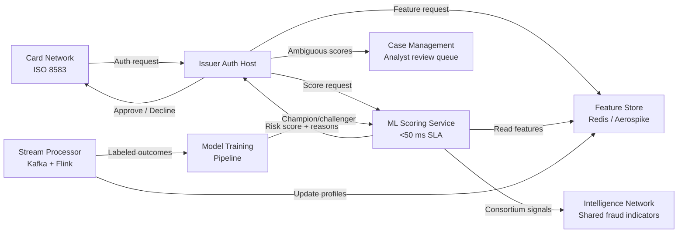

## What This Design Covers

This design describes an ML-driven fraud scoring service that sits inside the payment authorization path. It replaces static rule engines with behavioral models that score every transaction in under 50 ms, reducing both fraud losses and false declines. The design covers the scoring pipeline, the feature infrastructure that feeds it, the consortium intelligence layer, and the human review model for edge cases. It does not cover AML investigation, chargeback dispute management, or identity verification at onboarding.

## Recommended Operating Model

| Decision Area | Recommendation |
|---------------|----------------|
| **Autonomy Model** | Fully autonomous approve/decline for transactions scoring below or above calibrated thresholds; human review only for the narrow band of ambiguous scores (target: under 5% of flagged volume) |
| **System of Record** | The issuer's authorization host remains authoritative for the approve/decline decision; the fraud scoring service is advisory but integrated inline |
| **Human Decision Points** | Fraud analysts handle score-band exceptions, investigate novel attack patterns, tune thresholds, and validate model retraining outputs |
| **Primary Value Driver** | Reducing false declines (which cost 3-4x more than direct fraud losses) while simultaneously improving fraud catch rates |

## Architecture

### System Diagram

### Component Responsibilities

| Component | Role | Notes |
|-----------|------|-------|
| **ML Scoring Service** | Evaluates transaction risk using behavioral, contextual, and network features; returns score + top contributing factors | Deployed behind load balancer with active-active redundancy; must meet sub-50-ms p99 latency |
| **Feature Store** | Serves precomputed cardholder profiles, merchant risk scores, device fingerprints, and velocity aggregates at read time | In-memory store (Redis or Aerospike) with millisecond reads; features updated by stream processor |
| **Stream Processor** | Ingests raw transaction events, computes rolling aggregates (velocity, spend deviation, channel patterns), and updates the feature store | Kafka + Flink; also feeds labeled outcomes to the training pipeline |
| **Intelligence Network** | Provides consortium-level signals: compromised card lists, merchant risk scores, cross-institution fraud velocity | Federated or anonymized data sharing across participating issuers; FICO Falcon Intelligence Network and Mastercard network are production examples |
| **Case Management** | Routes ambiguous-score transactions to fraud analysts with enriched context | Receives score, contributing features, and cardholder history; feeds analyst decisions back as training labels |
| **Model Training Pipeline** | Retrains models on fresh labeled data, runs champion/challenger evaluation, and promotes new models to production | Offline pipeline; new models deploy via blue-green swap without scoring downtime |

## End-to-End Flow

| Step | What Happens | Owner |
|------|--------------|-------|
| 1 | Card network delivers ISO 8583 authorization request to issuer auth host | Card network |
| 2 | Auth host calls feature store to retrieve cardholder profile, merchant risk, device fingerprint, and rolling velocity aggregates | Feature store |
| 3 | Auth host sends feature vector to ML scoring service; service evaluates gradient-boosted model plus graph-network embeddings and returns risk score with top reason codes | ML scoring service |
| 4 | Auth host applies threshold logic: low-risk transactions approved, high-risk declined, ambiguous band routed to case management | Issuer auth host (deterministic) |
| 5 | Fraud analyst reviews ambiguous cases with enriched context; approve/decline decision feeds back as a training label | Fraud analyst |
| 6 | Stream processor updates cardholder profiles and computes new aggregates from the settled transaction; training pipeline ingests labeled outcomes for next model iteration | Stream processor + training pipeline |

## AI Responsibilities and Boundaries

| Workflow Area | AI Does | Deterministic System Does | Human Owns |
|---------------|---------|---------------------------|------------|
| **Transaction scoring** | Generates risk score from behavioral, contextual, and network features | Auth host applies threshold bands to translate score into approve/decline/review | Fraud ops sets threshold values and reviews score distribution |
| **Feature computation** | Stream models compute behavioral deviation and anomaly signals | Feature store enforces schema, TTLs, and freshness guarantees | Data engineering monitors pipeline health and data quality |
| **Consortium intelligence** | Graph models identify cross-institution fraud patterns from anonymized signals | Network enforces data anonymization and access controls | Compliance validates consortium data-sharing agreements |
| **Model lifecycle** | Training pipeline produces candidate models; champion/challenger framework evaluates offline | Deployment pipeline runs canary scoring and automatic rollback on metric degradation | Model risk team approves production promotion |

## Integration Seams

| System | Integration Method | Why It Matters |
|--------|--------------------|----------------|
| **Card network (Visa/Mastercard)** | ISO 8583 message flow via issuer auth host; scoring service is called synchronously within the authorization window | Any added latency directly impacts cardholder experience and network SLA compliance |
| **Feature store** | Low-latency key-value reads (Redis/Aerospike protocol); writes from Flink stream processor | Feature freshness drives model accuracy; stale profiles degrade scoring quality |
| **Case management / ITSM** | REST API push of enriched case objects (score, reasons, cardholder history) | Analyst efficiency depends on pre-assembled context; poor enrichment increases handle time |
| **Model registry** | MLflow or equivalent; blue-green deployment to scoring service | Safe model promotion without scoring downtime; automatic rollback on metric regression |

## Control Model

| Risk | Control |
|------|---------|
| **Model drift** — fraud patterns change and model accuracy degrades | Automated drift detection on score distribution and false-positive rate; champion/challenger evaluation on every retrain cycle; rollback trigger if KPIs degrade beyond threshold |
| **Adversarial evasion** — attackers probe scoring boundaries | Ensemble of model families (gradient boosting + graph neural network); regular red-team exercises; consortium intelligence provides cross-institution signal that single-issuer probing cannot game |
| **Regulatory explainability** — PSD2 and Reg E require decline reasons | Score decomposition into top contributing features (SHAP values or equivalent); reason codes mapped to customer-facing decline messages; full audit trail of every scoring decision |
| **Availability** — scoring outage blocks all authorizations | Active-active deployment across availability zones; deterministic fallback rules activate if scoring service is unreachable; 99.999% uptime target |
| **Data privacy** — PCI-DSS and GDPR govern transaction data | Feature store holds tokenized, non-PAN data; consortium layer operates on anonymized aggregates; no raw cardholder data leaves the issuer boundary |

## Reference Technology Stack

| Layer | Default Choice | Reason | Viable Alternative |
|-------|----------------|--------|--------------------|
| **Model layer** | XGBoost ensemble + GraphSAGE embeddings | XGBoost dominates production fraud scoring for latency and interpretability; GNN captures network-level patterns | LightGBM (faster training), PyTorch-based GNN |
| **Feature store** | Redis Cluster or Aerospike | Sub-millisecond reads at scale; proven in payment-critical paths | Feast on Redis, Tecton |
| **Stream processing** | Apache Kafka + Apache Flink | Kafka for durable event ingestion; Flink for stateful stream computation and rolling aggregates | Kafka Streams (simpler but less flexible), Spark Structured Streaming |
| **Model serving** | NVIDIA Triton or custom gRPC service | Triton supports ensemble inference (XGBoost + GNN) with GPU acceleration and sub-10-ms latency | TensorFlow Serving, Seldon Core |
| **Observability** | Prometheus + Grafana, with OpenTelemetry tracing | Standard stack for latency, throughput, and model metric dashboards | Datadog, Splunk |

## Key Design Decisions

| Decision | Choice | Why It Fits This Use Case |
|----------|--------|---------------------------|
| **Inline synchronous scoring** vs. async post-auth | Synchronous scoring within authorization window | Fraud must be blocked before funds move; post-auth detection only enables recovery, not prevention |
| **Ensemble model** (gradient boosting + GNN) vs. single model | Ensemble | Gradient boosting handles tabular features well; GNN captures relational fraud rings that tabular models miss; combining both matches what Mastercard and NVIDIA recommend for production |
| **Precomputed features** vs. real-time feature computation at scoring time | Precomputed in feature store, updated by stream processor | Moves computation out of the latency-critical authorization path; features are fresh within seconds, which is sufficient for behavioral profiles |
| **Champion/challenger model promotion** vs. direct replacement | Champion/challenger with canary scoring | Payment-critical path demands zero-downtime model updates; canary scoring catches regressions before full rollout |
| **Consortium intelligence** vs. issuer-only signals | Consortium | Single-issuer models cannot see cross-institution attack patterns; FICO and Mastercard networks demonstrate that shared intelligence materially improves detection |
