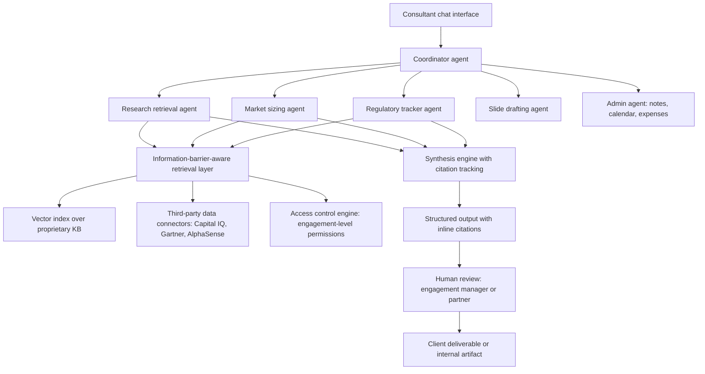

## What This Design Covers

This design covers an internal knowledge synthesis platform for management consulting firms that combines retrieval-augmented generation over a proprietary knowledge corpus with multi-agent orchestration and information-barrier-aware access control. The operating model is AI-assisted with mandatory human review for anything reaching a client deliverable. The design boundary includes research retrieval, multi-source synthesis, slide drafting, and administrative offloading — but excludes autonomous client-facing output, investment decisions, and unrestricted model training on proprietary content. [S1][S2][S3]

## Recommended Operating Model

| Decision Area | Recommendation |
|---------------|----------------|
| **Autonomy Model** | AI-assisted for research and synthesis; all client-facing output requires human review. Consultants remain accountable for every claim in a deliverable. Administrative tasks (meeting notes, calendar coordination, expense drafts) can run with lighter oversight. |
| **System of Record** | The firm's existing knowledge management system (SharePoint, Documentum, or proprietary KB) remains the authoritative document store. The AI platform indexes and retrieves from it but does not replace it. |
| **Human Decision Points** | Partner or engagement manager reviews every synthesized output before it enters a client deliverable. Compliance reviews information-barrier configurations. Knowledge management curates and classifies the underlying corpus. |
| **Primary Value Driver** | Reclaim 30% of consultant research time by replacing keyword search and partner-email queries with semantic retrieval across the full corpus, and compress scoping-deck production from days to hours. [S1][S2] |

## Architecture

### System Diagram

### Component Responsibilities

| Component | Role | Notes |
|-----------|------|-------|
| Coordinator agent | Decomposes a consultant's natural-language query into sub-tasks and routes them to specialized agents. | Follows McKinsey's Agentic AI Mesh pattern: a central orchestrator that discovers and dispatches to registered agents. [S9][S10] |
| Research retrieval agent | Searches the proprietary knowledge corpus for relevant past engagement decks, transcripts, and research. | Returns 5–7 most relevant artifacts with page-level citations. [S1] |
| Market sizing / regulatory / vertical agents | Specialized agents for practice-area tasks (market sizing, deal comparison, regulatory tracking). | Published via an internal agent marketplace; practice areas build and maintain their own. [S9] |
| Information-barrier-aware retrieval layer | Enforces engagement-level access controls before any document reaches an LLM context window. | The LLM never sees walled content. Attribute-based access control (ABAC) evaluated at retrieval time. |
| Synthesis engine | Combines multi-source retrieval into a coherent output with inline source citations. | Every claim is traced to a specific document and page. Ungrounded synthesis is flagged explicitly. |
| Slide drafting agent | Generates firm-branded slide structures and chart suggestions from synthesized research. | Integrates with PowerPoint via Office APIs. BCG's Deckster shows 450,000+ slide operations in its first year. [S6] |
| Admin agents | Handle meeting note generation, calendar coordination, and expense report drafting. | Lower-stakes tasks that run with lighter human oversight. |

## End-to-End Flow

| Step | What Happens | Owner |
|------|---------------|-------|
| 1 | Consultant enters a natural-language research query (e.g., "What do we know about growth strategies for mid-cap industrial chemicals companies in Southeast Asia?"). | Consultant via chat interface |
| 2 | Coordinator agent classifies the query, checks information-barrier context for the consultant's current engagement, and decomposes the query into sub-tasks (prior-work search, market data pull, regulatory scan). | Coordinator agent |
| 3 | Sub-agents execute retrieval against the proprietary corpus and licensed third-party sources, with the access-control engine filtering results to only documents the consultant is permitted to see. | Research agents + retrieval layer |
| 4 | Synthesis engine combines findings into a structured response with inline citations (document title, page number, source type). Claims without a traceable source are flagged as "ungrounded synthesis." | Synthesis engine |
| 5 | Consultant reviews the output, follows citations to verify claims, edits or extends the synthesis, and optionally routes it to the slide drafting agent for deck formatting. | Consultant |
| 6 | Engagement manager or partner reviews the deliverable before it reaches the client. The full prompt-retrieval-output chain is logged for audit. | Human reviewer + audit log |

## AI Responsibilities and Boundaries

| Workflow Area | AI Does | Deterministic System Does | Human Owns |
|---------------|---------|---------------------------|------------|
| Research retrieval | Semantically matches the query to relevant documents across the full corpus and ranks results by relevance. | Enforces information barriers, access controls, and document sensitivity classifications at retrieval time. | Validates that retrieved documents are actually relevant and that citations are accurate. |
| Multi-source synthesis | Combines findings from internal corpus and third-party sources into a coherent narrative with inline citations. | Applies citation formatting rules and flags ungrounded claims. | Reviews synthesis for correctness, completeness, and appropriate framing before client use. |
| Slide and chart drafting | Generates slide structures, chart suggestions, and prose in firm house style. | Applies firm visual templates and formatting standards. | Owns final content quality, narrative framing, and client-appropriateness. |
| Administrative tasks | Generates meeting notes, drafts expense reports, and suggests calendar blocks. | Routes through existing approval workflows (expense systems, calendar permissions). | Approves submitted expenses, confirms meeting actions. |
| Knowledge curation | Suggests tags, classifications, and filing locations for new engagement artifacts. | Enforces taxonomy rules and sensitivity labels. | Decides whether to file, how to classify, and which information barriers apply. |

## Integration Seams

| System | Integration Method | Why It Matters |
|--------|--------------------|----------------|
| Internal knowledge management (SharePoint / Documentum / proprietary KB) | Ingestion pipeline with incremental sync; vector index built from extracted text with document-level metadata (engagement ID, sensitivity, date, practice area). | This is the core corpus. Retrieval quality depends on index freshness and metadata accuracy. |
| Licensed third-party data (Capital IQ, Gartner, IBISWorld, AlphaSense) | API connectors with rate limiting and license-aware access; results cached with TTL respecting licensing terms. | Consultants expect the platform to combine internal knowledge with market data in a single query. |
| Microsoft 365 / PowerPoint / Excel | Office JavaScript API or Graph API for slide generation and chart insertion; SSO via Azure AD / Entra ID. | Deliverables are PowerPoint decks. The AI must write into the tool consultants already use, not export to a separate format. |
| Identity provider (Azure AD / Entra ID) | OIDC/SAML for authentication; group and engagement-role claims for ABAC at the retrieval layer. | Information-barrier enforcement depends on knowing the consultant's engagement assignments in real time. |
| Meeting platforms (Teams / Zoom) | Transcript ingestion via platform APIs; real-time note generation. | Expert interviews are a primary knowledge source. Ingesting transcripts feeds the corpus and enables post-meeting summarization. |
| CRM (Salesforce / Dynamics) | Read-only API for engagement metadata, staffing, and client context. | The coordinator agent uses engagement context to scope retrieval and apply information barriers. |

## Control Model

| Risk | Control |
|------|---------|
| Hallucinated citations — the AI claims a document says something it does not | Every citation must resolve to a real document and page. The synthesis engine verifies that cited passages exist in the retrieved content before including them. Unverifiable claims are flagged as "ungrounded." |
| Information-barrier breach — a consultant retrieves documents from a walled engagement | Access control evaluated at the retrieval layer before content enters the LLM context. The LLM never sees walled documents. Barrier configurations are managed by compliance and audited quarterly. |
| IP leakage to model vendors | Proprietary documents are used only for retrieval, never for model training. Enterprise LLM contracts include data-processing agreements prohibiting training on input/output. Embedding indices are encrypted at rest and tenant-isolated. |
| Automation bias — consultants over-trust AI output | The Harvard-BCG experiment showed a 19-percentage-point accuracy drop when consultants deferred to AI on outside-frontier tasks. [S3][S4] Mitigation: mandatory human review for client deliverables; visible confidence indicators; training on the "jagged frontier" concept. |
| Stale or poorly tagged knowledge base | Incremental corpus sync with freshness metadata. Retrieval results display document age. Knowledge management team curates and retires stale content on a defined schedule. |
| Audit and regulatory exposure | Full prompt-retrieval-output chain logged for every interaction. Logs retained per firm policy and regulatory requirements (EU AI Act, sector overlays). Audit trail is immutable and queryable by compliance. |

## Reference Technology Stack

| Layer | Default Choice | Reason | Viable Alternative |
|-------|----------------|--------|--------------------|
| **Model layer** | Multi-LLM: OpenAI GPT-4o via Azure for synthesis; Anthropic Claude for long-context document analysis; Cohere for embeddings | McKinsey's Lilli uses Cohere embeddings + OpenAI GPT-4 via Azure and describes itself as "LLM-agnostic." [S11][S12] Multi-model routing optimizes cost and capability per task. | Single-vendor with Azure OpenAI Service if procurement requires simplification. |
| **Orchestration** | LangGraph with an agent registry following the Agentic AI Mesh pattern | Supports the coordinator-plus-specialist-agents pattern, agent discovery, and workflow composition. [S10] | CrewAI or Autogen for teams with existing expertise in those frameworks. |
| **Retrieval / memory** | Azure AI Search (hybrid dense + sparse retrieval) with document-level ABAC filters | Hybrid retrieval improves precision 15–30% over pure vector search. Azure integration simplifies identity and compliance. | Elasticsearch with custom ABAC plugin; Pinecone with metadata filtering. |
| **Observability** | OpenTelemetry-based tracing with prompt-level spans | The Agentic AI Mesh specifies OpenTelemetry as the tracing standard for multi-agent systems. [S10] | Langfuse or LangSmith for teams wanting a managed tracing UI. |

## Key Design Decisions

| Decision | Choice | Why It Fits This Use Case |
|----------|--------|---------------------------|
| RAG over proprietary corpus, not fine-tuning | Retrieval-augmented generation with the firm's document store as the corpus | The knowledge base changes daily as engagement teams file new artifacts. Fine-tuning cannot keep pace, and RAG preserves full citation traceability. McKinsey's Lilli uses this approach. [S1][S11] |
| Information barriers enforced at retrieval, not chat | The access-control engine filters documents before they enter the LLM context window | If the LLM sees walled content even once, it may surface it in subsequent turns. Filtering at retrieval ensures the model never processes impermissible documents. |
| Multi-model routing per task | Different LLMs for embeddings, synthesis, long-context analysis, and slide generation | Consulting workloads vary from quick lookups (cost-sensitive) to 100-page document analysis (context-sensitive). No single model optimizes across all tasks. [S11] |
| Agent marketplace over monolithic platform | Practice areas publish their own specialized agents through a shared registry with governance controls | McKinsey scaled to thousands of internal agents by giving practice areas ownership of vertical agents under centralized compliance. [S9] This distributes domain expertise while keeping security centralized. |
| Mandatory human review for client deliverables | No AI output reaches a client without engagement-manager or partner sign-off | The Harvard-BCG experiment demonstrated that unsupervised AI use degrades accuracy on certain task types. [S3][S4] Consulting reputation depends on correctness, not speed alone. |
