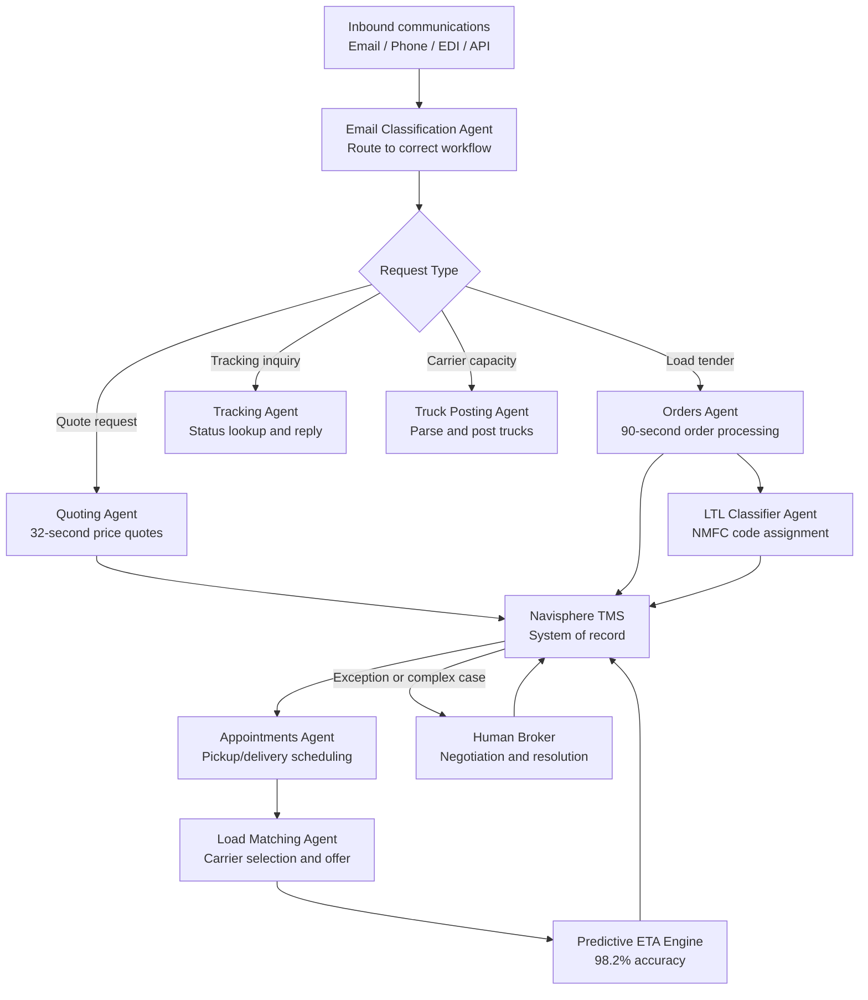

## What This Design Covers

This design covers the quote-to-delivery lifecycle for a third-party logistics provider that operates a transportation management system and brokers freight across truckload, LTL, intermodal, and air modes. The reference pattern uses a fleet of 30+ specialized AI agents embedded inside the TMS, each handling a discrete task—quoting, order intake, freight classification, appointment scheduling, carrier matching, shipment tracking—and escalating to human brokers only when negotiation or exception handling requires judgment. The primary reference deployment is C.H. Robinson's Always-On Logistics Planner operating inside its Navisphere TMS. [S1][S2][S3]

## Recommended Operating Model

| Decision Area | Recommendation |
|---------------|----------------|
| **Autonomy Model** | High autonomy for routine tasks. AI agents handle quoting, order processing, classification, appointment scheduling, and tracking updates end-to-end. Human brokers handle complex negotiations, multi-party exception resolution, and strategic account management. [S1][S2] |
| **System of Record** | The TMS (Navisphere or equivalent) remains authoritative for shipment records, pricing, carrier assignments, and customer contracts. AI agents read from and write back to the TMS. [S3][S5] |
| **Human Decision Points** | Brokers review AI-escalated exceptions, negotiate non-standard rates, resolve multi-party disputes, and manage strategic customer relationships. Operations managers own agent performance thresholds and escalation rules. [S2] |
| **Primary Value Driver** | Speed-to-quote in spot markets (first quote wins the load) and labor productivity through automation of high-volume, low-judgment email and phone interactions. C.H. Robinson achieved a 40% productivity improvement and 520 basis-point margin expansion. [S1][S6] |

## Architecture

### System Diagram

### Component Responsibilities

| Component | Role | Notes |
|-----------|------|-------|
| Email Classification Agent | Reads inbound emails, classifies by request type (quote, tender, tracking, capacity), extracts structured data from unstructured text and attachments. | Differentiates truckload, LTL, intermodal, and air freight. Handles multi-service requests combining modes. [S3][S5] |
| Quoting Agent | Generates customer-specific price quotes using the TMS pricing engine and real-time market data. | Processes 2,600+ quotes per day at 32 seconds each. Over 1.5 million quotes delivered. [S1][S2] |
| Orders Agent | Converts emailed load tenders with attachments into ready-to-move shipments in the TMS. | Handles 5,500 orders per day in 90 seconds each, whether single-load or 20-load batch tenders. Saves 600+ hours of labor daily. [S1][S2] |
| LTL Classifier Agent | Assigns NMFC freight classification codes to LTL shipments. | Classifies 2,000 shipments per day in 3 seconds each. Increased LTL automation from 50% to 75%+. [S4] |
| Appointments Agent | Schedules pickup and delivery appointments across the logistics network. | Sets 3,000 appointments daily across 43,000 locations in under 60 seconds per transaction. [S1][S2] |
| Truck Posting Agent | Parses carrier capacity emails and posts available trucks to the capacity center. | Accelerates carrier-to-load matching by making capacity visible sooner. [S2] |
| Tracking Agent | Responds to customer tracking inquiries with SKU-level shipment details. | One agent captured 318,000 tracking updates from phone calls in a single month. [S7] |
| Load Matching Agent | Matches available carrier capacity to shipments using hyper-customized load offers. | Manages appointment changes automatically when carrier assignments shift. [S6] |
| Predictive ETA Engine | Continuously updates estimated arrival times using tracking data and external signals. | 98.2% accuracy rate. Feeds disruption alerts back into the orchestration layer. [S6] |

## End-to-End Flow

| Step | What Happens | Owner |
|------|---------------|-------|
| 1 | Customer or carrier sends email, EDI message, or API call. Email Classification Agent identifies request type and extracts structured fields. | Email Classification Agent [S3][S5] |
| 2 | Request routes to the appropriate task agent: Quoting Agent for price requests, Orders Agent for tenders, Tracking Agent for status inquiries, Truck Posting Agent for carrier capacity. | Task-specific agent [S2] |
| 3 | Task agent executes its workflow: queries TMS pricing engine, builds the order record, classifies freight, or looks up shipment status. For LTL orders, the LTL Classifier Agent assigns NMFC codes before the order completes. | Task agent + LTL Classifier [S1][S4] |
| 4 | Completed actions write back to Navisphere TMS. Appointments Agent schedules pickup and delivery. Load Matching Agent selects and notifies carriers. | Appointments Agent, Load Matching Agent [S2] |
| 5 | Predictive ETA Engine monitors shipments in transit and updates arrival estimates. Exceptions (missed pickups, weather disruptions, carrier no-shows) escalate to human brokers with context. | ETA Engine or Human Broker [S6] |

## AI Responsibilities and Boundaries

| Workflow Area | AI Does | Deterministic System Does | Human Owns |
|---------------|---------|---------------------------|------------|
| Price quoting | Reads unstructured quote requests, extracts shipment details, generates customer-specific quotes using market data and pricing rules. [S1][S3] | TMS pricing engine calculates rates from contracted and spot market data. | Approves non-standard pricing, negotiates strategic accounts, overrides AI quotes. |
| Order processing | Parses emailed tenders and attachments, builds shipment records, handles batch orders. [S1] | TMS validates order completeness, enforces business rules, assigns shipment IDs. | Resolves ambiguous tenders, handles customer escalations, manages order exceptions. |
| Freight classification | Assigns NMFC codes based on commodity descriptions and learned freight-type patterns. [S4] | NMFC codebook provides the authoritative classification reference. | Reviews edge-case classifications, trains the agent on new freight types. |
| Appointment scheduling | Selects optimal pickup/delivery windows, sends scheduling requests to facilities. [S2] | TMS enforces facility operating hours, capacity constraints, and SLA windows. | Resolves scheduling conflicts, handles facility-level exceptions. |
| Shipment tracking | Captures tracking updates from calls and emails, responds to customer inquiries. [S7] | TMS maintains the authoritative shipment status record. | Manages service-failure escalations, communicates with customers on high-value exceptions. |

## Integration Seams

| System | Integration Method | Why It Matters |
|--------|--------------------|----------------|
| Transportation Management System (Navisphere) | REST API and internal service bus | System of record for all shipment data. Every agent reads from and writes back to the TMS. Navisphere integrates with 35+ external TMS and ERP systems. [S3][S5] |
| Email gateway (Exchange / SMTP) | IMAP/SMTP parsing with LLM classification | 60–70% of customer interactions arrive via email. The email classification layer is the primary intake channel for quotes, tenders, and tracking requests. [S3][S5] |
| Carrier network | EDI (204/214/990), API, and email | 450,000 contract carriers interact via a mix of EDI standards and unstructured email. The Truck Posting Agent and Load Matching Agent bridge both. [S6] |
| NMFC codebook | Structured reference data | LTL Classifier Agent queries the codebook for valid freight classes. The national system is updated periodically (major overhaul July 2025). [S4] |
| Dynamic Pricing Engine | Internal API | Quoting Agent calls the pricing engine for real-time market rates. The engine combines contracted rates, spot market data, and historical patterns. [S6] |

## Control Model

| Risk | Control |
|------|---------|
| Incorrect quote price (margin erosion or lost deal) | Quote accuracy validation against historical pricing bands; confidence scoring per quote; human review trigger when price deviates more than a threshold from market benchmarks. C.H. Robinson achieved 99.2% quote accuracy. [S1] |
| Misclassified LTL freight (re-invoicing, billing disputes) | Confidence score per classification; low-confidence items escalate to LTL specialists for review; periodic audit of classifications against actual freight inspections. [S4] |
| Incorrect order entry from ambiguous emails | Schema validation against required shipment fields; multi-field extraction confidence; fallback to human queue when critical fields are missing or contradictory. [S3][S5] |
| Missed pickup or delivery (SLA breach) | Predictive ETA Engine monitors all in-transit shipments; automated alerts for delays exceeding thresholds; escalation to human broker with context for resolution. [S6] |
| Agent drift or degradation over time | Human feedback loop integrated into each agent; continuous monitoring of accuracy, throughput, and escalation rates; retraining triggered by performance threshold breaches. [S5] |

## Reference Technology Stack

| Layer | Default Choice | Reason | Viable Alternative |
|-------|----------------|--------|--------------------|
| **Model layer** | Azure OpenAI Service (GPT-4 class) for email parsing, classification, and response generation | C.H. Robinson built on Azure AI Foundry with Azure OpenAI. LLMs handle the unstructured email variety that defeated prior RPA approaches. [S5] | Claude or Gemini for extraction; fine-tuned smaller models for high-volume classification tasks. |
| **Orchestration** | Custom multi-agent orchestration within the TMS, with each agent as a discrete service | 30+ agents need independent deployment, scaling, and monitoring. TMS-embedded agents avoid latency of external orchestration. [S2][S3] | LangGraph or Semantic Kernel for teams building from scratch; Temporal for durable execution. |
| **Data layer** | Azure SQL Database + Azure Cosmos DB | SQL for structured shipment and pricing data; Cosmos DB for high-throughput real-time operations (tracking updates, capacity posts). [S5] | PostgreSQL + Redis for smaller-scale deployments. |
| **Observability** | Per-agent accuracy, throughput, and escalation rate dashboards; human feedback loop telemetry | Each agent operates independently and needs isolated monitoring. Escalation rate is the primary signal for agent health. [S2] | OpenTelemetry traces per request; Datadog or Grafana for visualization. |

## Key Design Decisions

| Decision | Choice | Why It Fits This Use Case |
|----------|--------|---------------------------|
| One agent per task, not one monolithic model | Fleet of 30+ specialized agents, each handling a single workflow step | Each logistics task (quoting, classification, scheduling) has different accuracy requirements, data sources, and latency budgets. Independent agents allow targeted retraining and isolated failure. [S2] |
| Embed agents inside the TMS, not alongside it | Agents operate as services within Navisphere, reading and writing directly to TMS data | Avoids creating a shadow system of record. Keeps broker workflows in their existing tools. Eliminates synchronization lag between AI and operational data. [S3][S5] |
| LLM for email parsing, not RPA or template matching | Generative AI reads unstructured emails instead of rule-based extraction | C.H. Robinson tried traditional automation for years and failed—customer emails are too varied in format, language, and structure. LLMs broke this decades-old barrier. [S3][S5] |
| Human-in-the-loop via escalation, not approval | Agents execute autonomously and escalate only on exceptions or low confidence | At 10,000+ automated email transactions per day, requiring human approval per transaction would negate the speed advantage. Escalation-based design preserves the 32-second quote response time. [S1][S2] |
| Agents that help agents | LTL Classifier Agent feeds into the Orders Agent; Tracking Agent feeds ETA Engine | Composing agents into pipelines enables end-to-end automation of the shipment lifecycle without building a single complex model. [S2][S4] |
