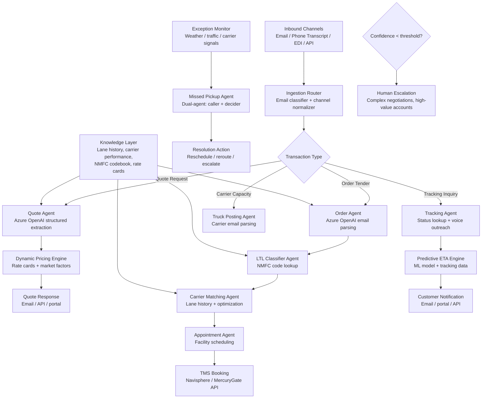

## Solution Overview

The right architecture for freight logistics automation is not a single monolithic agent. C.H. Robinson's production deployment demonstrates why: the shipment lifecycle touches too many distinct cognitive tasks — email parsing, freight classification, dynamic pricing, carrier matching, appointment scheduling, tracking, and exception handling — for one agent to handle well. Their "Always-On Logistics Planner" runs 30+ specialized AI agents, each owning a narrow step in the lifecycle, connected through the Navisphere TMS backend. The result: 3+ million automated shipping tasks, price quotes in 32 seconds, and a 40% productivity increase. [CS1][CS2][CS3][CS4]

The recommended design is a multi-agent orchestrator-worker system with event-driven coordination. LLM workers handle the parts that defied automation for decades: reading unstructured emails to extract shipment details, classifying freight against NMFC codes, reasoning about carrier selection, and conducting voice-based carrier outreach. Deterministic services handle everything that must be fast, auditable, and reproducible: dynamic pricing calculations, rate card lookups, appointment slot optimization, TMS record creation, and EDI transmission. The key insight from C.H. Robinson's approach — "map the problems, then engineer solutions" — means each agent exists because a specific bottleneck was identified, not because multi-agent architecture was chosen first. [CS1][CS5][CS6]

The reference integration seam targets a standard TMS (e.g., Navisphere, MercuryGate, BluJay) via REST API, because the agents augment the existing platform rather than replacing it. The same pattern ports to other TMS platforms by swapping the connector layer.

---

## Architecture

### Architecture Diagram

### Component Overview

| # | Component | Technology / Service | Role |
|---|-----------|----------------------|------|
| 1 | Ingestion router | LLM classifier + rules engine | Classifies inbound emails by transaction type (quote, order, tracking, capacity) and normalizes to canonical format. [CS1][CS7] |
| 2 | Quote agent | Azure OpenAI structured outputs | Extracts shipment details from unstructured quote requests and feeds the pricing engine. [CS1][CS2] |
| 3 | Dynamic Pricing Engine | Deterministic optimization service | Evaluates 847+ rate cards, market factors, carrier performance, and lane history to generate competitive quotes. [CS2] |
| 4 | Order agent | Azure OpenAI structured outputs | Parses emailed tenders including attachments, validates shipment details, optimizes mode selection. [CS1][CS3] |
| 5 | LTL classifier agent | Azure OpenAI + NMFC lookup tool | Determines correct freight class and NMFC code from product descriptions. [CS4][CS8] |
| 6 | Carrier matching agent | ML model + optimization | Matches shipments with carriers based on lane history, pricing, performance, capacity, and equipment type. [CS2] |
| 7 | Appointment agent | Scheduling optimizer | Coordinates pickup/delivery windows across 43,000+ locations, balancing facility hours, driver availability, and transit time. [CS3] |
| 8 | Truck posting agent | Azure OpenAI email parsing | Reads carrier emails offering capacity, extracts truck availability, posts to real-time capacity center. [CS1] |
| 9 | Tracking agent | Voice AI + TMS lookup | Responds to tracking inquiries, proactively contacts carriers via voice for status updates. [CS5] |
| 10 | Missed pickup agent | Dual-agent (caller + decider) | Voice agent contacts carriers about missed pickups; decision agent determines resolution. [CS9] |
| 11 | Predictive ETA engine | ML model on historical data | Continuously refines delivery predictions using tracking data, weather, traffic. [CS5] |
| 12 | TMS connector | REST API client | Reads from and writes to the TMS (Navisphere or equivalent) for all booking, tracking, and status operations. [CS1] |

---

## Data Flow

### AI Data Flow

| Stage | What enters the LLM | What comes out | What happens next |
|-------|---------------------|----------------|-------------------|
| Email classification | Raw email text, subject line, sender domain | Transaction type label (quote/order/tracking/capacity) and confidence score | Router dispatches to the appropriate agent. [CS1][CS7] |
| Quote extraction | Email body + attachments, extraction schema, few-shot examples | Structured `QuoteRequest` JSON: origin, destination, weight, commodity, timeline, special requirements | Dynamic Pricing Engine calculates the quote. [CS1][CS2] |
| Order parsing | Emailed tender text + attachments, order schema | Structured `OrderTender` JSON: all shipment fields validated against TMS requirements | Mode optimizer selects TL vs LTL, then books in TMS. [CS3] |
| Freight classification | Product description, weight, dimensions, NMFC tool results | Proposed NMFC code, freight class, confidence, reasoning | If high confidence, writes directly; otherwise routes to human classifier. [CS4][CS8] |
| Carrier email parsing | Carrier email offering truck capacity | Structured capacity record: equipment type, origin, destination, availability window | Posted to real-time capacity center for matching. [CS1] |
| Tracking voice call | Phone transcript from carrier call | Structured tracking update: location, status, ETA, exceptions | Updates TMS and triggers customer notification. [CS5] |
| Missed pickup resolution | Carrier call results, shipment context, resolution options | Resolution decision: reschedule, dispatch alternate carrier, or escalate | Executes resolution action and notifies all parties. [CS9] |

---

## Agent Pattern

| Aspect | Choice |
|--------|--------|
| **Pattern** | Multi-agent orchestrator-worker with event-driven coordination |
| **Orchestration** | Event-driven with TMS as the state backbone; agents triggered by email arrival, status change, schedule event, or exception signal |
| **Human-in-the-Loop** | Confidence-based escalation: low-confidence extractions, high-value accounts, novel exceptions route to human specialists |
| **State Management** | TMS is the system of record; agents are stateless workers that read from and write to TMS via API |
| **Autonomy Level** | Semi-autonomous: routine shipments flow end-to-end without human touch; complex negotiations and strategic decisions remain human-led |

---

## Tools & Frameworks

### AI / ML Stack

| Component | Technology | Why Chosen |
|-----------|------------|------------|
| **LLM Provider** | Azure OpenAI via Azure AI Foundry | C.H. Robinson confirmed: uses Azure AI Foundry as primary platform for building and deploying agents. [CS10][CS12][TD1] |
| **Model** | GPT-4o for extraction and classification; GPT-4o-mini for email classification | Balance of reasoning capability and cost at 5,000-50,000+ transactions/day. |
| **Agent Framework** | LangChain / LangGraph | C.H. Robinson confirmed: built agents with LangChain for model interoperability, evolved to LangGraph for complex classification tasks requiring state tracking. [CS12][TD2][TD3] |
| **Observability** | LangSmith | C.H. Robinson confirmed: uses LangSmith as "first line of defense in the testing process" for agent observability. [CS12] |
| **Structured Extraction** | Azure OpenAI structured outputs | Enforces JSON schema compliance for all extraction agents. [TD1] |
| **Voice AI** | Azure Communication Services + Azure OpenAI Realtime API | Carrier outreach calls for tracking and missed pickup resolution. [CS5][CS9] |
| **Predictive ETA** | Custom ML model (XGBoost / LightGBM) on historical data | C.H. Robinson reports 98.2% predictive ETA accuracy using billions of historical data points. [CS5] |

### Infrastructure Stack

| Component | Technology | Why Chosen |
|-----------|------------|------------|
| **Compute** | AKS or Azure Container Apps | Horizontal scaling for parallel agent execution across 5,000-50,000+ daily transactions. |
| **Message Queue** | Azure Service Bus | Event-driven trigger for agents; handles bursty email volume and seasonal peaks. |
| **Storage** | Azure Blob Storage + Cosmos DB + Azure SQL | C.H. Robinson confirmed: Azure SQL for structured data, Cosmos DB for real-time data with change feed for event-driven architecture, Blob for attachments. [CS12][CS13] |
| **Monitoring** | Application Insights / OpenTelemetry | Trace agent decisions, tool calls, latency, and escalation rates. |

---

## Security & Compliance

| Concern | Approach |
|---------|----------|
| **Authentication** | Managed identity for all Azure services; short-lived tokens for TMS API calls. |
| **Authorization** | Each agent has scoped API credentials — the extraction agent cannot book shipments; the booking agent cannot modify pricing. |
| **Data at Rest** | Customer-managed key encryption for shipment data, pricing data, and carrier PII. |
| **Data in Transit** | TLS 1.2+ for all API calls; private endpoints for Azure OpenAI and TMS connectivity. |
| **PII Handling** | Driver PII (names, phone numbers) redacted before LLM processing where not needed for the task. Carrier contact info processed only by voice agents with strict scope. |
| **Audit Trail** | Every agent decision logged with input, output, tool calls, confidence score, and escalation reason. Required for freight classification disputes and billing audits. |
| **Pricing Confidentiality** | Customer-specific pricing never exposed across accounts. Agent prompts include explicit isolation instructions. |
| **FMCSA Compliance** | Carrier selection agent validates safety ratings and insurance before matching. Deterministic check, not LLM decision. |
