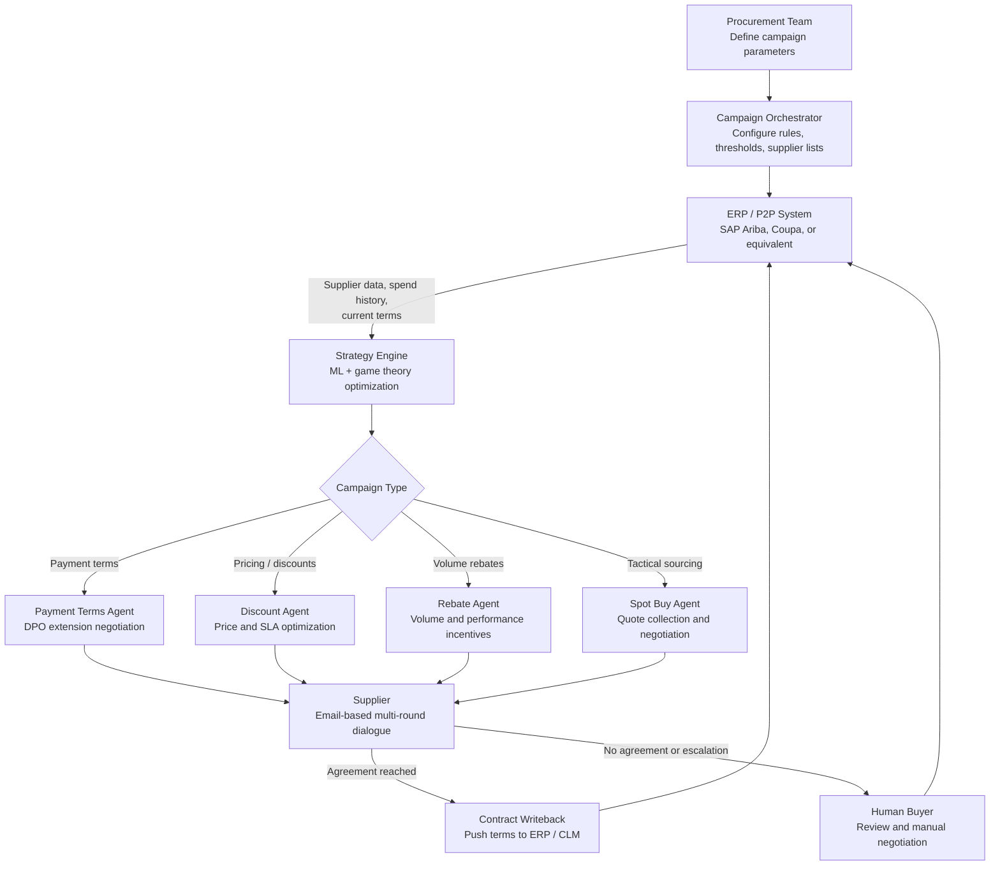

## What This Design Covers

This design covers autonomous negotiation of tail-spend and mid-tier supplier contracts — the 80% of vendor relationships that procurement teams cannot reach manually. The reference pattern uses a fleet of specialized AI agents that conduct multi-round, multi-issue negotiations with thousands of suppliers in parallel via email. Each agent handles a distinct procurement workflow — payment terms, rebates, pricing, or tactical sourcing — within guardrails set by procurement leadership. The primary reference deployments are Pactum AI at Walmart (GNFR categories across US, Canada, Chile, South Africa), Maersk (spot trucking rates), and SUEZ UK (2,000 suppliers in 2 months). [S1][S2][S3]

## Recommended Operating Model

| Decision Area | Recommendation |
|---------------|----------------|
| **Autonomy Model** | High autonomy for tail-spend and mid-tier negotiations. AI agents conduct end-to-end multi-round negotiations within defined parameters — price bands, payment term limits, escalation thresholds. Human buyers handle strategic supplier relationships, high-value contracts, and agent-escalated exceptions. [S1][S2] |
| **System of Record** | The ERP or procurement platform (SAP Ariba, Coupa, or equivalent) remains authoritative for supplier master data, spend history, contract terms, and purchase orders. AI agents read from and write back to this system. [S8] |
| **Human Decision Points** | Procurement leaders define campaign parameters, negotiation boundaries, and approval thresholds. Buyers review escalated negotiations, approve non-standard terms, and manage strategic accounts. Finance owns working capital targets for payment term campaigns. [S4][S5] |
| **Primary Value Driver** | Reach: converting thousands of un-negotiated tail-spend relationships into managed contracts. Walmart achieved 3% average savings and 35-day payment term extensions across categories that previously received no negotiation attention. [S1][S2] |

## Architecture

### System Diagram

### Component Responsibilities

| Component | Role | Notes |
|-----------|------|-------|
| Campaign Orchestrator | Manages parallel campaigns across supplier portfolios. Configures negotiation parameters, supplier segmentation, scheduling, and progress dashboards. | Can launch campaigns covering 10,000 suppliers simultaneously. Tracks active negotiations and completion rates in real time. [S5] |
| Strategy Engine | Calculates optimal starting offers, reservation values, and trade-off priorities per supplier using spend history, market data, and learned negotiation patterns. | Uses reinforcement learning and game theory to model supplier behavior and identify Pareto-improving proposals. Improves with each negotiation round. [S7] |
| Negotiation Agents (Payment Terms, Discount, Rebate, Spot Buy) | Conduct multi-round, multi-issue email conversations with suppliers. Present tailored proposals, evaluate counteroffers, and reach agreements within defined boundaries. | Each agent type specializes in a procurement workflow. Agents can trade concessions across issues — e.g., longer payment terms in exchange for higher rebate. [S4][S5] |
| Requisition Alignment Agent | Evaluates incoming procurement requests for completeness and negotiation opportunity before activating negotiation agents. | Screens purchase requests to determine whether negotiation is worthwhile, avoiding wasted outreach on non-negotiable items. [S4] |
| Contract Writeback | Pushes agreed terms back to ERP, procurement platform, or contract management system. Generates audit trail with full negotiation history. | Integration via standard APIs to SAP Ariba, Coupa, and other platforms. Every offer, counteroffer, and decision point is logged. [S8] |

## End-to-End Flow

| Step | What Happens | Owner |
|------|---------------|-------|
| 1 | Procurement team selects a supplier category (e.g., GNFR, transportation, facilities) and defines campaign parameters: target savings, payment term goals, escalation rules, and negotiation boundaries. | Procurement leadership [S1][S5] |
| 2 | Campaign orchestrator ingests supplier data from the ERP — contact details, current contract terms, spend history, payment terms baseline. Strategy engine calculates per-supplier starting offers and trade-off priorities. | Campaign Orchestrator + Strategy Engine [S5][S7] |
| 3 | Negotiation agent initiates parallel email conversations with all targeted suppliers. Each supplier receives a personalized proposal based on their specific circumstances and current terms. | Negotiation Agent [S4][S5] |
| 4 | Multi-round negotiation unfolds. Agent evaluates supplier counteroffers, proposes alternatives, and trades concessions across issues (price vs. payment terms vs. rebates). Conversations continue until agreement or impasse. | Negotiation Agent [S5][S7] |
| 5 | Agreed terms write back to the ERP or CLM system. Escalated or unresolved negotiations route to human buyers with full conversation context. Complete audit trail is generated for compliance. | Contract Writeback or Human Buyer [S4][S8] |

## AI Responsibilities and Boundaries

| Workflow Area | AI Does | Deterministic System Does | Human Owns |
|---------------|---------|---------------------------|------------|
| Negotiation execution | Conducts multi-round email dialogues with suppliers, proposes terms, evaluates counteroffers, and reaches agreements within defined boundaries. [S4][S5] | ERP validates supplier master data and enforces business rules on contract terms. | Approves non-standard terms, handles strategic accounts, resolves escalated negotiations. |
| Strategy calculation | Models supplier behavior, calculates optimal proposals, and identifies mutually beneficial trade-offs using ML and game theory. [S7] | Procurement platform provides spend history, market benchmarks, and current contract baselines. | Sets negotiation boundaries, defines acceptable ranges, and approves campaign parameters. |
| Campaign management | Orchestrates thousands of parallel negotiations, tracks progress, and routes outcomes. [S5] | Dashboard reports campaign metrics in real time. | Reviews campaign results, adjusts parameters for future campaigns, owns working capital targets. |
| Compliance and audit | Logs every offer, counteroffer, and decision point with full traceability. [S4] | CLM system stores executed contracts as the legal record. | Compliance team reviews audit trails, legal reviews non-standard clauses. |

## Integration Seams

| System | Integration Method | Why It Matters |
|--------|--------------------|----------------|
| ERP / Procurement platform (SAP Ariba, Coupa) | REST API and native marketplace connectors | System of record for supplier data, spend, and contracts. Pactum integrates into SAP Ariba approval flows and the Coupa App Marketplace, enabling end-to-end automation from requisition to PO. [S8] |
| Email gateway (SMTP) | Outbound email campaigns with inbound reply parsing | Suppliers interact through standard email — no portal login or software installation required. This is critical for tail-spend suppliers who lack EDI or procurement platform access. [S5] |
| Contract Lifecycle Management (CLM) | API writeback for agreed terms | Completed negotiations push signed terms to the CLM for contract storage and renewal tracking. Full negotiation history attached as audit evidence. [S4] |
| Spend analytics / BI | Data export or API | Campaign results feed into procurement analytics for category management, savings tracking, and working capital reporting. |

## Control Model

| Risk | Control |
|------|---------|
| Agent agrees to terms outside acceptable range | Hard guardrails enforce price bands, payment term limits, and minimum acceptable values per campaign. Agent cannot override these boundaries — terms outside limits trigger automatic escalation to human buyers. [S4][S5] |
| Supplier receives inconsistent or conflicting offers | Campaign orchestrator prevents overlapping negotiations with the same supplier. One active campaign per supplier-category combination at any time. |
| Negotiation data leaks competitive information | SOC 2 Type II certified platform. Data encrypted in transit and at rest. Role-based access controls limit visibility. No supplier sees another supplier's terms or negotiation history. [S4] |
| Agent drift degrades negotiation quality over time | Per-campaign accuracy and savings tracking. Conversion rates, average savings, and escalation rates monitored against baselines. Human feedback loop captures buyer corrections. |
| Supplier relationship damage from aggressive tactics | Agents use integrative bargaining — offering trade-offs rather than one-sided demands. Walmart reported 75% of suppliers preferred the bot over human negotiation, and 83% rated the experience as easy to use. [S1][S2] |

## Reference Technology Stack

| Layer | Default Choice | Reason | Viable Alternative |
|-------|----------------|--------|--------------------|
| **Model layer** | LLM (GPT-4 class or equivalent) for natural language negotiation + reinforcement learning for strategy optimization | Negotiations require natural language fluency for email dialogue and adaptive strategy for multi-round bargaining. Pactum uses ML, NLP, and game theory in combination. [S7] | Claude or Gemini for dialogue; custom RL models for strategy; smaller fine-tuned models for classification tasks. |
| **Orchestration** | Campaign-based orchestration with per-agent state management | Each campaign runs as an independent workflow with thousands of parallel supplier conversations. Campaign-level orchestration is simpler than generic agent frameworks for this structured use case. [S5] | Temporal for durable execution; LangGraph for teams building custom agent workflows. |
| **Integration** | SAP Ariba / Coupa native connectors + SMTP for supplier communication | Direct ERP integration ensures data flows bidirectionally without manual intervention. Email-based supplier interaction eliminates adoption friction. [S8] | CSV-based data exchange for initial deployment; webhook integrations for custom procurement platforms. |
| **Observability** | Campaign dashboards tracking conversion rates, savings, cycle time, escalation rate, and supplier sentiment | Each campaign needs isolated metrics. Conversion rate and average savings are the primary signals for campaign health. [S5] | OpenTelemetry for tracing; Datadog or Grafana for visualization. |

## Key Design Decisions

| Decision | Choice | Why It Fits This Use Case |
|----------|--------|---------------------------|
| Email-based supplier interaction, not portal or EDI | Suppliers negotiate via standard email — no login, no software, no training | Tail-spend suppliers are small businesses that lack procurement platform access. Email eliminates adoption friction entirely. Walmart and SUEZ achieved 64–68% agreement rates through email alone. [S1][S2][S3] |
| Multi-issue integrative bargaining, not single-variable price haggling | Agents negotiate price, payment terms, rebates, and service levels simultaneously | Trading concessions across dimensions produces better outcomes for both parties. A supplier might accept longer payment terms in exchange for a price hold. This drives the 75% supplier preference rate. [S5][S7] |
| Campaign-based execution, not continuous background negotiation | Negotiations run as time-bounded campaigns targeted at specific categories or supplier segments | Campaigns provide clear scope, measurable outcomes, and defined timelines. SUEZ contacted 2,000 suppliers in 2 months using campaign-based execution. Campaigns complete in 4–6 weeks versus 6–12 months manually. [S3][S5] |
| Hard guardrails with escalation, not probabilistic approval | Agents cannot exceed defined negotiation boundaries — violations escalate automatically | At thousands of parallel negotiations, human approval per move is impossible. Hard guardrails ensure compliance while maintaining speed. Every conversation is logged for audit. [S4] |
| Specialized agents per procurement workflow, not one general negotiator | Separate agents for payment terms, discounts, rebates, and tactical sourcing | Each workflow has different optimization objectives, data requirements, and success metrics. Specialization enables targeted improvement and isolated failure. [S4][S10] |
