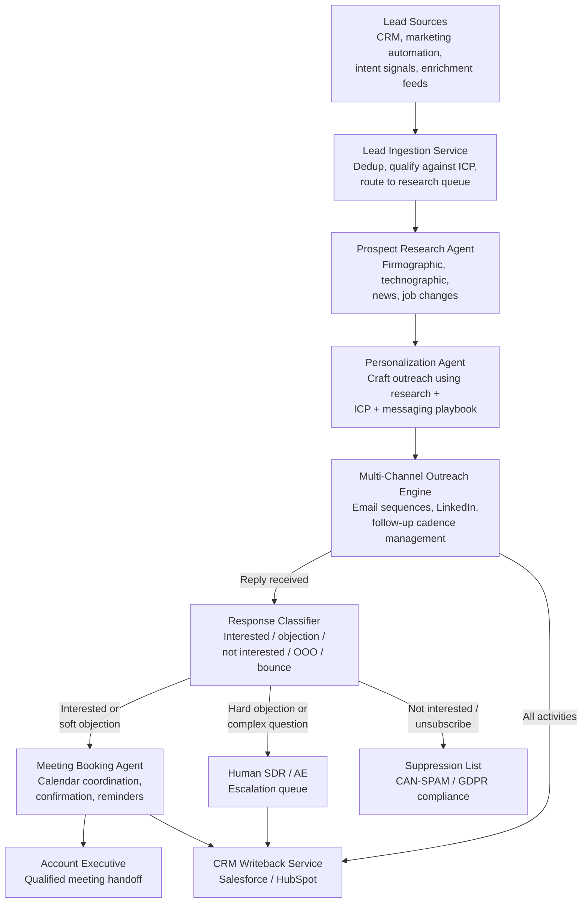

## What This Design Covers

This design covers an AI-driven sales development system that autonomously researches prospects, crafts personalized multi-channel outreach, handles responses, and books qualified meetings for account executives. The operating model keeps the CRM as system of record, gives AI agents autonomy over prospect research, outreach composition, response handling, and scheduling, and reserves ICP definition, deal strategy, and qualified conversations for humans. The primary reference deployments are SaaStr (20+ AI agents generating $4.8M pipeline and $2.4M closed-won revenue with 1.25 humans in sales), 11x.ai Alice 2.0 (~2M leads sourced, ~3M messages sent), and Qualified Piper (500+ enterprise customers, Demandbase 2x pipeline in 60 days). [S1][S2][S3]

## Recommended Operating Model

| Decision Area | Recommendation |
|---------------|----------------|
| **Autonomy Model** | High autonomy for prospect research, outreach composition, response classification, follow-up sequencing, and meeting scheduling. AI agents execute the full SDR workflow without human intervention for standard paths. Humans define ICP criteria, approve messaging playbooks, conduct qualified meetings, and handle escalated objections. [S1][S2] |
| **System of Record** | The CRM (Salesforce, HubSpot) remains authoritative for lead records, pipeline stages, activity history, and reporting. Every AI action writes back to the CRM via API. No shadow databases for prospect state. [S10] |
| **Human Decision Points** | Revenue leadership defines ideal customer profiles and messaging strategy. Account executives conduct all qualified meetings and own deal progression. Sales operations reviews AI performance metrics and adjusts targeting rules. Human review for any outreach to named strategic accounts. [S1] |
| **Primary Value Driver** | Volume and speed: AI SDRs process thousands of prospects per day across email and LinkedIn simultaneously, operating 24/7 across time zones. SaaStr sent 60,000+ personalized emails and doubled deal volume with 1.25 humans. Human SDRs produce 8-10 qualified meetings/month; AI agents target 40+. [S1][S6] |

## Architecture

### System Diagram

### Component Responsibilities

| Component | Role | Notes |
|-----------|------|-------|
| Lead Ingestion Service | Receives leads from CRM, marketing automation, and intent signal providers. Deduplicates, scores against ICP criteria, and routes qualified leads to the research queue. | Deterministic filtering and scoring. Prevents AI from working low-quality leads that waste send capacity and damage domain reputation. |
| Prospect Research Agent | Enriches each lead with firmographic data, technographic signals, recent company news, job changes, and buying intent indicators using data provider APIs. | 11x.ai's architecture uses a dedicated Researcher sub-agent for this function. Research depth directly drives personalization quality and reply rates. [S2][S13] |
| Personalization Agent | Composes outreach messages using prospect research, ICP context, and approved messaging playbooks. Generates email subject lines, body copy, and LinkedIn connection messages tailored to each prospect's situation. | SaaStr attributes its 6.7% reply rate (vs. 3-4% industry average) to deep personalization from prospect-specific research rather than template-based mail merge. [S1] |
| Multi-Channel Outreach Engine | Manages email sending infrastructure (domain warmup, SPF/DKIM/DMARC, throttling), LinkedIn automation, and multi-step follow-up sequences with configurable cadence and channel mix. | Email deliverability infrastructure is the hidden prerequisite. Domains need 4-6 weeks of warmup. Separate sending domains protect the primary corporate domain. [S14] |
| Response Classifier | Classifies incoming replies into categories: interested, soft objection, hard objection, not interested, out-of-office, bounce, unsubscribe. Routes each category to the appropriate next step. | Classification accuracy determines whether interested prospects get fast follow-up or fall through cracks. Hard objections and complex questions route to humans. |
| Meeting Booking Agent | Coordinates scheduling between interested prospects and account executives. Reads AE calendars, proposes time slots, handles timezone conversion, sends confirmations and reminders. | Eliminates the 2-3 day scheduling lag that kills momentum after a positive reply. Calendar integration with Google/Microsoft is required. |
| CRM Writeback Service | Logs every activity (emails sent, replies received, meetings booked, status changes) to the CRM in real time. Updates lead stages, creates tasks, and attaches conversation context to contact records. | Non-negotiable for pipeline visibility and compliance audit trails. SaaStr manages 20+ agents writing to a single CRM — deduplication and conflict resolution matter at scale. [S1][S10] |

## End-to-End Flow

| Step | What Happens | Owner |
|------|---------------|-------|
| 1 | New lead enters the system from CRM, marketing automation, or intent signal feed. Ingestion service deduplicates, scores against ICP criteria, and routes qualified leads to the research queue. | Lead Ingestion Service |
| 2 | Prospect research agent enriches the lead with firmographic data, technographic signals, recent news, and job changes. Enrichment is stored on the CRM record. | Prospect Research Agent [S2][S13] |
| 3 | Personalization agent composes a multi-step outreach sequence (typically 4-6 touches across email and LinkedIn) using research context and messaging playbook. | Personalization Agent [S1] |
| 4 | Outreach engine sends messages according to the cadence, managing deliverability, throttling, and channel-specific timing rules. All sends are logged to the CRM. | Multi-Channel Outreach Engine [S14] |
| 5 | When a reply arrives, the response classifier categorizes it and routes accordingly: interested prospects go to the meeting booking agent, objections to the appropriate handler, unsubscribes to the suppression list. | Response Classifier |
| 6 | Meeting booking agent coordinates with the prospect and the assigned AE's calendar, confirms the meeting, and sends reminders. The AE receives a pre-call brief with full prospect context. | Meeting Booking Agent → Account Executive |

## AI Responsibilities and Boundaries

| Workflow Area | AI Does | Deterministic System Does | Human Owns |
|---------------|---------|---------------------------|------------|
| Lead qualification and research | Enriches leads with firmographic/technographic data, scores buying intent signals, identifies relevant trigger events (funding, job changes, expansion). [S2][S13] | ICP scoring rules and threshold filters are configured deterministically. CRM enforces lead routing and assignment rules. | Defines ideal customer profile criteria. Reviews and adjusts ICP parameters based on pipeline quality feedback. |
| Outreach composition | Generates personalized email copy, subject lines, and LinkedIn messages using prospect research and approved messaging frameworks. Adapts tone and value proposition to prospect context. [S1] | Sending infrastructure enforces rate limits, deliverability rules, and compliance checks (opt-out links, sender identification). | Approves messaging playbooks and brand guidelines. Reviews outreach to named strategic accounts before sending. |
| Response handling and follow-up | Classifies replies, generates contextual follow-up messages for soft objections, manages multi-step nurture sequences for "not now" responses. [S2] | Suppression list management, unsubscribe processing, and bounce handling follow deterministic compliance rules. | Handles complex objections, competitive questions, and pricing discussions that require deal judgment. |
| Meeting scheduling | Books meetings on AE calendars, handles timezone coordination, sends confirmations and reminders, generates pre-call briefs. | Calendar system enforces availability windows and booking rules. | Conducts the qualified meeting. Owns deal strategy and progression from first meeting onward. |

## Integration Seams

| System | Integration Method | Why It Matters |
|--------|--------------------|----------------|
| CRM (Salesforce, HubSpot) | REST API with OAuth 2.0. Salesforce: SOQL queries for lead retrieval, composite API for batch writes. HubSpot: REST API with rate limit of 100 requests/10 seconds. [S10] | System of record for all prospect data and pipeline. Every AI action must write back to maintain a single source of truth. Activity logging enables pipeline attribution and compliance audit. |
| Data enrichment (ZoomInfo, Apollo, Clearbit) | REST API for real-time enrichment on lead intake; batch enrichment for existing database. | Research quality drives personalization quality, which drives reply rates. Without enrichment, AI-composed outreach degrades to generic templates with no advantage over traditional mail merge. |
| Email sending infrastructure (SendGrid, Amazon SES, or dedicated SMTP) | SMTP relay with SPF/DKIM/DMARC authentication. Separate sending domains from corporate domain. Webhook callbacks for delivery, open, click, bounce, and complaint events. [S14] | Deliverability is the single largest operational risk. Gmail and Microsoft enforce sender reputation scoring; exceeding 0.1% spam complaint rate triggers throttling. Dedicated infrastructure isolates outreach reputation from corporate email. |
| Calendar (Google Calendar, Microsoft 365) | Calendar API for availability reads and booking writes. | Eliminates the scheduling back-and-forth that delays meeting booking by 2-3 days after a positive reply. Real-time availability reduces double-booking conflicts. |
| LinkedIn (via Sales Navigator API or compliant automation) | API or browser automation within LinkedIn's usage policies. | Second outreach channel for prospects who do not respond to email. LinkedIn InMail has higher open rates but strict daily volume limits. |

## Control Model

| Risk | Control |
|------|---------|
| Email deliverability collapse from volume or spam complaints | Dedicated sending domains separate from corporate domain. 4-6 week domain warmup before production volume. SPF/DKIM/DMARC authentication on all sending domains. Daily monitoring of bounce rates (< 2%) and spam complaints (< 0.1%). Automatic throttling when reputation metrics degrade. [S14] |
| CAN-SPAM and GDPR non-compliance | Every email includes physical address, sender identification, and one-click unsubscribe link. Unsubscribe requests processed within 24 hours (CAN-SPAM) or immediately (GDPR). Suppression list checked before every send. GDPR requires legitimate interest basis documented per contact for B2B outreach; explicit consent required where local law mandates it. Penalty: up to $51,744 per non-compliant email under CAN-SPAM. [S7][S8] |
| Brand damage from low-quality or hallucinated outreach | Messaging playbooks reviewed and approved by sales leadership before deployment. AI operates within approved frameworks, not free-form generation. Sample audit of 5-10% of outbound messages weekly. Immediate pause capability if quality issues are detected. [S1] |
| AI-generated content transparency under EU AI Act | EU AI Act requires disclosure when AI generates content in interactions with natural persons. Transparency obligations take effect August 2026. Outreach templates should include appropriate disclosure where required by jurisdiction. [S9] |
| Prospect data exposure or misuse | PII handling follows data minimization principles. Enrichment data stored only in the CRM, not in intermediate agent state. Role-based access controls on CRM records. Data retention policies aligned with GDPR and local requirements. |

## Reference Technology Stack

| Layer | Default Choice | Reason | Viable Alternative |
|-------|----------------|--------|--------------------|
| **Model layer** | GPT-4 class LLM for prospect research synthesis, outreach composition, and response classification. Embedding model for ICP similarity scoring. | Outreach personalization requires natural language fluency and the ability to synthesize research into compelling, context-specific messages. 11x.ai uses OpenAI and Anthropic APIs in production. [S13] | Claude for composition and classification; fine-tuned compact models for high-volume response classification where latency and cost matter. |
| **Orchestration** | LangGraph with supervisor-agent pattern. Supervisor routes tasks to specialized sub-agents (researcher, composer, classifier, scheduler). | 11x.ai rebuilt their production system on LangGraph with this exact pattern — supervisor agent routing to four specialized sub-agents. Graph-based execution supports conditional routing and parallel processing. [S11][S13] | Temporal for durable execution with retry guarantees; custom event-driven pipeline with Celery for teams preferring lower abstraction. |
| **Retrieval / memory** | Vector store for ICP matching and messaging playbook retrieval. Conversation history in CRM. Redis for active sequence state. | Semantic matching between prospect profiles and successful outreach patterns improves personalization over time. Sequence state needs fast reads for real-time response routing. | PostgreSQL with pgvector for teams preferring a single database; Elasticsearch for hybrid keyword + vector search across prospect data. |
| **Observability** | LangSmith for LLM trace logging. Pipeline dashboards tracking send volume, reply rates, meeting conversion, and deliverability health. | 11x.ai uses LangSmith for agent observability in production. Reply rate and meeting conversion are the primary health signals; deliverability metrics are the leading indicators. [S13] | Braintrust for LLM evaluation; Datadog or Grafana for infrastructure monitoring; custom dashboards for sales operations. |

## Key Design Decisions

| Decision | Choice | Why It Fits This Use Case |
|----------|--------|---------------------------|
| Multi-agent architecture with specialized sub-agents, not a monolithic outreach tool | Separate agents for research, composition, response classification, and scheduling, coordinated by a supervisor | Each function has different latency requirements, model needs, and failure modes. Research can take seconds; composition needs high-quality LLM output; classification needs speed. 11x.ai validated this pattern in production with their Alice 2.0 rebuild. [S2][S13] |
| Dedicated sending infrastructure separate from corporate email | Separate domains with independent reputation, warmup, and monitoring | A deliverability incident on outreach domains must not impact corporate email. Gmail and Microsoft reputation scoring is domain-level. This isolation is non-negotiable for any organization sending outreach at AI-enabled volume. [S14] |
| Human-approved messaging playbooks, not fully autonomous content generation | AI composes within approved frameworks; it does not invent new value propositions, pricing claims, or competitive positioning | SaaStr's success came from extensive agent training and hyper-segmentation, not "set and forget" autonomous generation. Brand risk from uncontrolled AI messaging is high — a single hallucinated claim can damage prospect trust and create legal exposure. [S1] |
| CRM as single source of truth with real-time writeback, not a separate prospect database | All prospect state, activity history, and pipeline data lives in the CRM; agents read from and write to CRM via API | SaaStr runs 20+ agents against a single CRM. Shadow databases create data drift, break pipeline reporting, and make handoff to AEs unreliable. CRM writeback also provides the compliance audit trail. [S1][S10] |
| Hybrid AI-human model for meeting qualification, not fully autonomous pipeline handoff | AI books the meeting; human AE conducts it and qualifies the opportunity | AI-booked meetings convert to qualified opportunities at roughly 15% vs. 25% for human-booked meetings. The gap is in relationship building and contextual judgment during the conversation, not in the booking step. The optimal model uses AI for volume and humans for conversion. [S6] |
