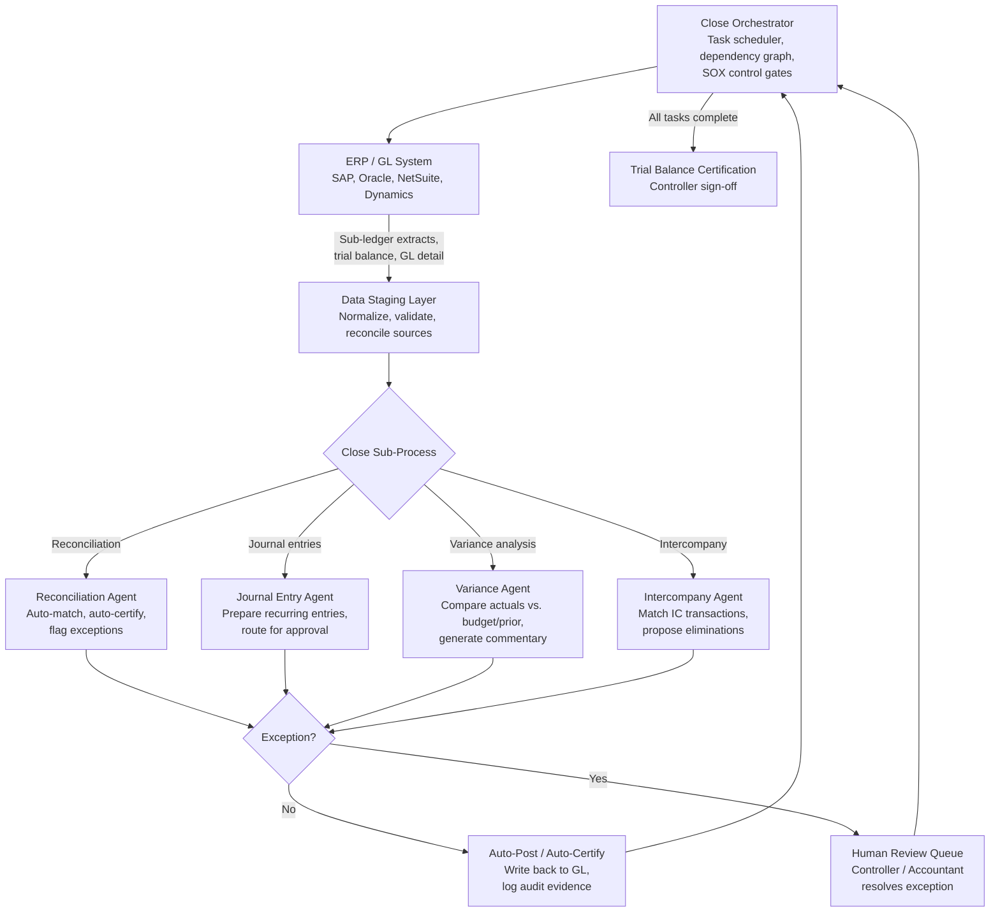

## What This Design Covers

This design covers autonomous orchestration of the monthly financial close — account reconciliation, transaction matching, journal entry preparation, variance analysis, and exception routing — for organizations running ERP-centric accounting operations. The operating model uses specialized AI agents for each close sub-process, coordinated by a close orchestrator that enforces task dependencies, SOX controls, and audit trail requirements. The design boundary includes all record-to-report activities from sub-ledger data extraction through trial balance certification. Consolidation, statutory reporting, and tax provision are outside this first release. The primary reference deployments are FloQast (3,500+ customers including Lululemon and Chipotle, built on Claude via Amazon Bedrock), Trintech Cadency (Ralph Lauren, Proshop, Tower Federal Credit Union), and HighRadius (Konica Minolta, major US hotel chain). [S1][S2][S4]

## Recommended Operating Model

| Decision Area | Recommendation |
|---------------|----------------|
| **Autonomy Model** | High autonomy for recurring, rules-driven close tasks — auto-matching, auto-certification, standard journal entries, and routine variance checks. Human review required for material exceptions, new account types, non-standard adjustments, and final trial balance sign-off. Trintech customers report 99%+ auto-match rates with only ~50 exceptions per 6,000 daily reconciliations reaching humans. [S2][S3] |
| **System of Record** | The ERP general ledger (SAP S/4HANA, Oracle, NetSuite, or Dynamics 365) remains authoritative for posted balances and journal entries. The close management platform orchestrates tasks and holds working papers but does not replace the GL. [S5][S10] |
| **Human Decision Points** | Controllers approve the close checklist and final trial balance. Accountants resolve flagged exceptions above materiality thresholds. Finance leadership reviews variance commentary before filing. Internal audit validates control evidence. [S7] |
| **Primary Value Driver** | Cycle time compression and labor reallocation. The close shrinks from 10+ days to 4–6 days by eliminating manual data gathering, spreadsheet reconciliation, and email-based review chains. Finance staff shift from transaction processing to analysis. FloQast customers report a 20% average monthly reduction in time to close; HighRadius reports 30% reduction in days to close with 50% of close tasks automated. [S1][S4] |

## Architecture

### System Diagram

### Component Responsibilities

| Component | Role | Notes |
|-----------|------|-------|
| Close Orchestrator | Manages the close checklist as a dependency graph. Schedules tasks, enforces sequencing, tracks completion, and gates downstream steps on upstream sign-off. | SAP AFC, FloQast, or Trintech Cadency serve this role. Provides the single dashboard for close status across entities and periods. [S1][S5][S10] |
| Reconciliation Agent | Matches GL balances to sub-ledger or bank data. Auto-certifies low-risk accounts where balances match within tolerance. Routes exceptions with supporting detail. | Trintech achieves 99%+ auto-match; BlackLine reports 43–85% auto-certification depending on account portfolio. Konica Minolta processes 45,000+ monthly line items at 99% match rate. [S2][S4][S9] |
| Journal Entry Agent | Prepares recurring and accrual entries from templates and historical patterns. Calculates amounts, populates coding, and routes for approval. | HighRadius reports 95% automation rate for journal posting. Handles accruals, deferrals, allocations, and reclassifications. [S4] |
| Variance Agent | Compares period actuals against budget, forecast, and prior period. Flags material variances and drafts narrative commentary for review. | LLM-powered commentary generation is the primary AI differentiator. Deterministic threshold logic handles flagging. [S1] |
| Intercompany Agent | Matches intercompany transactions across entities and proposes elimination entries. Flags unmatched items for resolution before consolidation. | BlackLine offers AI-enabled intercompany accounting. Critical for multi-entity organizations where IC mismatches delay close. [S9] |
| Audit Trail Service | Captures every agent action, human override, approval, and timestamp in an immutable log. Generates SOX control evidence packages on demand. | Required for SOX 302/404 compliance. FloQast holds ISO/IEC 42001 certification for auditable AI. [S1][S7] |

## End-to-End Flow

| Step | What Happens | Owner |
|------|---------------|-------|
| 1 | Period ends. Close orchestrator triggers the close checklist, pulls sub-ledger data from ERP, bank feeds, and supporting systems. Data staging layer normalizes and validates extracts. | Close Orchestrator + ERP [S5][S10] |
| 2 | Reconciliation agent auto-matches GL balances to supporting data across all accounts. Low-risk accounts with matching balances auto-certify. Exceptions queue for human review with full supporting detail. | Reconciliation Agent [S2][S4] |
| 3 | Journal entry agent prepares recurring entries (accruals, deferrals, allocations) from templates and prior-period patterns. Intercompany agent matches IC transactions and proposes eliminations. Entries route for approval. | Journal Entry Agent + Intercompany Agent [S4][S9] |
| 4 | Variance agent compares actuals to budget and prior period. Flags material variances above threshold and drafts commentary. Controller reviews flagged items and approves or adjusts commentary. | Variance Agent + Controller [S1] |
| 5 | Close orchestrator confirms all tasks complete, all exceptions resolved, all approvals captured. Controller certifies trial balance. Audit trail service packages control evidence for SOX documentation. | Close Orchestrator + Controller [S7] |

## AI Responsibilities and Boundaries

| Workflow Area | AI Does | Deterministic System Does | Human Owns |
|---------------|---------|---------------------------|------------|
| Account reconciliation | Matches transactions using ML pattern matching beyond exact-match rules. Identifies probable matches across format differences, timing gaps, and partial amounts. [S2][S4] | ERP provides GL balances and sub-ledger detail. Matching engine applies exact-match rules first. Tolerance thresholds enforce auto-certification limits. | Resolves exceptions above materiality threshold. Approves new matching rules. Certifies reconciliation completeness. |
| Journal entry preparation | Generates recurring entries from templates and historical patterns. Calculates amounts for accruals and allocations. Populates account coding. [S4] | ERP validates account codes, period status, and posting rules. Workflow engine routes entries through approval chain. | Approves non-standard entries. Reviews and posts manual adjustments. Signs off on closing entries. |
| Variance analysis and commentary | Compares actuals to benchmarks, identifies material variances, and drafts narrative explanations referencing likely drivers. [S1] | BI system provides budget, forecast, and prior-period data. Threshold rules determine materiality. | Reviews AI-drafted commentary. Edits or replaces explanations. Approves variance package for reporting. |
| Intercompany elimination | Matches IC transactions across entities using fuzzy matching. Proposes elimination journal entries. [S9] | ERP enforces IC account mapping and elimination rules. | Resolves unmatched IC items. Approves elimination entries before consolidation. |

## Integration Seams

| System | Integration Method | Why It Matters |
|--------|--------------------|----------------|
| ERP / General Ledger (SAP, Oracle, NetSuite) | REST API or native connector for GL extract, journal posting, and trial balance pull. SAP AFC uses its Scheduling Provider Interface and SCIM V2 API for multi-system orchestration. | System of record for all posted balances. Bidirectional integration ensures agents read current data and write back approved entries without manual re-keying. [S5][S10] |
| Bank feeds and treasury | Automated bank statement ingestion (BAI2, MT940, or API feeds from banking platforms) | Bank reconciliation is the highest-volume matching workload. Automated feeds eliminate manual download and upload of bank statements. [S2][S4] |
| Close management platform (FloQast, Trintech, BlackLine) | Native platform — agents run within the close management tool or integrate via its API | The close platform owns the task checklist, workflow routing, and audit trail. It is the coordination layer that agents operate within. [S1][S2][S9] |
| Budget and planning system | Read-only API or data extract for budget, forecast, and prior-period actuals | Variance agent needs benchmark data to flag and explain deviations. Integration avoids manual export of planning data each period. |

## Control Model

| Risk | Control |
|------|---------|
| AI auto-certifies an account with a material error | Materiality thresholds gate auto-certification. Accounts above a dollar threshold or with balance changes exceeding tolerance require human review regardless of match result. Segregation of duties enforced: preparer and approver cannot be the same agent or person. [S2][S7] |
| Journal entry posted with incorrect amount or coding | Two-stage approval: agent prepares, human approves entries above a threshold. ERP validation rules reject invalid account codes or period violations. All entries logged with full lineage from source data to posted amount. [S4] |
| Variance commentary contains hallucinated explanation | LLM-generated commentary is marked as draft and routed to the controller for review before inclusion in reporting packages. Commentary references specific data points that the reviewer can verify. [S1] |
| Audit trail gaps break SOX compliance | Immutable logging of every agent action, human decision, and timestamp. Audit trail service generates SOX evidence packages automatically. FloQast holds ISO/IEC 42001 certification for AI audit readiness. [S1][S7] |
| Data extraction from ERP is incomplete or stale | Data staging layer validates extract completeness — row counts, control totals, and period markers — before agents begin processing. Reconciliation agent flags accounts where supporting data is missing. [S5] |

## Reference Technology Stack

| Layer | Default Choice | Reason | Viable Alternative |
|-------|----------------|--------|--------------------|
| **Model layer** | Claude (via Amazon Bedrock) for variance commentary, exception triage, and document analysis. ML matching models for transaction reconciliation. | FloQast's production architecture uses Claude 3.5 Sonnet on Bedrock for accounting workflows. ML matching models handle high-volume transaction pairing where pattern recognition outperforms rules. [S1] | GPT-4 class models for commentary; custom XGBoost or gradient-boosted models for transaction matching; BlackLine Verity AI as an integrated alternative. [S9] |
| **Orchestration** | Close management platform (FloQast, Trintech Cadency, or SAP AFC) as the task orchestrator with dependency graph and approval routing | The close is a structured, sequential process with hard dependencies between tasks. Purpose-built close platforms handle this better than generic agent frameworks. [S1][S2][S5] | HighRadius Record-to-Report suite; custom orchestration with Temporal for teams building from scratch. [S4] |
| **Integration** | ERP-native connectors (SAP AFC Scheduling API, Oracle ERP Cloud REST API, NetSuite SuiteQL) + bank feed automation (Plaid, MX, or direct BAI2 ingestion) | Direct ERP integration avoids CSV intermediaries and ensures data freshness. Bank feed APIs eliminate manual statement downloads. [S5][S10] | Flat-file exchange for initial deployment; middleware (MuleSoft, Workato) for complex multi-ERP environments. |
| **Observability** | Close dashboard with task-level status, SLA tracking, exception aging, and audit trail viewer. Reconciliation match-rate monitoring per account type. | Close status visibility is both an operational need and a SOX requirement. Match-rate trends detect model drift before it causes exceptions. [S1][S2][S7] | OpenTelemetry for agent-level tracing; Datadog or Grafana for infrastructure monitoring. |

## Key Design Decisions

| Decision | Choice | Why It Fits This Use Case |
|----------|--------|---------------------------|
| Purpose-built close platform as orchestrator, not a generic agent framework | Use FloQast, Trintech, BlackLine, or SAP AFC as the coordination layer rather than building custom agent orchestration | The financial close has well-defined task dependencies, approval chains, and audit requirements that these platforms encode natively. Building this from scratch would replicate years of domain-specific product development. FloQast serves 3,500+ customers; Trintech and BlackLine have decades of close-specific workflow logic. [S1][S2][S8] |
| ML matching models for reconciliation, LLMs for commentary and exception triage | Transaction matching uses supervised ML models trained on historical match patterns. LLMs handle unstructured tasks — variance commentary, exception summarization, document analysis. | Matching millions of transactions requires speed and determinism that ML classifiers provide. LLMs add value where language understanding is needed — explaining why a variance occurred or summarizing an exception for a reviewer. Mixing model types avoids using expensive LLM inference for commodity pattern matching. [S1][S4] |
| Auto-certification with hard materiality gates | Low-risk accounts auto-certify when balances match within tolerance; high-value or high-risk accounts always require human review | This mirrors the risk-based approach that auditors expect. BlackLine customers see 43–85% auto-certification rates, meaning the majority of accounts clear without human touch while material accounts retain full oversight. [S9][S7] |
| Immutable audit trail as a first-class component, not an afterthought | Every agent action, human override, and approval is logged to an append-only store with timestamps, actor identity, and decision rationale | SOX 302/404 compliance requires demonstrable controls over financial reporting. Audit trail gaps are the fastest way to trigger material weakness findings. Building this into the architecture from day one avoids expensive retrofitting. [S7] |
| Start with reconciliation and journal entries, defer consolidation and statutory reporting | Phase 1 covers the highest-volume, most repetitive close tasks. Consolidation and statutory reporting come in later phases. | Reconciliation and journal entries consume 60–70% of close labor and have the clearest automation path. Consolidation involves inter-entity logic and regulatory formatting that requires deeper customization per organization. Phasing reduces deployment risk. [S2][S4] |
