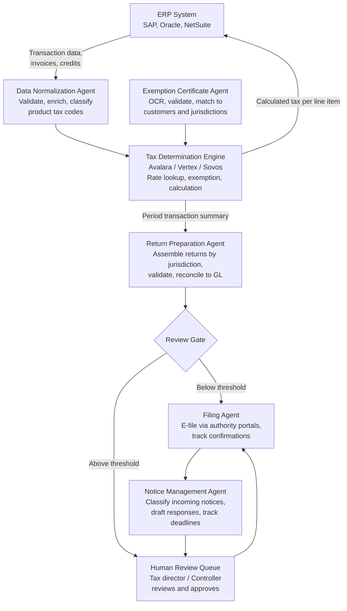

## What This Design Covers

This design covers autonomous orchestration of the indirect tax compliance lifecycle — transaction-level tax determination, return preparation and validation, e-filing, exemption certificate management, and notice triage — for enterprises operating across multiple U.S. and international tax jurisdictions. The operating model pairs a commercial tax determination engine (Avalara, Vertex, or Sovos) for rate calculation with agentic AI for data normalization, return assembly, anomaly detection, notice classification, and exemption certificate processing. The design boundary includes sales and use tax, VAT, and GST compliance. Income tax, transfer pricing, and customs duties are outside the first release. Reference deployments include Thomson Reuters ONESOURCE (120% three-year ROI per Forrester TEI), Avalara (153% three-year ROI per Forrester TEI, 50 billion+ annual transactions), and Vertex (195+ countries, 300 million+ tax rules). [S1][S2][S5]

## Recommended Operating Model

| Decision Area | Recommendation |
|---------------|----------------|
| **Autonomy Model** | Full autonomy for real-time tax determination on transactions (rate lookup, exemption application, calculation). High autonomy for return preparation, validation, and e-filing of routine jurisdictions. Human approval required for filing sign-off above materiality threshold, nexus determination changes, notice responses, and exemption policy exceptions. Thomson Reuters reports 40–60% of preparation time eliminated through automation; Avalara customers see 85% of return management streamlined. [S3][S2] |
| **System of Record** | The ERP (SAP, Oracle, NetSuite) remains authoritative for transaction data and GL postings. The tax determination engine (Avalara AvaTax, Vertex O Series, or Sovos) is the system of record for tax rates, rules, and jurisdictional content. The compliance platform owns return status, filing confirmations, and notice history. [S5][S4] |
| **Human Decision Points** | Tax directors approve nexus determinations and changes to filing obligations. Controllers sign off on prepared returns above a dollar threshold before e-filing. Tax analysts review notice classifications and draft responses before submission. Exemption certificate exceptions requiring policy judgment route to the tax team. [S1] |
| **Primary Value Driver** | Labor reallocation and error reduction. A Forrester TEI study found Thomson Reuters ONESOURCE IDT customers achieved 120% ROI over three years, with $2.6M in error-reduction value from moving the error rate from 3% to below 1%. Avalara customers saved 510 hours per year on return management alone. Tax teams shift from data gathering and form preparation to strategic tax planning. [S1][S2] |

## Architecture

### System Diagram

### Component Responsibilities

| Component | Role | Notes |
|-----------|------|-------|
| Data Normalization Agent | Ingests transaction data from the ERP, validates completeness, enriches with product tax codes using ML classification, and flags data quality issues before they reach the tax engine. | Vertex Tax Categorization Service and Sovos Sovi AI both offer ML-based product classification. Incorrect product codes are a leading cause of tax determination errors. [S5] |
| Tax Determination Engine | Calculates tax for each transaction line item: jurisdiction lookup, rate application, exemption handling, and special rules. Maintains the tax content database with vendor-managed rate updates. | Deterministic, not AI. Avalara processes 50 billion+ transactions annually at 15ms average response. Vertex covers 300 million+ effective tax rules across 195+ countries. This is the component you do not build yourself. [S4][S5] |
| Return Preparation Agent | Aggregates period transactions by jurisdiction, maps to return forms, reconciles calculated tax to GL tax accounts, and validates returns against filing rules. | Assembles the return but does not file it. Validation catches common errors — rate mismatches, missing transactions, GL reconciliation gaps — before human review. [S3] |
| Filing Agent | Submits approved returns through state e-filing portals, federal systems, and international authority APIs. Tracks submission confirmations, payment deadlines, and rejection handling. | Thomson Reuters supports e-filing in 33 U.S. states plus Canada with 1,200+ signature-ready return forms. International filing requires country-specific connectors. [S3] |
| Notice Management Agent | Classifies incoming tax authority correspondence by type and urgency, extracts key dates and amounts, drafts initial responses, and tracks resolution deadlines. | LLM-powered classification and drafting. Notices are unstructured documents where AI adds clear value over rules-based routing. [S8] |
| Exemption Certificate Agent | Processes exemption certificates using OCR, extracts customer and jurisdiction details, validates certificate completeness and expiration, and maintains the certificate store linked to customer accounts. | Avalara ECM automates certificate validation. Certificates are a document-processing problem well-suited to AI: variable formats, handwritten fields, expiration tracking. [S4] |

## End-to-End Flow

| Step | What Happens | Owner |
|------|---------------|-------|
| 1 | Transactions flow from the ERP to the tax determination engine in real time (point-of-sale, invoice creation, procurement). The engine returns calculated tax per line item. Tax is posted to the GL. | Tax Determination Engine + ERP [S4][S5] |
| 2 | At period end, the data normalization agent extracts the full transaction set, validates against GL tax accounts, flags discrepancies, and enriches any items with missing or incorrect product tax codes. | Data Normalization Agent [S5] |
| 3 | The return preparation agent assembles returns for each filing jurisdiction, maps transactions to the correct return lines, applies jurisdiction-specific rules, and reconciles the return total to the GL. Returns below a review threshold auto-advance to filing. | Return Preparation Agent [S3] |
| 4 | Returns above the materiality threshold enter the human review queue. The tax director or controller reviews the return, supporting schedules, and GL reconciliation. Approved returns advance to filing. Exceptions route back for correction. | Tax Director / Controller [S1] |
| 5 | The filing agent submits approved returns through the appropriate channel — state e-filing portals, federal electronic filing, or international authority APIs. It records confirmation numbers, tracks payment due dates, and handles rejections with retry or escalation. | Filing Agent [S3] |
| 6 | The notice management agent monitors incoming correspondence from tax authorities. It classifies each notice (assessment, inquiry, penalty, audit request), extracts deadlines and amounts, drafts an initial response, and routes to the tax analyst for review and submission. | Notice Management Agent + Tax Analyst [S8] |

## AI Responsibilities and Boundaries

| Workflow Area | AI Does | Deterministic System Does | Human Owns |
|---------------|---------|---------------------------|------------|
| Tax determination | Classifies products into tax categories using ML. Flags anomalies in effective tax rates across transactions. [S5][S8] | Tax engine calculates rates, applies exemptions, and handles jurisdiction-specific rules. Rate content maintained by the vendor with ~800 U.S. rate changes per year. [S4][S6] | Approves nexus determinations. Sets exemption policy. Decides treatment for ambiguous product categories. |
| Return preparation and filing | Assembles returns from transaction data, validates completeness, reconciles to GL, and identifies discrepancies. [S3] | Filing system enforces form schemas, calculation rules, and submission protocols. E-filing portals validate format compliance. | Reviews and approves returns above materiality threshold. Resolves GL reconciliation exceptions. Signs off before filing. |
| Notice and correspondence | Classifies notices by type and urgency using NLP. Extracts key dates, amounts, and required actions. Drafts initial responses. [S8] | Calendar system tracks response deadlines. Workflow enforces routing rules and escalation timers. | Reviews AI-classified notices and draft responses. Decides on appeals, payment, or further investigation. |
| Exemption certificate management | Extracts certificate details via OCR. Validates completeness, expiration, and jurisdiction coverage. Matches certificates to customer accounts. [S4] | Certificate store enforces expiration rules and jurisdiction matching. ERP links certificate status to customer tax treatment. | Approves certificates with policy exceptions. Decides on expired or incomplete certificate follow-up. |

## Integration Seams

| System | Integration Method | Why It Matters |
|--------|--------------------|----------------|
| ERP (SAP S/4HANA, Oracle, NetSuite) | Native connector or REST API for transaction data extraction, tax posting, and GL reconciliation. Vertex offers SAP-certified integration mapping up to 80 chain flow data fields. Avalara has 1,400+ signed partner integrations. | The ERP is the source of truth for transactions. Bidirectional integration ensures tax is calculated on actual transaction data and posted amounts reconcile to the GL. [S5][S4] |
| Tax determination engine (Avalara AvaTax, Vertex O Series, Sovos) | REST API for real-time tax calculation. Vertex O Series Edge supports multi-cloud deployment (AWS, Azure, OCI, GCP). Avalara AvaTax processes requests at 15ms average. | The tax engine is the calculation and content backbone. API integration allows real-time determination at the point of transaction and batch recalculation for return preparation. [S4][S5] |
| State and federal e-filing portals | Platform-managed filing connectors. Thomson Reuters covers 33 U.S. states for e-filing with 1,200+ signature-ready forms. International filing requires country-specific authority APIs. | Direct electronic filing eliminates manual portal submissions. Each jurisdiction has its own submission format, authentication, and confirmation protocol. [S3] |
| E-invoicing networks (Peppol, country CTC platforms) | Structured e-invoice generation (EN 16931 for EU), API transmission to clearance platforms, and authority validation. EU ViDA mandates cross-border B2B e-invoicing by July 2030. | Continuous transaction controls are replacing periodic return filing in many jurisdictions. E-invoicing integration becomes a compliance requirement, not an optimization. [S7] |

## Control Model

| Risk | Control |
|------|---------|
| Incorrect tax rate applied to transactions | Tax determination engine content is vendor-managed and updated continuously (Sovos monitors 19,000+ global jurisdictions with 100+ regulatory specialists). Anomaly detection flags transactions where the effective rate deviates from the expected range for that jurisdiction and product category. [S6][S8] |
| Return filed with errors or for wrong jurisdiction | Return preparation agent reconciles calculated tax to GL tax accounts before filing. Pre-submission validation checks form completeness, mathematical accuracy, and jurisdiction assignment. Returns above materiality threshold require human sign-off. [S3] |
| Missed filing obligation due to nexus change | Periodic nexus review evaluates economic nexus thresholds (e.g., Wayfair thresholds) across all states. Threshold monitoring alerts the tax team when sales approach filing triggers. New nexus determinations require human approval before creating filing obligations. [S6] |
| E-invoicing rejection by tax authority | Structured validation against authority schemas (EN 16931, country-specific formats) before submission. Rejection handling with automated retry for format errors and escalation for substantive rejections. [S7] |
| Notice response deadline missed | Notice management agent extracts deadlines at classification time. Calendar system tracks deadlines with escalating alerts. SLA monitoring ensures notices are classified within 48 hours and responses are drafted within the authority's response window. |
| Exemption certificate expired or invalid | Certificate agent monitors expiration dates and sends renewal requests automatically. Transactions against expired certificates flag for review before the next return cycle. [S4] |

## Reference Technology Stack

| Layer | Default Choice | Reason | Viable Alternative |
|-------|----------------|--------|--------------------|
| **Model layer** | Claude or GPT-4 class model for notice classification, exemption certificate extraction, and anomaly commentary. ML classifiers for product tax categorization. | Notice triage and certificate processing are document-understanding tasks where LLMs outperform rules. Product classification requires high-throughput inference better served by specialized ML models. Vertex acquired Ryan LLC's LLM-based categorization technology for this purpose. [S5][S8] | Sovos Sovi AI or Avalara ALFA as integrated AI layers within the tax platform, reducing the need for a separate model deployment. [S4] |
| **Orchestration** | Commercial tax compliance platform (Thomson Reuters ONESOURCE, Avalara, or Vertex + Sovos for filing) as the process backbone, with workflow automation for return routing and approval. | Tax compliance is a highly regulated, jurisdiction-specific domain. Commercial platforms encode decades of jurisdictional rules, form mappings, and filing protocols. Building this from scratch is not viable. [S1][S2] | For organizations already on SAP, the SAP Document and Reporting Compliance module integrates tax determination and e-invoicing natively. |
| **Integration** | Tax engine REST API (Avalara AvaTax v2, Vertex O Series REST API v2) for real-time determination. ERP-native connectors for transaction data. Platform-managed e-filing connectors. | REST APIs enable real-time tax calculation at the point of transaction. Avalara's 1,400+ partner integrations and Vertex's SAP certification reduce connector development effort. [S4][S5] | Edge deployment (Vertex O Series Edge) for high-volume retail or POS scenarios requiring sub-millisecond latency. |
| **Observability** | Filing status dashboard tracking return preparation, submission, confirmation, and payment across all jurisdictions. Rate accuracy monitoring comparing effective rates to expected ranges. Notice SLA tracking. | Multi-jurisdiction compliance requires visibility across hundreds of filing obligations with different frequencies and deadlines. Rate monitoring detects content issues before they compound across returns. [S6] | Sovos and Avalara both provide built-in compliance dashboards. Custom dashboards via BI tools (Power BI, Looker) for cross-platform visibility. |

## Key Design Decisions

| Decision | Choice | Why It Fits This Use Case |
|----------|--------|---------------------------|
| Commercial tax determination engine as the calculation backbone, not custom-built rate logic | Use Avalara, Vertex, or Sovos for all tax rate determination and jurisdictional content | U.S. jurisdictions change rates approximately 800 times per year across 13,000+ jurisdictions. No enterprise can maintain this content in-house. Sovos employs 100+ global regulatory specialists for this purpose. Avalara covers 190+ countries. Building rate logic is the single worst investment an enterprise can make in tax compliance. [S4][S5][S6] |
| AI for unstructured tasks, deterministic engines for calculations | LLMs handle notice classification, certificate processing, anomaly commentary, and product categorization. Tax calculation stays deterministic. | Tax rate calculation must be audit-defensible and reproducible. AI adds value where the input is unstructured (notices, certificates, product descriptions) or where pattern recognition beats rules (anomaly detection). Mixing model types matches capability to task. [S8][S5] |
| Start with indirect tax (sales/use, VAT/GST), defer income tax and transfer pricing | Phase 1 covers the highest-volume, most rules-driven tax type with the clearest automation path | Indirect tax has the most jurisdictions, highest filing frequency, and most commoditized rate content. It is also where commercial platforms are most mature. Income tax and transfer pricing involve more judgment, fewer filings, and less automation-ready content. [S1][S2] |
| E-invoicing readiness built into the architecture from day one | Support structured e-invoice generation and CTC submission alongside traditional return filing | EU ViDA mandates cross-border B2B e-invoicing by July 2030. India already requires e-invoicing for businesses above INR 5 crore. Building e-invoicing as an afterthought creates a separate compliance silo. Including it from the start means the architecture handles both periodic filing and continuous transaction controls. [S7] |
