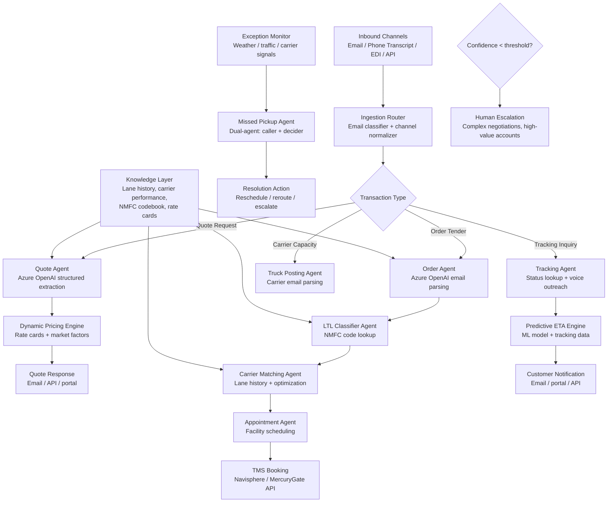

# UC-020: Autonomous Freight Logistics Orchestration with Agentic AI — Solution Design

## Solution Overview

The right architecture for freight logistics automation is not a single monolithic agent. C.H. Robinson's production deployment demonstrates why: the shipment lifecycle touches too many distinct cognitive tasks — email parsing, freight classification, dynamic pricing, carrier matching, appointment scheduling, tracking, and exception handling — for one agent to handle well. Their "Always-On Logistics Planner" runs 30+ specialized AI agents, each owning a narrow step in the lifecycle, connected through the Navisphere TMS backend. The result: 3+ million automated shipping tasks, price quotes in 32 seconds, and a 40% productivity increase. [CS1][CS2][CS3][CS4]

The recommended design is a multi-agent orchestrator-worker system with event-driven coordination. LLM workers handle the parts that defied automation for decades: reading unstructured emails to extract shipment details, classifying freight against NMFC codes, reasoning about carrier selection, and conducting voice-based carrier outreach. Deterministic services handle everything that must be fast, auditable, and reproducible: dynamic pricing calculations, rate card lookups, appointment slot optimization, TMS record creation, and EDI transmission. The key insight from C.H. Robinson's approach — "map the problems, then engineer solutions" — means each agent exists because a specific bottleneck was identified, not because multi-agent architecture was chosen first. [CS1][CS5][CS6]

The reference integration seam targets a standard TMS (e.g., Navisphere, MercuryGate, BluJay) via REST API, because the agents augment the existing platform rather than replacing it. The same pattern ports to other TMS platforms by swapping the connector layer.

---

## Architecture

### Architecture Diagram



### Component Overview

| # | Component | Technology / Service | Role |
|---|-----------|----------------------|------|
| 1 | Ingestion router | LLM classifier + rules engine | Classifies inbound emails by transaction type (quote, order, tracking, capacity) and normalizes to canonical format. [CS1][CS7] |
| 2 | Quote agent | Azure OpenAI structured outputs | Extracts shipment details from unstructured quote requests and feeds the pricing engine. [CS1][CS2] |
| 3 | Dynamic Pricing Engine | Deterministic optimization service | Evaluates 847+ rate cards, market factors, carrier performance, and lane history to generate competitive quotes. [CS2] |
| 4 | Order agent | Azure OpenAI structured outputs | Parses emailed tenders including attachments, validates shipment details, optimizes mode selection. [CS1][CS3] |
| 5 | LTL classifier agent | Azure OpenAI + NMFC lookup tool | Determines correct freight class and NMFC code from product descriptions. [CS4][CS8] |
| 6 | Carrier matching agent | ML model + optimization | Matches shipments with carriers based on lane history, pricing, performance, capacity, and equipment type. [CS2] |
| 7 | Appointment agent | Scheduling optimizer | Coordinates pickup/delivery windows across 43,000+ locations, balancing facility hours, driver availability, and transit time. [CS3] |
| 8 | Truck posting agent | Azure OpenAI email parsing | Reads carrier emails offering capacity, extracts truck availability, posts to real-time capacity center. [CS1] |
| 9 | Tracking agent | Voice AI + TMS lookup | Responds to tracking inquiries, proactively contacts carriers via voice for status updates. [CS5] |
| 10 | Missed pickup agent | Dual-agent (caller + decider) | Voice agent contacts carriers about missed pickups; decision agent determines resolution. [CS9] |
| 11 | Predictive ETA engine | ML model on historical data | Continuously refines delivery predictions using tracking data, weather, traffic. [CS5] |
| 12 | TMS connector | REST API client | Reads from and writes to the TMS (Navisphere or equivalent) for all booking, tracking, and status operations. [CS1] |

---

## Data Flow

### AI Data Flow

| Stage | What enters the LLM | What comes out | What happens next |
|-------|---------------------|----------------|-------------------|
| Email classification | Raw email text, subject line, sender domain | Transaction type label (quote/order/tracking/capacity) and confidence score | Router dispatches to the appropriate agent. [CS1][CS7] |
| Quote extraction | Email body + attachments, extraction schema, few-shot examples | Structured `QuoteRequest` JSON: origin, destination, weight, commodity, timeline, special requirements | Dynamic Pricing Engine calculates the quote. [CS1][CS2] |
| Order parsing | Emailed tender text + attachments, order schema | Structured `OrderTender` JSON: all shipment fields validated against TMS requirements | Mode optimizer selects TL vs LTL, then books in TMS. [CS3] |
| Freight classification | Product description, weight, dimensions, NMFC tool results | Proposed NMFC code, freight class, confidence, reasoning | If high confidence, writes directly; otherwise routes to human classifier. [CS4][CS8] |
| Carrier email parsing | Carrier email offering truck capacity | Structured capacity record: equipment type, origin, destination, availability window | Posted to real-time capacity center for matching. [CS1] |
| Tracking voice call | Phone transcript from carrier call | Structured tracking update: location, status, ETA, exceptions | Updates TMS and triggers customer notification. [CS5] |
| Missed pickup resolution | Carrier call results, shipment context, resolution options | Resolution decision: reschedule, dispatch alternate carrier, or escalate | Executes resolution action and notifies all parties. [CS9] |

### End-to-End Sequence (Order Flow)

```text
1. Trigger  -> Customer emails a freight order tender to the logistics provider.
2. Classify -> Email classification agent identifies this as an order tender.
3. Extract  -> Order agent parses email + attachments into structured shipment data.
4. Classify -> LTL classifier determines NMFC code and freight class (if LTL).
5. Match    -> Carrier matching agent selects optimal carrier from available options.
6. Schedule -> Appointment agent coordinates pickup/delivery windows.
7. Book     -> TMS connector creates the booking in Navisphere.
8. Track    -> Tracking agent monitors shipment, contacts carrier for updates.
9. Resolve  -> If exception detected, missed pickup agent intervenes autonomously.
10. Notify  -> Customer receives proactive status updates and predictive ETA.
```

---

## LLM Role

| Step | AI Needed? | LLM Role | Why AI Fits |
|------|------------|----------|-------------|
| Email classification | Yes | Classify free-text emails into transaction types | Emails are unstructured, inconsistent, and multilingual. Rules alone miss too many variants. [CS1][CS7] |
| Shipment data extraction | Yes | Extract structured fields from unstructured email text and attachments | The freight industry runs on free-form email. Each shipper formats requests differently. This is the core unlock. [CS1][CS5] |
| Freight classification | Yes, tool-grounded | Reason about product characteristics and select NMFC code from lookup results | NMFC classification requires semantic understanding of product descriptions plus code lookup. [CS4][CS8] |
| Dynamic pricing | No | None | Pricing is a deterministic optimization problem: rate cards, market data, historical patterns. [CS2] |
| Carrier matching | Hybrid | LLM can reason about soft factors; optimization algorithm handles the hard constraints | Core matching is optimization, but reasoning about carrier reliability and contextual factors benefits from LLM. [CS2] |
| Appointment scheduling | No | None | Scheduling is constraint satisfaction over known facility hours and transit windows. |
| TMS record creation | No | None | Structured data writes should stay deterministic and auditable. |
| Tracking voice calls | Yes | Conduct natural-language phone conversations with carriers, extract status information | Carriers communicate status via phone. Voice AI replaces hundreds of manual check calls. [CS5][CS9] |
| Missed pickup resolution | Yes | Reason about resolution options given carrier response and shipment context | Determining the best next action requires contextual reasoning across multiple factors. [CS9] |
| Exception detection | Hybrid | LLM processes unstructured signals; rules detect structured anomalies | Weather and traffic data is structured, but carrier communications about issues are not. |

---

## Agent Pattern

| Aspect | Choice |
|--------|--------|
| **Pattern** | Multi-agent orchestrator-worker with event-driven coordination |
| **Orchestration** | Event-driven with TMS as the state backbone; agents triggered by email arrival, status change, schedule event, or exception signal |
| **Human-in-the-Loop** | Confidence-based escalation: low-confidence extractions, high-value accounts, novel exceptions route to human specialists |
| **State Management** | TMS is the system of record; agents are stateless workers that read from and write to TMS via API |
| **Autonomy Level** | Semi-autonomous: routine shipments flow end-to-end without human touch; complex negotiations and strategic decisions remain human-led |

### Why This Pattern?

C.H. Robinson's production deployment validates the multi-agent approach over alternatives. They built 30+ specialized agents rather than one general-purpose logistics assistant, and the reasoning is instructive. [CS1][CS3]

**Why not a single agent?** The shipment lifecycle involves fundamentally different cognitive tasks. Email parsing is language understanding. Freight classification is domain reasoning with tool lookup. Pricing is optimization. Tracking is voice communication. A single agent would need an enormous tool surface, degrading selection quality and making validation harder. C.H. Robinson's approach of narrow agents with narrow tool sets produces measurably better results. Their GenAI team specifically chose LangGraph for complex classification because it provides "the most flexibility to understand state, to track and update information for orders as needed." [CS1][CS12][TD4]

**Why not pure RAG?** RAG is useful for knowledge retrieval (rate cards, NMFC codebook, carrier history), but the system must take actions: create bookings, make phone calls, set appointments, resolve exceptions. RAG retrieves; agents act. [CS1]

**Why event-driven rather than graph-based?** Unlike pharmacovigilance where a single case flows through a linear review pipeline, freight logistics has parallel, independent workflows (quoting, booking, tracking, exceptions) that share the TMS as state backbone but operate on different triggers and timelines. An event-driven pattern where each agent responds to its trigger (email arrival, status change, exception signal) fits better than a single graph. [CS1][CS5]

**Why the TMS as state backbone?** The constraint is clear: agents must augment the existing TMS, not replace it. The TMS holds the authoritative shipment state, and every agent reads from and writes to it. This means agents can be deployed incrementally — C.H. Robinson started with quoting, added orders, then classification, then tracking — without requiring a complete system replacement. [CS1][UC]

---

## Prompt Strategy

### Prompt Structure

| Agent | Prompt Style | Why |
|-------|--------------|-----|
| Email classifier | Few-shot classification with confidence score | Incoming emails vary wildly in format; few-shot examples cover the most common patterns without overtraining. [CS1][CS7] |
| Quote/Order extraction | Schema-first system prompt with extraction rules | Forces the model to fill a defined contract rather than generating free-form text. This is the highest-leverage pattern. [TD1] |
| Freight classifier | Tool-first prompt with "never invent a code" rule | The model must select from NMFC lookup results, not hallucinate classification codes. [CS4][CS8] |
| Tracking voice agent | Conversational prompt with structured output extraction | Must conduct natural dialogue while extracting specific data points (location, ETA, exceptions). [CS5] |
| Missed pickup decider | Reasoning prompt with structured resolution schema | Must weigh multiple factors (carrier response, shipment urgency, available alternatives) and output a clear action. [CS9] |

### Example Email Extraction Prompt

```text
System:
You are the order intake agent for a freight logistics platform.
Your job is to extract structured shipment data from emailed freight tenders.

Rules:
1. Extract only facts explicitly stated in the email or attachments.
2. If a field is ambiguous or missing, return null and set requires_review=true.
3. Do not infer freight class or NMFC codes — those are handled by a separate agent.
4. Do not invent carrier names, facility addresses, or reference numbers.
5. When a shipper requests both truckload and LTL quotes, flag mode_selection="both".
6. Return only the schema-valid JSON object.

Required fields:
- origin (city, state, zip, facility name if provided)
- destination (city, state, zip, facility name if provided)
- pickup_date (or window)
- delivery_date (or window, or "ASAP")
- weight_lbs
- commodity_description
- equipment_type (van, reefer, flatbed, or null)
- special_requirements (hazmat, team driver, liftgate, etc.)
```

### Example NMFC Classification Prompt

```text
System:
You are the freight classification agent. You determine NMFC codes for LTL shipments.
You may call search_nmfc to look up classification codes.

Rules:
1. Always call search_nmfc before selecting a code. Never guess.
2. Consider product material, density, handling characteristics, and stowability.
3. If the product description is ambiguous, return the top 3 candidates with confidence scores and set requires_review=true.
4. Explain your reasoning: what product characteristics drove the classification.
5. If weight and dimensions are provided, calculate density and use it to narrow the class.
```

### Prompt Engineering Rules

- Keep agent prompts narrow and task-specific. C.H. Robinson's 30+ agent fleet demonstrates that specialized agents outperform generalist ones. [CS1][CS3]
- Use structured output schemas for all extraction agents. This is the single highest-leverage pattern — it turns "write something useful" into "fill this contract." [TD1]
- Require evidence and reasoning in classification outputs so human reviewers can verify decisions without re-reading the source material. [CS4]
- Keep tool count per agent small. Semantic Kernel guidance warns that tool selection quality degrades with too many tools. [TD4]

---

## Human-in-the-Loop

### Escalation Policy

| Trigger | Action | Why |
|---------|--------|-----|
| Extraction confidence below threshold | Route to human coordinator for manual review | Ambiguous emails can't be booked incorrectly — a wrong booking cascades into wrong carrier, wrong rate, wrong delivery. [CS1] |
| High-value account or strategic customer | Human handles personally | Relationship management on top accounts requires human judgment and negotiation skills. [UC] |
| NMFC classification ambiguity | LTL specialist reviews top candidates | Misclassification causes re-invoicing, billing disputes, and delays. C.H. Robinson routes uncertain classifications to experts. [CS4][CS8] |
| Carrier no-show after AI resolution attempt | Escalate to exception coordinator | When the missed pickup agent can't resolve within its action set, humans intervene with manual carrier outreach. [CS9] |
| Hazmat or oversized freight | Human reviews classification and routing | Regulatory compliance for hazmat requires human sign-off. [UC] |
| Quote request with non-standard terms | Pricing specialist reviews | Custom contract terms, multi-stop routes, and unusual equipment requirements need human judgment. [UC] |

### Confidence Thresholds

These are starting points to be calibrated on historical data:

- Auto-process orders when extraction confidence is `>= 0.92`
- Route to human when classification confidence is `< 0.80`
- Always escalate hazmat, high-value (>$50K), and new customer first orders
- Review missed pickup resolutions when the AI decision agent's confidence is `< 0.85`

C.H. Robinson's approach was to start conservative and widen the automation envelope as agents proved reliable — going from 2,268 initial customers on quoting to 5,200+ over time. [CS1][CS7]

---

## Integration Points

| System | Integration Method | Direction | Purpose |
|--------|--------------------|-----------|---------|
| TMS (Navisphere / MercuryGate) | REST API | Bidirectional | System of record for all shipment data, bookings, status, and documents. [CS1][UC] |
| Email inbox | Exchange / Graph API / IMAP | Inbound | Receive quote requests, order tenders, tracking inquiries, and carrier communications. [CS1] |
| Dynamic Pricing Engine | Internal API | Read | Calculate competitive quotes from rate cards, market data, and carrier performance. [CS2] |
| NMFC Classification Service | Internal API | Read | Look up freight classes and codes from the National Motor Freight Classification tariff. [CS4] |
| Carrier Capacity Center | Internal API | Write | Post available truck information parsed from carrier emails. [CS1] |
| Voice AI Platform | Telephony API (e.g., Azure Communication Services) | Bidirectional | Conduct outbound calls to carriers for tracking updates and missed pickup resolution. [CS5][CS9] |
| Weather / Traffic APIs | REST API | Read | Feed disruption signals into exception detection and predictive ETA models. |
| EDI Gateway | AS2 / SFTP | Bidirectional | Exchange structured shipment data with carriers and customers who use EDI. [UC] |
| Customer Portal / API | REST API / Webhook | Write | Deliver quotes, booking confirmations, tracking updates, and ETAs to customers. |

---

## Tools & Frameworks

### AI / ML Stack

| Component | Technology | Why Chosen |
|-----------|------------|------------|
| **LLM Provider** | Azure OpenAI via Azure AI Foundry | C.H. Robinson confirmed: uses Azure AI Foundry as primary platform for building and deploying agents. [CS10][CS12][TD1] |
| **Model** | GPT-4o for extraction and classification; GPT-4o-mini for email classification | Balance of reasoning capability and cost at 5,000-50,000+ transactions/day. |
| **Agent Framework** | LangChain / LangGraph | C.H. Robinson confirmed: built agents with LangChain for model interoperability, evolved to LangGraph for complex classification tasks requiring state tracking. [CS12][TD2][TD3] |
| **Observability** | LangSmith | C.H. Robinson confirmed: uses LangSmith as "first line of defense in the testing process" for agent observability. [CS12] |
| **Structured Extraction** | Azure OpenAI structured outputs | Enforces JSON schema compliance for all extraction agents. [TD1] |
| **Azure-native alternative** | Semantic Kernel / Microsoft Agent Framework | Strong option for .NET teams; AutoGen merged with Semantic Kernel in late 2025 to form MAF. [TD4][TD5] |
| **Voice AI** | Azure Communication Services + Azure OpenAI Realtime API | Carrier outreach calls for tracking and missed pickup resolution. [CS5][CS9] |
| **Predictive ETA** | Custom ML model (XGBoost / LightGBM) on historical data | C.H. Robinson reports 98.2% predictive ETA accuracy using billions of historical data points. [CS5] |

### Infrastructure Stack

| Component | Technology | Why Chosen |
|-----------|------------|------------|
| **Compute** | AKS or Azure Container Apps | Horizontal scaling for parallel agent execution across 5,000-50,000+ daily transactions. |
| **Message Queue** | Azure Service Bus | Event-driven trigger for agents; handles bursty email volume and seasonal peaks. |
| **Storage** | Azure Blob Storage + Cosmos DB + Azure SQL | C.H. Robinson confirmed: Azure SQL for structured data, Cosmos DB for real-time data with change feed for event-driven architecture, Blob for attachments. [CS12][CS13] |
| **Monitoring** | Application Insights / OpenTelemetry | Trace agent decisions, tool calls, latency, and escalation rates. |

---

## Security & Compliance

| Concern | Approach |
|---------|----------|
| **Authentication** | Managed identity for all Azure services; short-lived tokens for TMS API calls. |
| **Authorization** | Each agent has scoped API credentials — the extraction agent cannot book shipments; the booking agent cannot modify pricing. |
| **Data at Rest** | Customer-managed key encryption for shipment data, pricing data, and carrier PII. |
| **Data in Transit** | TLS 1.2+ for all API calls; private endpoints for Azure OpenAI and TMS connectivity. |
| **PII Handling** | Driver PII (names, phone numbers) redacted before LLM processing where not needed for the task. Carrier contact info processed only by voice agents with strict scope. [UC] |
| **Audit Trail** | Every agent decision logged with input, output, tool calls, confidence score, and escalation reason. Required for freight classification disputes and billing audits. [UC] |
| **Pricing Confidentiality** | Customer-specific pricing never exposed across accounts. Agent prompts include explicit isolation instructions. [UC] |
| **FMCSA Compliance** | Carrier selection agent validates safety ratings and insurance before matching. Deterministic check, not LLM decision. [UC] |

---

## Scalability & Performance

| Dimension | Approach |
|-----------|----------|
| **Throughput** | 5,500+ truckload orders/day, 2,000+ LTL classifications/day, 3,000+ appointments/day — each agent type scales independently via queue-based fan-out. [CS3] |
| **Latency Target** | Quote response: < 60 seconds (achieved: 32 seconds). Order processing: < 2 minutes (achieved: 90 seconds). Classification: < 10 seconds (achieved: 3 seconds after training). [CS1][CS2][CS4] |
| **Scaling Strategy** | Horizontal pod autoscaling per agent type, triggered by Service Bus queue depth. Seasonal peaks (2-3x volume) absorbed by adding worker replicas. |
| **Rate Limits** | Azure OpenAI provisioned throughput for high-volume agents (quoting, orders); standard deployment for lower-volume agents (exception handling). |
| **Caching** | Cache NMFC lookup results, carrier performance scores, and facility operating hours. Never cache customer-specific pricing across requests. |

---

## Cost Estimate

The table below estimates costs for a mid-size 3PL processing 5,000 shipments/day. C.H. Robinson operates at much larger scale (100,000+/day) with economies that a smaller operator would not immediately realize. The target is to keep AI costs well below displaced labor costs, given 3PL operating margins of 3-5%. [UC]

| Component | Unit Cost | Monthly Estimate |
|-----------|-----------|------------------|
| **LLM API calls** (extraction, classification, parsing) | ~$0.02-0.10 per transaction | `$8k-$15k` estimated |
| **Voice AI** (tracking calls, missed pickup outreach) | ~$0.10-0.30 per call | `$3k-$8k` estimated |
| **Compute** (AKS workers, API services) | Container runtime | `$3k-$6k` estimated |
| **Message queue + storage + monitoring** | Service Bus, Blob, App Insights | `$2k-$4k` estimated |
| **Predictive ETA model** (inference) | ML model serving | `$1k-$3k` estimated |
| **Total** | | **`$17k-$36k` estimated** |

For comparison, manual processing of 5,000 shipments/day at pre-AI productivity levels required roughly 150-200+ FTEs for quoting, order processing, classification, tracking, and exception handling. At average logistics coordinator compensation, the monthly labor cost far exceeds the AI operating cost. [UC][CS1]

---

## Alternatives Considered

| Alternative | Pros | Cons | Why Not Chosen |
|-------------|------|------|----------------|
| Single tool-calling agent | Simpler architecture, fewer components | Tool surface too large for reliable selection; impossible to validate 8+ distinct cognitive tasks in one prompt loop | C.H. Robinson explicitly chose 30+ specialized agents over a monolith. [CS1][CS3] |
| Pure RPA (no LLM) | Deterministic, easy to audit | Cannot handle unstructured emails, free-text freight descriptions, or voice carrier interactions | C.H. Robinson tried rules-based automation for a decade; unstructured data was the barrier that LLMs broke. [CS7] |
| Pure RAG assistant | Good for knowledge retrieval | Does not take actions: can't book shipments, make calls, or set appointments | Useful as a subsystem for NMFC lookup and carrier history, not as the operating pattern. |
| Fully managed Azure AI agents | Azure-native operations model | Less control over agent coordination and state management for high-volume, low-latency workflows | Viable for teams starting out; production freight operations need more control at scale. [TD6] |
| Single graph orchestrator (LangGraph) | Clean state management for linear flows | Freight logistics has parallel independent workflows (quoting, tracking, exceptions) better served by event-driven coordination than a single graph | Graph works well within an agent; event-driven works better between agents. |
